# 1. Из каких основных сущностей состоит Spring-приложение?
## Что такое Spring Framework?
**Spring Framework** — это мощный и гибкий фреймворк для разработки приложений на языке Java. Он предоставляет широкий спектр возможностей для создания enterprise-приложений, упрощая разработку, тестирование и поддержку кода. Spring стал одним из самых популярных фреймворков в экосистеме Java благодаря своей модульности, простоте интеграции и поддержке современных подходов к разработке.

Spring состоит из множества модулей, которые можно использовать независимо друг от друга. Основные модули:
- **Spring Core**: Это основа фреймворка, которая включает в себя контейнер Inversion of Control (IoC) и механизм Dependency Injection (DI). IoC отвечает за управление жизненным циклом объектов и их зависимостями, а DI позволяет внедрять зависимости в объекты, что делает код более модульным и тестируемым.
- **Spring MVC**: Модуль для создания веб-приложений на основе архитектуры Model-View-Controller (MVC). Он упрощает разработку веб-интерфейсов, обработку запросов и управление представлениями.
- **Spring Data**: Упрощает работу с базами данных и различными источниками данных (реляционные и NoSQL БД). Spring Data предоставляет унифицированный API для доступа к данным, а также репозитории, которые минимизируют объем boilerplate-кода.
- **Spring Security**: Обеспечивает безопасность приложений, включая аутентификацию, авторизацию, защиту от атак (например, CSRF) и другие аспекты безопасности. Модуль легко интегрируется с другими компонентами Spring.
- **Spring Boot**: Упрощает создание standalone-приложений с минимальной конфигурацией. Spring Boot автоматически настраивает приложение на основе зависимостей, предоставляет встроенные серверы (например, Tomcat) и упрощает процесс разработки и развертывания.
- **Spring AOP**: Поддержка аспектно-ориентированного программирования (AOP). Позволяет разделять сквозные задачи, такие как логирование, управление транзакциями, безопасность и т.д., от основной бизнес-логики.
- **Spring WebFlux**: Для создания реактивных приложений, которые работают асинхронно и поддерживают неблокирующие операции.
- **Spring Cloud:** Набор инструментов для создания распределенных систем и микросервисов. Spring Cloud предоставляет решения для конфигурации, обнаружения сервисов, балансировки нагрузки, распределенных транзакций и других задач, связанных с микросервисной архитектурой.

Spring использует контейнер IoC для управления жизненным циклом объектов и их зависимостями. Вместо того чтобы создавать объекты вручную, разработчик описывает их в конфигурации (XML, аннотации или Java-код), а Spring автоматически создает и связывает их.

Spring легко интегрируется с другими популярными библиотеками и фреймворками, такими как Hibernate, JPA, Thymeleaf, Kafka и многими другими.
### Преимущества Spring Framework?
- Упрощает разработку сложных приложений.
- Поддерживает современные подходы к разработке (позволяет легко создавать микросервисы и облачные приложения благодаря модулю Spring Cloud).
- Имеет активное сообщество и множество ресурсов для обучения.
- Подходит как для небольших проектов, так и для крупных enterprise-систем.

### Недостатки?
- Может быть избыточным для простых приложений.
- Требует времени для изучения из-за своей обширной функциональности.

## Из каких основных сущностей состоит Spring-приложение?
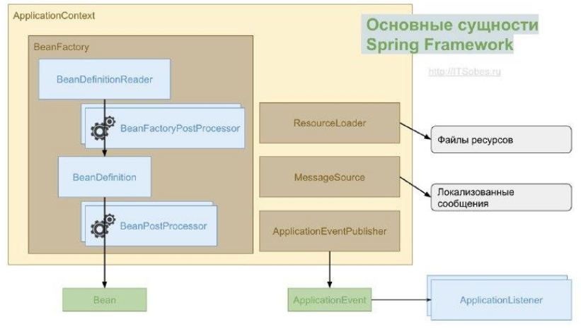

Spring-приложение состоит из нескольких ключевых сущностей, которые взаимодействуют между собой для обеспечения работы приложения. Вот основные из них:
- **Bean** — это Java объект, который управляется Spring IoC-контейнером. Бин содержит бизнес-логику приложения и может быть создан, настроен и управляем контейнером Spring.
- **BeanDefinition** — содержит метаинформацию о бине, такую как его класс, параметры конструктора, свойства, область видимости (scope) и другие атрибуты.
- **BeanDefinitionReader** - используется для чтения конфигурации бинов и создания `BeanDefinition` из разных источников. Например, `XmlBeanDefinitionReader` читает конфигурацию из XML-файлов, а `AnnotationConfigApplicationContext` использует аннотации для создания определений бинов.
- **BeanFactory** — отвечает за создание, настройку и управление бинами.
- **ApplicationContext** — это "главный управляющий", который реализует внутри себя весь функционал BeanFactory. Это значит что он также может хранить и управлять жизненным циклом бинов. Также ApplicationContext предоставляет дополнительный функционал поверх стандартных возможностей которые есть у BeanFactory.
- **BeanPostProcessor** - позволяет выполнять дополнительную обработку бинов после их создания, но до того, как они будут помещены в контейнер.
- **BeanFactoryPostProcessor** - позволяет модифицировать `BeanDefinition` до того, как бины будут созданы.
- **Scope** — это настройка для бина, которая говорит, как долго живет бин.
- **ApplicationEvent** и **ApplicationListene** — это способ "общения между разными частями приложения". Реализация паттерна "Наблюдатель" (Observer), который позволяет компонентам реагировать на события в приложении.
- **ResourceLoader** и **MessageSource** — это инструменты для работы с файлами и текстами.

В Spring все эти компоненты работают вместе, чтобы управлять бинами (объектами) и их жизненным циклом. **BeanDefinition** — это "описание" для создания бина, который хранит информацию о классе, параметрах и настройках. **BeanFactory** использует эти описания для создания и управления бинами (**Bean**). **BeanPostProcessor** и **BeanFactoryPostProcessor** позволяют настраивать бины и их описания перед использованием. **ApplicationContext** — это расширенная версия BeanFactory, которая добавляет функции загрузки ресурсов (**ResourceLoader**), публикации событий (**ApplicationEvent** и **ApplicationListener**) и интернационализации (**MessageSource**). **Scope** определяет, как долго живет бин (например, один на всё приложение или новый при каждом запросе). Вместе эти компоненты образуют мощный механизм для управления зависимостями и конфигурацией в Spring-приложении.

### **Bean**:
Это Java объект, который управляется Spring IoC-контейнером. Бин содержит бизнес-логику приложения и может быть создан, настроен и управляем контейнером Spring.
Бины могут быть объявлены с помощью аннотаций (например, `@Component`, `@Service`, `@Repository`, `@Controller`) или через XML-конфигурацию.

Это просто объект, который Spring создает и управляет им. Например, это может быть сервис, контроллер или репозиторий. Spring сам создает эти объекты и следит за их жизненным циклом.

### **BeanDefinition**:
Это описание того, как создавать и настраивать бин. `BeanDefinition` содержит метаинформацию о бине, такую как его класс, параметры конструктора, свойства, область видимости (scope) и другие атрибуты.
`BeanDefinition` используется контейнером Spring для создания экземпляров бинов.

Это "инструкция" для Spring о том, как создать бин. Там написано, какой класс использовать, какие параметры передать в конструктор и как настроить объект.

### Основные параметры, которые включает `BeanDefinition`:

**Класс бина**: Указывает, какой класс нужно использовать для создания бина. Например, `com.example.MyService`.

**Имя бина**: Уникальное имя, по которому можно получить бин из контейнера Spring. Например, `myService`.

**Параметры конструктора**: Если бин создается через конструктор, здесь указываются аргументы, которые нужно передать в конструктор.

**Свойства бина**: Список свойств (полей) бина, которые нужно установить после создания объекта. Например, это могут быть зависимости, которые Spring внедрит через сеттеры или поля.

**Область видимости (Scope)**: Определяет, как долго живет бин. Например:
- `singleton` — один экземпляр на всё приложение.
- `prototype` — новый экземпляр каждый раз, когда бин запрашивается.

**Ленивая инициализация (Lazy-init)**: Если `true`, бин будет создан только тогда, когда он впервые понадобится, а не при старте приложения.

**Метод инициализации**: Метод, который Spring вызовет после создания бина, чтобы выполнить дополнительную настройку. Например, метод с аннотацией `@PostConstruct`.

**Метод уничтожения**: Метод, который Spring вызовет перед удалением бина. Например, метод с аннотацией `@PreDestroy`.

**Зависимости (Dependencies)**: Список других бинов, которые нужны этому бину для работы. Spring автоматически внедряет эти зависимости.

**Фабричный метод**: Если бин создается не через конструктор, а через статический или нестатический метод, здесь указывается этот метод.

**Родительский бин (Parent)**: Если бин наследует настройки от другого бина, здесь указывается имя родительского бина.

**Абстрактность (Abstract)**: Если `true`, то этот `BeanDefinition` используется только как шаблон для других бинов и не создается как самостоятельный бин.

**Роль (Role)**: Указывает, какую роль играет бин:
  - `ROLE_APPLICATION` — обычный бин.
  - `ROLE_SUPPORT` — вспомогательный бин.
  - `ROLE_INFRASTRUCTURE` — бин, который используется внутри Spring (например, для AOP).

**Дополнительные атрибуты**: Любая другая информация, которая может понадобиться для создания и настройки бина. Например, кастомные метаданные.

### **BeanFactory**:
Это основная точка входа для работы с IoC-контейнером Spring. `BeanFactory` отвечает за создание, настройку и управление бинами.
`BeanFactory` использует `BeanDefinition` для создания экземпляров бинов и управления их жизненным циклом.
Это низкоуровневый интерфейс, который предоставляет базовые возможности DI-контейнера.

Это "мастерская", где Spring создает и хранит бины. Она знает, как создавать объекты по их описаниям (BeanDefinition) и выдает их, когда нужно.

- Внутри `BeanFactory` и `ApplicationContext` бины хранятся в **специальных структурах данных**, таких как карты (Map), где ключом является имя бина, а значением — сам бин (или его `BeanDefinition`, если бин еще не создан).
- Для синглтонов (`singleton`) бины создаются один раз и хранятся в контейнере на протяжении всего жизненного цикла приложения.
- Для бинов с scope `prototype` контейнер не хранит сами бины, а только их `BeanDefinition`. Каждый раз, когда такой бин запрашивается, создается новый экземпляр.

### **BeanPostProcessor**:
Это интерфейс, который позволяет выполнять дополнительную обработку бинов после их создания, но до того, как они будут помещены в контейнер.
`BeanPostProcessor` используется для настройки бинов, например, для внедрения зависимостей через `@Autowired`, оборачивания бинов в прокси (например, для AOP) или выполнения других задач.

Это как "дополнительная настройка" для бинов. После того как Spring создал бин, но перед тем как отдать его в использование, BeanPostProcessor может что-то в нем изменить. Например, добавить зависимости или обернуть бин в прокси (для AOP).

### **BeanFactoryPostProcessor**:
Это интерфейс, который позволяет модифицировать `BeanDefinition` до того, как бины будут созданы.
`BeanFactoryPostProcessor` используется для изменения конфигурации бинов, например, для изменения свойств или класса бина.

Это как "редактор инструкций". Он может изменить описание бинов (BeanDefinition) до того, как Spring начнет их создавать. Например, поменять настройки или класс, из которого будет создаваться бин.

- **BeanFactoryPostProcessor** работает с **конфигурацией** бина (до его создания).
- **BeanPostProcessor** работает с **экземпляром** бина (после его создания).

### **ApplicationContext**:
Это более продвинутая версия `BeanFactory`, которая предоставляет дополнительные возможности, такие как загрузка ресурсов, публикация событий и интернационализация.

Например, `ApplicationContext` также умеет создавать бины, управлять их жизненным циклом, внедрять зависимости и т.д. — всё это базовые функции `BeanFactory`.

**Функции ApplicationContext, вкратце:** (ДОПОЛНИТЬ ПО ВОЗМОЖНОСТИ)
- **DI-контейнер**: Управляет бинами и их зависимостями.
- **Загрузка ресурсов**: Позволяет загружать файлы и другие ресурсы через интерфейс `ResourceLoader`.
- **Публикация событий**: Поддерживает механизм событий (event-driven programming) через интерфейс `ApplicationEventPublisher`.
- **Интернационализация**: Поддерживает локализацию через интерфейс `MessageSource`.

**BeanFactory** — это базовая реализация, а **ApplicationContext** — расширенная. В реальных приложениях чаще используется `ApplicationContext`, так как он предоставляет больше возможностей.

Если ваше приложение очень простое и вам не нужны дополнительные функции (например, события, загрузка ресурсов, интернационализация), то можно обойтись без `ApplicationContext`, используя только `BeanFactory` он предоставляет минимальный набор функций для управления бинами (создание, внедрение зависимостей, управление жизненным циклом).

Технически, Spring-приложение может работать даже без `BeanFactory` и `ApplicationContext`, но тогда это уже не будет Spring-приложением в классическом понимании.

В Spring Boot `ApplicationContext` создается автоматически при старте приложения. Вы можете использовать его, даже не задумываясь о его существовании.

### **BeanDefinitionReader**:
Это интерфейс, который используется для чтения конфигурации бинов и создания `BeanDefinition`. Например, `XmlBeanDefinitionReader` читает конфигурацию из XML-файлов, а `AnnotationConfigApplicationContext` использует аннотации для создания определений бинов.

**BeanDefinitionReader** — это не отдельная сущность, а часть механизма, который используется внутри `BeanFactory` или `ApplicationContext` для чтения конфигурации.

Это "переводчик", который читает конфигурацию (например, из XML-файла или аннотаций) и создает из нее описания бинов (BeanDefinition).

### **Scope**:
Определяет жизненный цикл и видимость бина. Например, бины могут быть в scope `singleton` (один экземпляр на весь контейнер) или `prototype` (новый экземпляр при каждом запросе).

Это настройка, которая определяет, как долго живет бин. Например:
- Для синглтонов (`singleton`) бины создаются один раз и хранятся в контейнере на протяжении всего жизненного цикла приложения.
- Для бинов с scope `prototype` контейнер не хранит сами бины, а только их `BeanDefinition`. Каждый раз, когда такой бин запрашивается, создается новый экземпляр.

### **ApplicationEvent и ApplicationListener**:
`ApplicationEvent` — это событие, которое может быть опубликовано в Spring-приложении.
`ApplicationListener` — это интерфейс, который реализуют бины, чтобы реагировать на события.

Spring может отправлять "события" (например, "приложение запущено" или "бин создан"). Другие части приложения могут "слушать" эти события и реагировать на них.

### **ResourceLoader**:
Интерфейс для загрузки ресурсов (например, файлов) из различных источников, таких как classpath, файловая система или URL.

Это инструмент для загрузки файлов или других ресурсов. Например, Spring может загрузить файл конфигурации из папки проекта или из classpath.

### **MessageSource**:
Интерфейс для работы с интернационализацией (i18n), позволяющий получать локализованные сообщения для пользователей.

Это инструмент для работы с текстами на разных языках. Например, если приложение поддерживает несколько языков, Spring может подгружать нужный текст в зависимости от выбора пользователя.

# 2. Что такое инверсия контроля (IoC) и внедрение зависимостей (DI)?
**Инверсия контроля (IoC)** и **внедрение зависимостей (DI)** — это два ключевых принципа, на которых основан Spring Framework. Они помогают создавать гибкие, легко тестируемые и поддерживаемые приложения.

### **Инверсия контроля (Inversion of Control, IoC)**:
IoC — это принцип проектирования архитектуры приложения, при котором создание объекта и управление его жизненны циклом передается внешнему источнику "контейнеру IoC" (например, в Spring его реализует ApplicationContext или BeanFactory), а не управляется вручную в коде.

В традиционном программировании объекты создаются и управляются вручную. IoC контейнер берет на себя ответственность за создание объектов и управление их жизненным циклом. Вы просто описываете, какие объекты нужны, а Spring их создает и настраивает. Внедряя все зависимые объекты при создании и предоставляет уже готовый объект "bean".

В Spring мы можем описать "bean" в файле конфигурации или через аннотации.
Spring создаст объект и будет управлять его жизненным циклом.

Название "инверсия управления" связано с тем, что управление потоком выполнения программы "инвертируется":
- В традиционном подходе **ваш код вызывает библиотеки**.
- В IoC **фреймворк вызывает ваш код**.
  То есть управление "переворачивается": вместо того чтобы код приложения управлял всем, фреймворк берет на себя эту роль.

Представим, что вы пишите программу, которая готовит кофе. В традиционном подходе **ваш код сам управляет всем процессом**. Например:
![[Pasted image 20250310134935.png]]
- **Вы полностью контролируете процесс**: вы сами создаете объекты, вызываете методы и решаете, в каком порядке это делать.
- **Ваш код "знает" все детали**: например, как создать кофе, как нагреть воду и как их смешать.

Проблема в том, что если вы захотите изменить процесс (например, добавить молоко или сахар), вам придется менять код. Это делает программу менее гибкой и более сложной для поддержки.

Это похоже на то, как если бы вы сами ходили в магазин за кофе, сами кипятили воду и сами смешивали ингредиенты.

Теперь представьте, что вы используете фреймворк (например, Spring). В этом случае **фреймворк берет на себя управление процессом**, а ваш код просто говорит, что нужно сделать. Например:

- **Фреймворк управляет процессом**:
    - Он создает объекты `Coffee` и `Water`.
    - Он передает их в ваш код через конструктор (это называется Dependency Injection, или "внедрение зависимостей").
- **Ваш код не знает, как создаются объекты**: он просто использует их.

Это похоже на то, как если бы вы заказали кофе в кафе: вы просто говорите, что хотите кофе, а бариста сам решает, как его приготовить.

**Почему это называется "инверсия"?**
Потому что управление "переворачивается":
- В традиционном подходе **ваш код управляет всем**.
- В IoC **фреймворк управляет всем**, а ваш код просто говорит, что нужно сделать.
#### Преимущества IoC:
- Упрощает код: вам не нужно вручную создавать объекты и управлять их зависимостями.
- Повышает гибкость: конфигурация приложения может быть изменена без изменения кода.
- Упрощает тестирование: зависимости могут быть легко заменены на моки или заглушки.

### **Внедрение зависимостей (Dependency Injection, DI)**:
DI — это реализация IoC, при котором зависимости объекта (например, другие объекты или сервисы) передаются ему извне, а не создаются внутри самого объекта.

Вместо того чтобы объект сам создавал свои зависимости, они "внедряются" в него извне (например, через конструктор, сеттеры или поля). Эти зависимости объект получает из другого класса, а не создает их в своем классе. Под зависимостями подразумеваются другие объекты которые нужны исходному объекту для нормального функционирования.
Spring IoC-контейнер автоматически находит и внедряет эти зависимости.

DI поддерживает разные способы внедрения: через конструктор (рекомендуется), сеттеры или поля.
#### Преимущества DI:
- Упрощает тестирование: зависимости можно легко заменить на моки.
- Уменьшает связанность (coupling) между классами.
- Делает код более модульным и поддерживаемым.

### **Как IoC и DI связаны?**
- **IoC** — это общий принцип, при котором управление объектами передается внешнему контейнеру.
- **DI** — это конкретный механизм реализации IoC, при котором зависимости объекта передаются ему извне.

# 3. Как эти принципы реализованы в Spring?
Чтобы добавить в приложение поддержку базового функционала Spring, такого как Inversion of Control (IoC) и Dependency Injection (DI), вам нужно добавить соответствующие зависимости в ваш проект. Если вы используете Maven, вот что вам нужно:

**Maven:**

В Spring принципы Inversion of Control (IoC) и Dependency Injection (DI) реализованы через **контейнер Spring**, который управляет жизненным циклом объектов (бинов) и их зависимостями.
####  **Inversion of Control (IoC)**
**Контейнер Spring**: Spring предоставляет контейнер (`ApplicationContext` или `BeanFactory`), который отвечает за создание, настройку и управление бинами.

**Конфигурация**: Вы можете конфигурировать бины с помощью:
- XML-файлов (устаревший способ, но все еще поддерживается).
- Аннотаций (например, `@Component`, `@Service`, `@Repository`, `@Configuration`).
- Java-кода (через `@Configuration` и `@Bean`).

#### **Dependency Injection (DI)**
**Spring поддерживает три основных способа внедрения зависимостей:**

**Через конструктор (Constructor Injection)**:
- Зависимости передаются через параметры конструктора.
- Рекомендуемый способ, так как он делает зависимости явными и неизменяемыми.

**Через сеттеры (Setter Injection)**:
- Зависимости передаются через методы-сеттеры.
- Поле не может быть final

**Через поля (Field Injection)**:
- Зависимости внедряются напрямую в поля класса с помощью аннотации`@Autowired`.
- Не рекомендуется, так как делает код менее тестируемым и скрывает зависимости.
- Поле не может быть final

Spring использует следующие механизмы для поиска и связывания бинов:
- **Сканирование компонентов**: С помощью аннотации `@ComponentScan` Spring сканирует указанные пакеты и автоматически регистрирует классы, помеченные аннотациями (`@Component`, `@Service`, `@Repository`, `@Controller`), как бины.
- **Автопривязка (@Autowiring)**: Делегирует Spring автоматически связывать бины на основе их типов. Например, если у вас есть бин типа `MyRepository`, Spring автоматически внедрит его в `MyService`, если там есть поле или конструктор, ожидающий `MyRepository`.
- **Ручная конфигурация (@Configuration)**: Мы можем явно указать, как создавать и связывать бины, используя аннотации `@Bean` в классах помеченных аннотацией как  `@Configuration`.

- **Гибкость**: Мы можем легко менять реализации зависимостей.
- **Упрощение кода**: Нам не нужно вручную создавать и управлять объектами, Spring делает это за вас.
- **Модульность**: Приложение становится более модульным, так как компоненты слабо связаны между собой.

### Почему внедрение зависимостей через конструктор является рекомендуемым способом?
Когда зависимости передаются через конструктор, они могут быть объявлены как `final`. Это делает объект **неизменяемым** после его создания, что предотвращает случайное изменение зависимостей в процессе работы.

Конструктор явно указывает, какие зависимости необходимы для создания объекта. Это делает код более понятным и самодокументируемым.    
Если класс требует 5 зависимостей, это будет видно в его конструкторе, и вы не сможете создать объект, не передав все необходимые зависимости.

Внедрение через конструктор упрощает тестирование, так как вы можете легко передавать mock-объекты или заглушки в конструктор при создании экземпляра класса.

Начиная с Spring 4.3, если в классе есть только один конструктор, аннотация `@Autowired` не обязательна. Spring автоматически использует этот конструктор для внедрения зависимостей. Это уменьшает количество boilerplate-кода.

При использовании конструктора все зависимости передаются при создании объекта, что гарантирует, что они не будут `null`. Это предотвращает ошибки `NullPointerException` в рантайме. Сравните с Field Injection, где зависимости могут быть `null`, если Spring не сможет их внедрить.

Соответствие принципам SOLID.

### Проблемы других способов внедрения?
**Field Injection (внедрение через поля):**
- Зависимости скрыты, и их не видно в публичном API класса.
- Труднее тестировать, так как зависимости нельзя передать напрямую (нужно использовать Reflection или Spring Context).
- Поля не могут быть `final`, что делает объект изменяемым.

**Setter Injection (внедрение через сеттеры):**
- Объект может быть создан в неполном состоянии (если не все сеттеры вызваны).
- Зависимости могут быть изменены после создания объекта, что нарушает принцип неизменяемости.

Сам Spring в своей документации рекомендует использовать Constructor Injection как основной способ внедрения зависимостей. Это связано с его преимуществами в безопасности, тестируемости и поддержке принципов SOLID.

## Dependency Injection и принципы SOLID, как связаны?
Внедрение зависимостей (Dependency Injection, DI) напрямую связано с принципами SOLID, которые являются фундаментальными принципами объектно-ориентированного проектирования.

#### **Принцип единственной ответственности (Single Responsibility Principle, SRP)**
**Формулировка**: Класс должен иметь только одну причину для изменения, то есть выполнять только одну задачу.

- Класс, использующий DI, не занимается созданием своих зависимостей. Это значит, что он не отвечает за их жизненный цикл и конфигурацию.
- Класс сосредоточен только на своей основной задаче, а создание и управление других объектов "зависимостями" делегируется контейнеру (например, Spring).

- `UserService` отвечает только за бизнес-логику, связанную с пользователями.
- Создание `UserRepository` делегировано Spring.

#### **Принцип открытости/закрытости (Open/Closed Principle, OCP)**
**Формулировка**: Программные сущности (классы, модули, функции) должны быть открыты для расширения, но закрыты для модификации.

- DI позволяет легко заменять реализации зависимостей без изменения кода класса, который их использует. Например, можно внедрить разные реализации интерфейса, не изменяя код класса, который зависит от этого интерфейса.

Если мы захотим заменить реализацию `UserRepository` (например, на `JdbcUserRepository` или `InMemoryUserRepository`), нам не нужно изменять код `UserService`.

#### **Принцип инверсии зависимостей (Dependency Inversion Principle, DIP)**
**Формулировка**:
1. Модули верхнего уровня не должны зависеть от модулей нижнего уровня. Оба типа модулей должны зависеть от абстракций.
2. Абстракции не должны зависеть от деталей. Детали должны зависеть от абстракций.

- DI позволяет классам зависеть от абстракций (интерфейсов), а не от конкретных реализаций.
- Контейнер (например, Spring) внедряет конкретные реализации в классы, что соответствует принципу инверсии зависимостей.

- `UserService` (модуль верхнего уровня) зависит от интерфейса `UserRepository` (абстракция).
- Конкретная реализация `UserRepository` (модуль нижнего уровня) также зависит от интерфейса `UserRepository`.
- Spring внедряет конкретную реализацию в `UserService`, что соответствует DIP.

# 4. Что такое IoC контейнер?
Контейнер IoC «под капотом» является ассоциативным массивом (набором пар
элементов), где ключом является String имя бина, а значением является объект.
Контейнер может предоставить полностью сконфигурированный объект (bean) при обращении к нему.

- **Ключ** — это имя бина (обычно строка, например, `"userService"`). Если не указано явно название бина (просто стоит аннотация @Component, @Service и т.д. то имя бина будет равно имени классу, но имя будет начинаться с маленькой буквы).
- **Значение** — это объект (экземпляр бина, например, `UserService`).

**Ассоциативный массив** — это именно структура данных, где **ключ** связан со **значением**. То есть между ключом и значением существует **ассоциация** (связь), которая позволяет быстро находить значение по ключу.

## Какие существуют реализации интерфейса ApplicationContext?
Spring Framework предоставляет несколько реализаций интерфейса `ApplicationContext`, каждая из которых предназначена для конкретных сценариев использования.
 
### **ClassPathXmlApplicationContext**
Эта реализация загружает конфигурацию Spring из XML-файла, расположенного в classpath (например, в папке `src/main/resources`).

**Когда использовать**: Когда конфигурация Spring описана в XML-файлах.

Здесь `applicationContext.xml` — это XML-файл, в котором описаны бины.

### **FileSystemXmlApplicationContext**
Эта реализация загружает конфигурацию Spring из XML-файла, расположенного в файловой системе (например, по абсолютному или относительному пути).

**Когда использовать**: Когда XML-файл с конфигурацией находится вне classpath (например, в файловой системе).

### **WebApplicationContext**
Эта реализация предназначена для веб-приложений и используется в связке с сервлетами и Spring MVC.

**Когда использовать**: Для веб-приложений, развернутых на сервере (например, Tomcat). Когда конфигурация Spring интегрирована с веб-контейнером.

**Особенности**: Поддерживает загрузку конфигурации как из XML, так и из аннотаций. Обычно конфигурируется через `web.xml` или с помощью класса `AnnotationConfigWebApplicationContext`.

### **AnnotationConfigApplicationContext**
Эта реализация загружает конфигурацию Spring из Java-классов, аннотированных `@Configuration`, `@Component`, `@Service`, `@Repository` и другими аннотациями.

**Когда использовать**: Когда конфигурация Spring описана с помощью Java-кода (аннотаций).

### **GenericApplicationContext**
Это более гибкая реализация, которая может использоваться для программируемой конфигурации (например, через `BeanDefinitionRegistry`).

**Когда использовать**: Для нестандартных сценариев, где нужно напрямую работать с `BeanDefinition`.

Каждая реализация `ApplicationContext` предназначена для конкретных сценариев:
- **ClassPathXmlApplicationContext** и **FileSystemXmlApplicationContext** — для XML-конфигурации.
- **WebApplicationContext** — для веб-приложений.
- **AnnotationConfigApplicationContext** — для Java-конфигурации с использованием аннотаций.
- **AnnotationConfigWebApplicationContext** — для веб-приложений с аннотациями.
- **GenericApplicationContext** — для программируемой конфигурации.

Выбор конкретной реализации зависит от типа приложения (автономное или веб) и способа конфигурации (XML или аннотации).

## Какие существуют способы конфигурации бинов в Spring Framework?
В Spring Framework существует несколько способов конфигурации бинов, каждый из которых подходит для разных сценариев.

### **1) XML-конфигурация**
Это классический способ конфигурации, который использовался в ранних версиях Spring. Конфигурация описывается в XML-файлах.

**Когда использовать**: 
- В legacy-проектах, где уже используется XML.
- Когда требуется централизованное управление конфигурацией (вся конфигурация бинов в одном месте).

**Преимущества:**
- Централизованное управление конфигурацией. Все описания бинов в одном месте.

**Недостатки:**
- XML код = много boilerplate-кода.

### **2) Конфигурация через аннотации**
Вместо того, чтобы использовать XML-файл для описания связывания компонентов, мы перемещаем конфигурацию в сам класс компонента, используя аннотации к соответствующему классу, методу или полю.

При этом, сам XML-файл с базовыми настройками остаётся. Контейнер считывает аннотации ПЕРЕД считыванием XML, поэтому, если бин конфигурируется через аннотации + XML-файл, то настройки XML переопределят настройки аннотаций.

Основные аннотации:
- `@Component` — для указания, что класс является компонентом Spring.
- `@Service` — для сервисного слоя.
- `@Repository` — для слоя доступа к данным.
- `@Controller` — для веб-контроллеров.
- `@RestController` - для веб-контроллеров которые отдают только данные, а не данные + представление (view).
- `@Autowired` — для автоматического внедрения зависимостей.

##### Когда использовать:
- В современных проектах, где используется Java-код вместо XML.
- Для упрощения конфигурации.

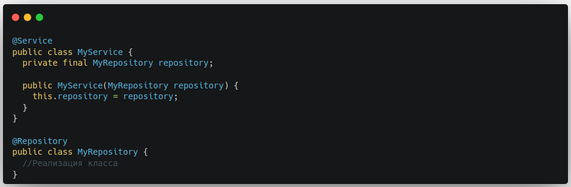

**Преимущества:**
- Меньше boilerplate-кода.
- Лучшая читаемость и поддержка.
- Аннотации делают код более выразительным.

**Недостатки:**
- Конфигурация "размазана" по коду. Может быть сложно управлять большим количеством аннотаций.

### **3) Java-based конфигурация**
Начиная со Spring 3.0, используя Java-код, а не файлы XML, можно определять настройки в специальном классе, помеченном аннотацией @Configuration.

Появились аннотации @Configuration, @Bean, @Import и @DependsOn и т.д.

##### Когда использовать:
- Когда требуется полный контроль над созданием бинов.
- Для сложных сценариев, где нужно программировать логику создания бинов.

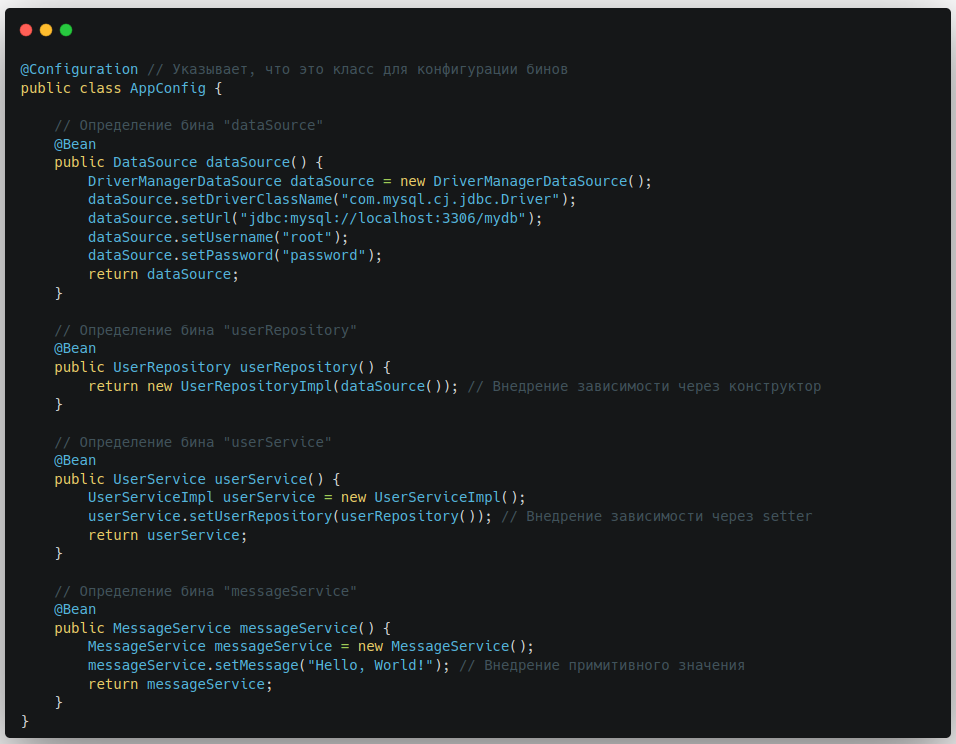

**Преимущества:**
- Полный контроль над созданием бинов.
- Подходит для интеграции с другими библиотеками.

**Недостатки:**
- Требуется больше кода по сравнению с аннотациями.

### Еще существуют другие способы конфигурации:
4) **Groovy-конфигурация** — для лаконичного и динамического подхода.
5) **Программная конфигурация** — для сложных и нестандартных сценариев.
6) **JSR-330** — для совместимости с другими DI-фреймворками.

## Какой вид конфигурации сейчас самый популярный?
**В современных проектах чаще всего используются Аннотации (2) + Java-based (3) конфигурация.**

# 5. Что такое Bean в Spring Framework?
В **Bean** — в Spring Framework это объект, который просто управляется контейнером Spring (например, `ApplicationContext`). 
Эти объекты создаются, настраиваются и управляются Spring'ом в рамках его контейнера IoC (Inversion of Control).

Они могут представлять собой разные класс или любые другие объекты, которые необходимы в нашем приложении.

**Основные характеристики бинов в Spring:**
- Spring управляет созданием, инициализацией и уничтожением бинов. Мы можем настроить методы инициализации и уничтожения с помощью аннотаций `@PostConstruct` и `@PreDestroy` или через XML-конфигурацию.
- Зависимости бина (другие объекты, которые ему нужны для работы) внедряются Spring'ом через Dependency Injection (DI). Это может быть сделано через конструктор, сеттеры или поля.
- Бин может иметь различную область видимости:
    - **Singleton** (по умолчанию) — один экземпляр на весь контейнер Spring.
    - **Prototype** — новый экземпляр при каждом запросе.
    - **Request** — один экземпляр на HTTP-запрос (для веб-приложений).
    - **Session** — один экземпляр на HTTP-сессию (для веб-приложений).
    - **Application** — один экземпляр на `ServletContext` (для веб-приложений).
- Бин может быть сконфигурирован с помощью:
    - XML-файлов.
    - Аннотаций (например, `@Component`, `@Service`, `@Repository`, `@Controller`)
    - Java-кода (через `@Configuration` и `@Bean`).
- Каждый бин должен иметь уникальное имя (идентификатор), которое используется для его поиска в контейнере. Имя может быть задано явно или сгенерировано автоматически.

## Что делает Spring если имя бина не задано? Какие имена будут у бинов?
Если имя не указано явно, Spring генерирует его автоматически.
Для классов с аннотациями `@Component`, `@Service`, `@Repository` имя бина — это имя класса с маленькой буквы.
- Например, для класса `UserService` имя бина будет `"userService"`.

Для методов с аннотацией `@Bean` имя бина — это имя метода.
- Например, для метода `myBean()` имя бина будет `"myBean"`.

**Дополнительные псевдонимы для бинов (несколько имен для бинов):**
Также Spring позволяет задавать **алиасы** (псевдонимы) для бинов. Это дополнительные имена, которые можно использовать для доступа к бину.

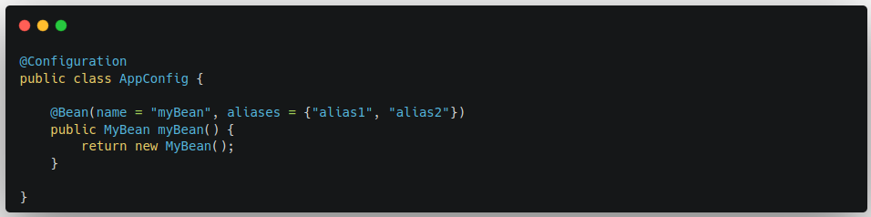

**Теперь бин можно получить по любому из имен**:

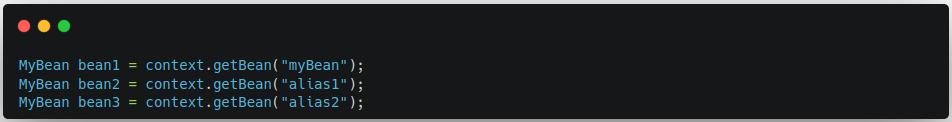

## Исключения при поиске бинов
- Если два бина имеют одинаковое имя, Spring выбрасывает исключение `BeanDefinitionStoreException`.
- Если бин не найден по имени, Spring выбрасывает исключение `NoSuchBeanDefinitionException`.

# 6. Расскажите про аннотацию @Bean?
Аннотация **`@Bean`** в Spring Framework используется над методом для указания того, что метод создает и возвращает объект, который должен быть бином (bean) в контейнере Spring. Этот подход является частью **Java-based конфигурации** и позволяет определять бины программно, вместо использования XML или аннотаций на уровне класса (например, `@Component`, `@Service` и т.д.).

Метод, помеченный `@Bean`, возвращает объект, который Spring регистрирует как бин в своем контексте.  Он позволяет задать логику создания бина, основываясь на каких нибудь условиях. Такой метод создания бинов подходит для сложных сценариев, где требуется полный контроль над созданием объекта. Также такой подход используется для интеграции с библиотеками когда мы не можем поставить аннотацию `@Component` в классе который предоставляется сторонней библиотекой. Например мы не можем создать экземпляр бина `PasswordEncoder` из `BCriptPasswordEncoder` указав в нем аннотацию, так как этот класс предоставляется сторонней библиотекой.

## Когда использовать аннотацию @Bean?
Если создание объекта требует сложной логики (например, настройки параметров, условной логики), метод `@Bean` позволяет реализовать эту логику.

Если класс предоставляется сторонней библиотекой (например, `BCryptPasswordEncoder` из Spring Security), и вы не можете добавить аннотацию `@Component` в этот класс, метод `@Bean` позволяет зарегистрировать объект этого класса как бин.

## Какие параметры может принимать аннотация @Bean?
**Аннотация `@Bean` имеет несколько необязательных параметров:**
1. **`name`** (или `value`):
    - Задает имя бина. По умолчанию имя бина совпадает с именем метода.
    - 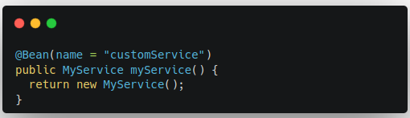
2. **`initMethod`**:
    - Указывает метод, который должен быть вызван после инициализации бина. 
    - 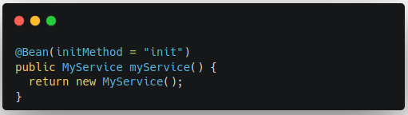
3. **`destroyMethod`**:
    - Указывает метод, который должен быть вызван перед уничтожением бина. 
    - 
4. **`autowire`** (устарел):
    - Раньше использовался для указания способа автопривязки. В современных версиях Spring рекомендуется использовать `@Autowired`.

## Где используется @Bean?
Методы с аннотацией `@Bean` можно использовать как в КЛАССАХ с аннотацией
`@Configuration`, так и в классах с аннотацией `@Component` (или её наследниках).

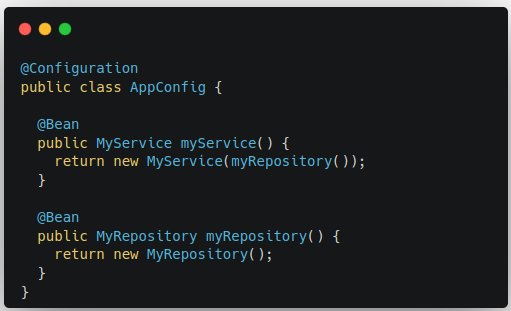

Классы, аннотированные @Configuration, проксируются через CGLib.

Классы @Component или обычные классы не проксируются и не перехватывают вызовы методов с аннотациями @Bean, что означает, что вызовы не будут маршрутизироваться через контейнер и каждый раз будет возвращаться новый экземпляр бина.

Также методы бинов, вызывая друг друга в таких классах, не будут создавать бины, а
будет просто выполняться код метода, т.к. они отработают не через прокси.

CGLib (Code Generation Library) – это библиотека инструментария байтов, используемая во многих средах Java, таких как Hibernate или Spring. Инструментарий
байт-кода позволяет манипулировать или создавать классы «на лету» после фазы
компиляции программы.

Hibernate использует cglib для генерации динамических прокси. Например, он не вернет полный объект, хранящийся в БД, но вернет инструментальную версию хранимого класса, которая лениво загружает значения из базы данных по требованию.
Прокси — это шаблон проектирования. Создаем и используем его для добавления и
изменения функционала УЖЕ существующих классов.

В таком случае, прокси-объект применяется вместо исходного. Обычно он использует тот же метод, что и оригинальный, и в Java прокси-классы расширяют исходные.

# 7. Расскажите про аннотацию @Component?
Аннотация **`@Component`** в Spring Framework используется для обозначения класса как **бина в Spring IoC контейнере**. Классы, помеченные этой аннотацией, автоматически обнаруживаются и регистрируются как бины (beans) в контейнере Spring в процессе сканирования компонентов (`@ComponentScan`).

Spring автоматически обнаруживает классы, помеченные `@Component`, и регистрирует их как бины в контейнере. Позволяет избавиться от необходимости явного объявления бинов в XML или Java-конфигурации.

Spring сканирует классы в указанных пакетах (с помощью `@ComponentScan`) и ищет классы, помеченные `@Component`. Если такой класс найден, Spring создает его экземпляр и регистрирует его как бин.

**Аннотация `@Component` имеет один необязательный параметр:**
- **`value`**: Задает имя бина. Имя бина по умолчанию (если не указываем) совпадает с именем класса, но с маленькой буквы (например, для класса `MyService` имя бина будет `myService`).
## Что такое «Stereotype annotations»?
`@Component` является общей аннотацией для любых компонентов Spring.
На ее основе созданы более специализированные аннотации, такие как `@Service`, `@Repository` и `@Controller`. Их главное отличие – семантика и логическая роль компонентов.

#### **`@Service`**:
- Используется для обозначения сервисного слоя (бизнес-логики).

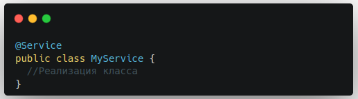

#### **`@Repository`**:
- Используется для обозначения слоя доступа к данным (репозиториев).
- Автоматически преобразует исключения в исключения Spring DataAccessException.
- Spring автоматически применяет аспекты (например, управление транзакциями) к классам, помеченным `@Repository`.

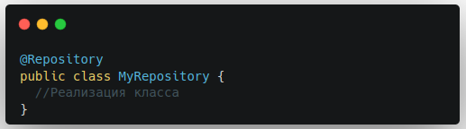

Когда вы используете `@Repository`, Spring подключает **перехватчик исключений** (exception translator), который:
1. Перехватывает исключения, возникающие в классе (например, `SQLException`).
2. Преобразует их в соответствующие исключения Spring DataAccessException.

Если в методе репозитория возникает `SQLException`, Spring преобразует его в `DataAccessException` (например, `CannotAcquireLockException`, `DataIntegrityViolationException` и т.д.).

- Вместо того чтобы обрабатывать множество специфичных исключений (например, `SQLException`, `HibernateException`), вы работаете с унифицированными исключениями Spring.
- Не нужно писать сложные блоки `try-catch` для обработки исключений, специфичных для конкретной технологии (например, JDBC, Hibernate).

#### **`@Controller` и `@RestController`**:
- Используются для обозначения веб-контроллеров в Spring MVC. 
- @Controller - может передавать данные и представление(view).
- @RestController - передает только данные, без представления (view).

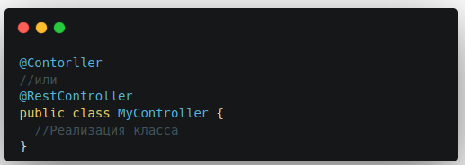

#### **`@Configuration`**:
- Используется для классов, содержащих конфигурацию бинов (методы с `@Bean`).

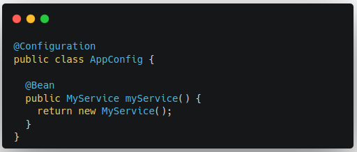

### Когда использовать `@Component`?
- Когда мы хотим, чтобы Spring автоматически обнаруживал и регистрировал классы как бины. И если класс не относится к сервисам (@Service), репозиториям(@Repository) или контроллерам(@Controller/@RestController), но должен быть управляемым бином.

# 8. Чем отличаются аннотации @Bean и @Component?

### @Component
Также как производные от него аннотации такие как @Service и @Repository, используется для АВТОМАТИЧЕСКОГО обнаружения и автоматической настройки бинов в ходе сканирования путей к классам.

### @Bean
Используется для ЯВНОГО объявления бина, а не для того, чтобы Spring делал
это автоматически в ходе сканирования путей к классам:
- прописываем вручную метод для создания бина
- возможно объявить бин независимо от объявления класса, что позволяет использовать классы из сторонних библиотек, у которых не можем указать аннотацию @Component
- с аннотацией @Bean также можно настроить initMethod, destroyMethod, autowireCandidate, делая создание бина более гибким

# 9. Расскажите про аннотации @Service и @Repository. Чем они отличаются?
`@Service` и `@Repository` являются производными аннотациями от `@Component`. Технически они одинаковы, но используются их для определения разных типов бинов.

### Аннотация @Service
Указывает, что используем сервис-слой, отвечающий за бизнес-логику.

### Аннотация @Repository
Указывает на то, что класс предоставляет механизм для CRUD операций: для хранения, извлечения, поиска, обновления и удаления операций с объектами. Этот слой отвечает за доступ к данным.

CRUD это обозначение операций таких как CREATE, READ, UPDATE, DELETE.

Аннотация `@Repository` в Spring Data упрощает реализацию доступа к данным, сокращая объем шаблонного кода для работы с различными хранилищами, а также автоматически перехватывает исключения персистентности (Persistence Exception) и пробрасывать их как одно непроверяемое исключение Spring Framework.

Для этого в контекст должен быть добавлен класс PersistenceExceptionTranslationPostProcessor.
# 10. Расскажите про аннотацию @Autowired
Аннотация **`@Autowired`** в Spring Framework используется для **автоматического внедрения зависимостей** (Dependency Injection, DI). Мы можем пометить место куда Spring автоматически найдет и подставит подходящий бин (beans). Данной аннотацией мы можем помечать поля, конструкторы или методы класса.

- Spring автоматически находит подходящий бин в контейнере и внедряет его в поле, конструктор или метод.
- Избавляет от необходимости вручную создавать объекты или искать зависимости.
- Поддерживает внедрение через поля, конструкторы, сеттеры и даже произвольные методы.

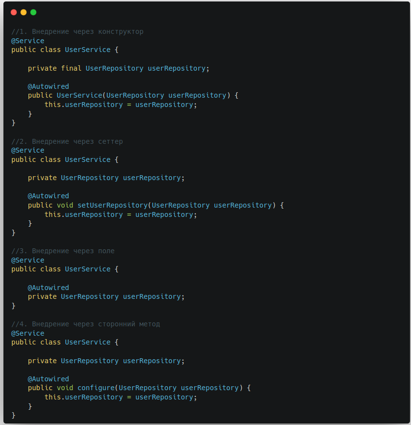

За обработку `@Autowired` отвечает BeanPostProcessor (соответствует этапу ЖЦ бина).

То есть фактическое внедрение выполняется через BeanPostProcessor, что, в свою
очередь, означает, что нельзя использовать `@Autowired` для внедрения ссылок в типы `BeanPostProcessor` или `BeanFactoryPostProcessor`.

По умолчанию проверяет наличие аннотации `@Autowired` класс `AutowiredAnnotationBeanPostProcessor`.

Начиная со Spring 4.3, аннотация `@Autowired` для конструкторов больше не требуется, если в классе переменную определяет только один конструктор. Если у нас в классе существует 
несколько конструкторов, которые внедряют компонент, то тогда следует указать аннотацию, чтобы дать понять Spring'у какой конструктор ему следует использовать для внедрения. 
Получается в таком случае требуется пометить как минимум один констурктор данной аннотацией.

Аннотация `@Autowired` также принимает необязательный логический аргумент с именем **required**. По умолчанию его значение равно true. Можно явно установить для него значение **false**, для которого Spring не будет генерировать исключение при сбое
автоматического подключения: `@Autowired(required = false)`.

##### **По умолчанию Spring распознает объекты для вставки по ТИПУ. Если в контейнере доступно более одного бина одного и того же типа, будет выброшено исключение. Чтобы этого избежать можно указать аннотацию **`@Qualifier`**, тем самым указав какой именно бин нужно внедрить.**

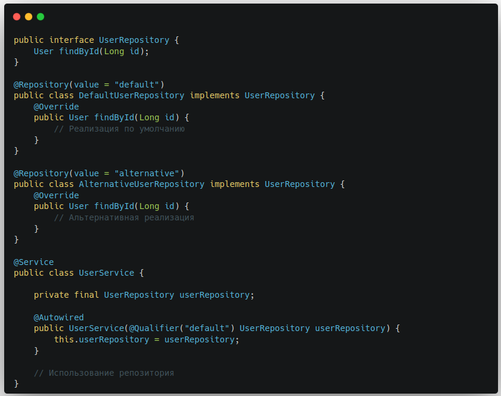

При выборе между несколькими бинами при автоматическом внедрении используется имя поля. 

# 11. Расскажите про аннотацию @Resource
Аннотация **`@Resource`** — это стандартная аннотация из пакета **`javax.annotation`**, которая используется для внедрения зависимостей в Java-приложениях. 
Она является частью стандарта **JSR-250** (Common Annotations for the Java Platform) и может использоваться в любом Java-приложении, включая Spring-приложения. 
Spring Framework также поддерживает данную аннотацию, она работает почти так же как и аннотация `@Autowired`. Ее можно использовать если мы хотим заменить реализацию IoC и DI на другую. 
Но все же рекомендуется использовать аннотацию, которую предоставляет сам Spring - `@Autowired`.

Аннотация `@Resource` используется для **внедрения зависимостей** (Dependency Injection, DI). Она позволяет:
1. Внедрять бины по **имени**.
2. Внедрять бины по **типу**, если имя не указано.

`@Resource` можно также ставить на:
- **Полям** (field injection).
- **Сеттерам** (setter injection).
- **Методам** (method injection).
- ~~**Конструкторы** (constructors)~~

### **`@Resource`** **нельзя ставить на конструктор класса**.
Аннотация `@Resource` предназначена для внедрения зависимостей в **поля** (fields) и **сеттеры** (setter methods).  Если нужно внедрение через конструктор, то данная аннотация уже не подходит.

По умолчанию `@Resource` ищет бин по имени (name), а если имя не указано, то по типу (type).
### Пример использования на поле:

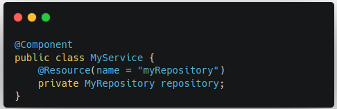

### Пример использования на сеттере:

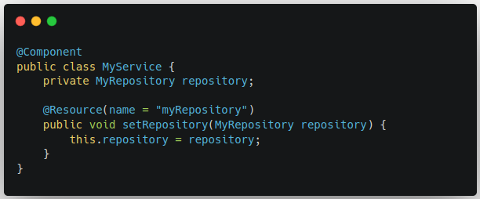

**Поиск по имени**:
- Если указано имя (например, `@Resource(name = "myRepository")`), Spring ищет бин с этим именем в контексте.
- Если бин с таким именем не найден, выбрасывается исключение `NoSuchBeanDefinitionException`.

**Поиск по типу**:
- Если имя не указано, Spring ищет бин по типу поля или параметра метода.
- Если найдено несколько бинов одного типа, Spring выбрасывает исключение `NoUniqueBeanDefinitionException`.

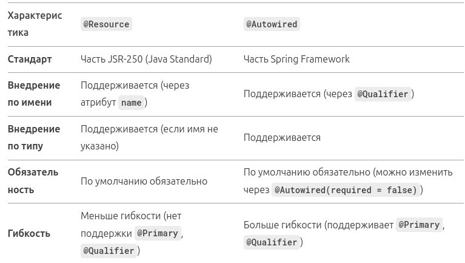

## Что такое JSR-250 и как с ним связан Spring? (доп.вопрос "немного информации про спецификацию JSR-250") Знать совсем не обязательно! Для общего контекста.
**JSR-250** — это **Java Specification Request** (спецификация Java), которая определяет набор общих аннотаций для платформы Java. Эти аннотации предназначены для упрощения разработки и стандартизации некоторых аспектов Java-приложений. Spring Framework поддерживает многие аннотации из JSR-250, что позволяет разработчикам использовать их в своих приложениях.

JSR-250, также известный как **Common Annotations for the Java Platform**, был выпущен в 2006 году. Он включает аннотации, которые могут использоваться в различных Java-приложениях, включая:
- **Управление жизненным циклом** (например, `@PostConstruct`, `@PreDestroy`).
- **Внедрение зависимостей** (например, `@Resource`).
- **Безопасность** (например, `@RolesAllowed`, `@PermitAll`, `@DenyAll`).

Эти аннотации являются частью пакета **`javax.annotation`** и могут использоваться в любом Java-приложении, включая Spring, Java EE (Jakarta EE) и другие фреймворки.

**Основные аннотации JSR-250**
1. **Общие аннотации:**
    - `@ManagedBean`: Указывает, что класс является управляемым компонентом (managed bean).
    - `@Named`: Альтернативная аннотация для `@ManagedBean`.
2. **Аннотации для управления жизненным циклом:**
    - `@PostConstruct`: Вызывается после создания компонента и инъекции зависимостей, перед началом его использования.
    - `@PreDestroy`: Вызывается непосредственно перед уничтожением компонента.
3. **Аннотации для инъекции ресурсов:**
    - `@Resource`: Инъекция ресурса (например, объекта типа `DataSource`, `SessionContext` и др.).
    - `@Resources`: Контейнерная аннотация для нескольких аннотаций `@Resource`.
4. **Аннотации для безопасности:**
    - `@RolesAllowed`: Ограничивает доступ к методу или классу для указанных ролей.
    - `@PermitAll`: Разрешает доступ ко всем пользователям.
    - `@DenyAll`: Запрещает доступ всем пользователям.
    - `@DeclareRoles`: Декларирует роли, используемые в приложении.
    - `@RunAs`: Изменяет идентичность текущего пользователя на указанную роль.

**Поддерживаемые аннотации:**
Spring Framework активно использует многие аннотации из JSR-250. Например:
- **`@Resource`**: Используется для инъекции зависимостей, аналогично `@Autowired` в Spring.
- **`@PostConstruct`, `@PreDestroy`**: Используются для инициализации и завершения работы бинов.
- **`@RolesAllowed`, `@PermitAll`, `@DenyAll`**: Применяются для управления доступом к методам на основе ролей.

**Исключения и особенности:**
Однако не все аннотации JSR-250 поддерживаются Spring Framework напрямую. Некоторые из них требуют дополнительной настройки или использования сторонних библиотек.

Например:
- **`@RunAs`**: Эта аннотация используется для изменения идентичности вызывающего субъекта. В Spring Security она заменяется механизмом аутентификации и авторизации, который позволяет гибко управлять пользователями и ролями.
- **`@DeclareRoles`**: Аннотация предназначена для объявления ролей в EJB-контейнерах. В Spring эта функциональность реализуется через конфигурацию безопасности.

# 12. Расскажите про аннотацию @Inject
Аннотация `@Inject` является частью стандарта JSR-330 (Dependency Injection for Java) и предоставляет альтернативу аннотации `@Autowired` из Spring. 
Она используется для внедрения зависимостей и может быть применена в любом фреймворке, который поддерживает этот стандарт (например, Spring, Guice и другие).

Spring полностью поддерживает @Inject, так как реализует стандарт JSR-330.

@Inject по функционалу очень похож на @Autowired его также можно использовать для внедрения зависимостей через:
- Конструктор
- Сеттер
- Поле
- Произвольный метод

Аннотация @Inject определена в пакете `javax.inject`, который является частью стандарта JSR-330. 
Чтобы использовать эту аннотацию, необходимо добавить соответствующую зависимость в проект (Maven пример).

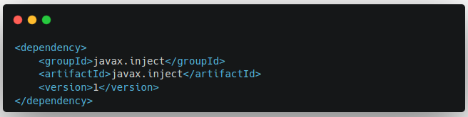

Пакет `javax.inject` содержит несколько аннотаций и интерфейсов для внедрения зависимостей:
- `@Inject`: Основная аннотация для внедрения зависимостей.
- `@Named`: Аннотация для указания имени бина (аналог @Qualifier в Spring).
- `@Qualifier`: Мета-аннотация для создания кастомных квалификаторов.
- `@Scope`: Мета-аннотация для создания кастомных областей видимости бинов.
- `@Singleton`: Аннотация для указания, что бин должен быть синглтоном.

Если используется другой фреймворк, который требует явного наличия javax.inject (например, Guice). То тогда нужно добавить зависимость.

Но если используется Spring, то начиная с версии 3.0 он поддерживает стандарт JSR-330 (javax.inject) "из коробки". 
Это означает, что Spring предоставляет свою собственную реализацию `@Inject`, и не нужно добавлять отдельную зависимость `javax.inject`.

В контексте Spring Framework аннотация `@Inject` может быть использована как альтернатива `@Autowired`. Основное различие заключается в том, что `@Inject` 
является стандартизированной аннотацией, тогда как `@Autowired` — это собственная реализация механизма внедрения зависимостей от Spring.

`@Inject`, как и `@Autowired` в первую очередь пытается подключить зависимость по типу, затем по описанию и только потом по имени. Это означает, что даже если имя
переменной ссылки на класс отличается от имени компонента, но они одинакового типа, зависимость все равно будет разрешена.

Если в контейнере несколько бинов-кандидатов на внедрение, то нужно использовать аннотацию `@Qualifier` вместе с `@Inject`. 

Если используется @Inject (из JSR-330), то вместо `@Qualifier` можно использовать аннотацию `@Named` (также из JSR-330).
`@Named` — это аналог `@Qualifier` из JSR-330. Он позволяет указать имя бина, который нужно внедрить.

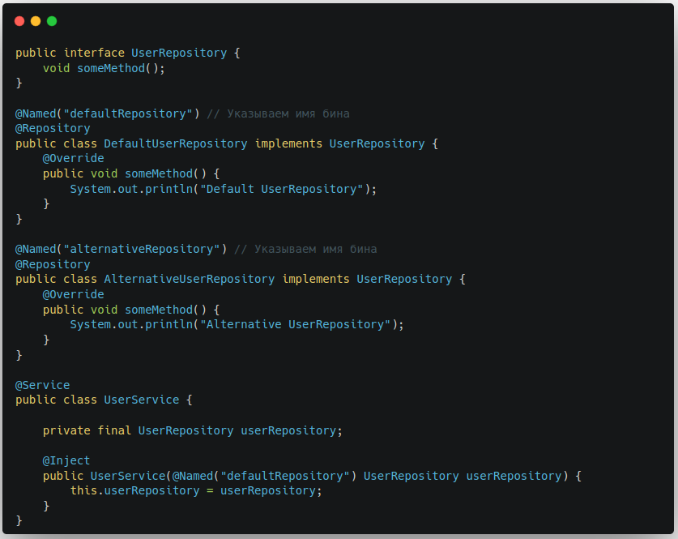

# 13. Расскажите про аннотацию @Lookup
Аннотация **`@Lookup`** в Spring Framework используется для внедрения **прототипных бинов** (бинов с областью видимости `prototype`) в **синглтон-бины** (бины с областью видимости `singleton`). Это позволяет решить проблему, когда синглтон-бин должен использовать прототипный бин, но при этом каждый раз получать новый экземпляр прототипного бина.

В Spring:
- **Синглтон-бин** создается один раз, и один и тот же экземпляр используется на протяжении всего жизненного цикла приложения.
- **Прототипный бин** создается каждый раз заново при запросе из контекста.

Если синглтон-бин зависит от прототипного бина, то по умолчанию прототипный бин будет внедрен только один раз (при создании синглтон-бина). Это означает, что синглтон-бин будет использовать один и тот же экземпляр прототипного бина, что может быть нежелательно.

Аннотация `@Lookup` позволяет синглтон-бину каждый раз получать новый экземпляр прототипного бина. Spring создает прокси-объект, который переопределяет метод, помеченный `@Lookup`, и каждый раз возвращает новый экземпляр прототипного бина.

Имеется бин Car — синглтон (singleton bean), и ему
требуется каждый раз новый экземпляр бина Passenger (каршеринг).

То есть Car – синглтон, а Passenger – так называемый прототип-бин (prototype bean).

Жизненные циклы бинов разные. Бин Car создается контейнером только раз, а
бин Passenger создается каждый раз новый – допустим, это происходит каждый раз при вызове какого-то метода бина Car.

Вот здесь то и пригодится внедрение бина с помощью Lookup метода.

Оно происходит не при инициализации контейнера, а позднее: каждый раз, когда
вызывается метод.

Создаётся метод-заглушка в бине Car и помечается специальным образом – аннотацией `@Lookup`. Этот метод должен возвращать бин Passenger, каждый раз новый.

Контейнер Spring под капотом создаст подкласс и переопределит этот метод и будет
выдавать новый экземпляр бина Passenger при каждом вызове аннотированного метода. Даже если в заглушке он возвращает null (а так и надо делать, все равно этот метод будет переопределен).

**Пример реализации:**
Создадим класс `Passenger`, который будет прототипным бином. Это означает, что каждый раз, когда мы запрашиваем этот бин, Spring будет создавать новый экземпляр.

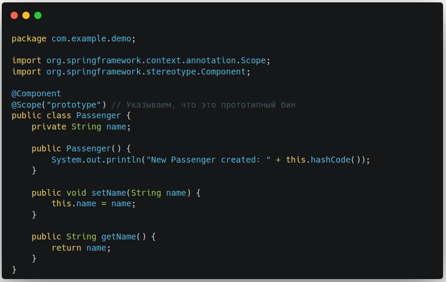

Теперь создадим класс `Car`, который будет синглтон-бином. В этом классе мы добавим метод, помеченный аннотацией `@Lookup`, чтобы каждый раз получать новый экземпляр `Passenger`.

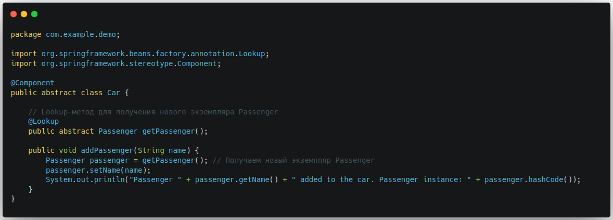

**Как использовать `@Lookup`?**
1. Создайте прототипный бин.
2. В синглтон-бине создайте абстрактный метод (или метод с пустой реализацией), помеченный аннотацией `@Lookup`.
3. Spring автоматически переопределит этот метод и будет возвращать новый экземпляр прототипного бина при каждом вызове.

#### **Почему метод должен быть абстрактным?**
Метод, помеченный `@Lookup`, должен быть абстрактным или иметь пустую реализацию, потому что Spring переопределяет его на уровне прокси. В нашем примере метод `getPassenger()` абстрактный, и Spring автоматически реализует его, чтобы возвращать новый экземпляр `Passenger`.

#### **Альтернативный подход: использование `ApplicationContext`**
Если вы не хотите использовать `@Lookup`, можно внедрить `ApplicationContext` и вручную запрашивать прототипный бин:

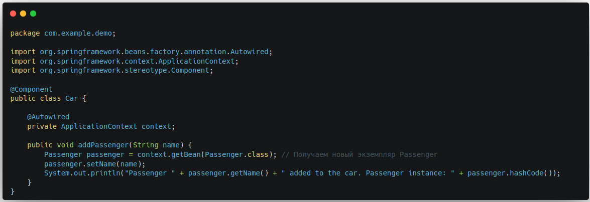

# 14. Как работает инъекция прототипа в синглтон?
Вопрос касается также различия области видимости (скоупов) singleton и prototype в
Spring Framework. Допустим ситуацию, когда в singleton-компонент внедряется
зависимость со scope prototype – когда будет создан её объект?

Если просто добавить к определению бина аннотацию @Scope(SCOPE_PROTOTYPE),
и использовать этот бин в синглтоне через аннотацию @Autowired – будет создан только один объект. Потому что синглтон создается только однажды, и обращение к прототипу случится тоже однажды при его создании (при внедрении зависимости).

Примитивный способ получать новый объект при каждом обращении – отказаться
от @Autowired, и доставать его из контекста вручную, вызывая `context.getBean(MyPrototype.class)`.  **Пример этого подхода написан выше.**

Воспользоваться автоматическим внедрением зависимостей можно через внедрение
метода (паттерн «Команда»). Внедряется не сам объект, а производящий его метод.

Команда (Command) — поведенческий шаблон проектирования, используемый при ООП, для обработки команды в виде объекта и представляющий ДЕЙСТВИЕ. То есть Объект команды заключает в себе само действие и его параметры.

По умолчанию его значение NO – прокси не создается. Но если указать INTERFACES
или TARGET_CLASS, то под @Autowired будет внедряться не сам объект, а
сгенерированный фреймворком прокси.

И когда проксируемый бин имеет скоуп prototype, то объект внутри прокси будет
пересоздаваться при каждом обращении.

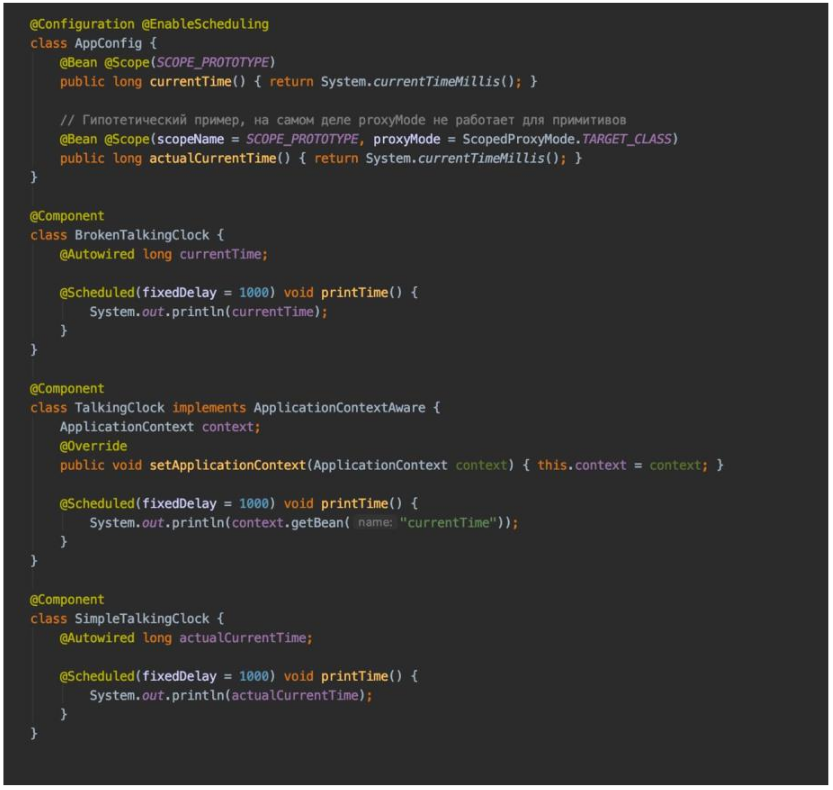

# 15. Можно ли вставить бин в статическое поле? Почему?
В Spring Framework не рекомендуется внедрять бины в статические поля напрямую. Это связано с тем, что Spring управляет 
жизненным циклом бинов через механизм Dependency Injection (DI), который работает с объектами, а не с статическими контекстами.

- Статические поля не принадлежат какому-либо объекту, и Spring не может управлять их жизненным циклом.
- Статические поля усложняют тестирование, так как они являются глобальными и могут сохранять состояние между тестами.
- Статические поля могут вызывать проблемы в многопоточных приложениях, если к ним одновременно обращаются несколько потоков.

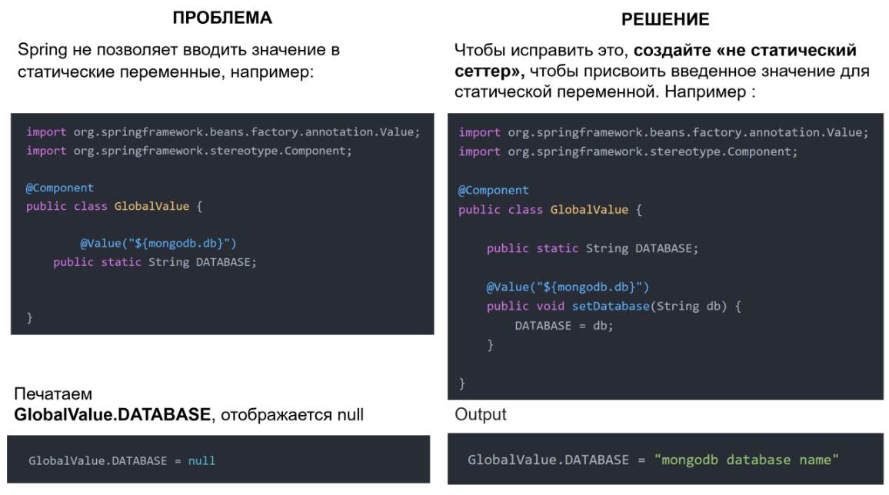

Также существуют еще несколько других подходов как это можно сделать если все таки требуется внедрить зависимость в статическое поле.

# 16. Расскажите про аннотации @Primary и @Qualifier
Аннотации **`@Primary`** и **`@Qualifier`** в Spring Framework используются для управления **внедрением зависимостей**, когда в контексте Spring существует несколько бинов одного типа. Они помогают Spring понять, какой именно бин нужно внедрить, если есть несколько кандидатов.

**`@Primary`**:
- Указывает предпочтительный бин, который будет выбран по умолчанию, если есть несколько бинов одного типа. Полезен, когда один бин используется чаще других.

**`@Qualifier`**:
- Позволяет явно указать, какой бин нужно внедрить. Полезен, когда нужно выбрать конкретный бин из нескольких кандидатов.

#### **Аннотация @Primary**
Аннотация `@Primary` указывает, что данный бин должен быть **предпочтительным** (primary) при внедрении, если существует несколько бинов одного типа. Если Spring находит несколько бинов одного типа, он выбирает бин, помеченный `@Primary` как бин по умолчанию.

**Когда использовать `@Primary`?**
Когда у вас есть несколько реализаций одного интерфейса или класса, и вы хотите указать, какая из них должна использоваться по умолчанию.

Теперь, если вы внедряете `MyService`, Spring выберет `PrimaryService`:

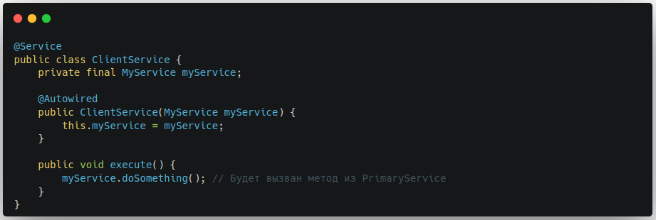

#### **Аннотация @Qualifier**
- Аннотация `@Qualifier` позволяет **явно указать**, какой именно бин нужно внедрить, если существует несколько бинов одного типа. Она используется вместе с `@Autowired` для уточнения, какой бин следует выбрать.

**Когда использовать `@Qualifier`?**
Когда у вас есть несколько бинов одного типа, и вы хотите явно указать, какой из них использовать в конкретном месте.

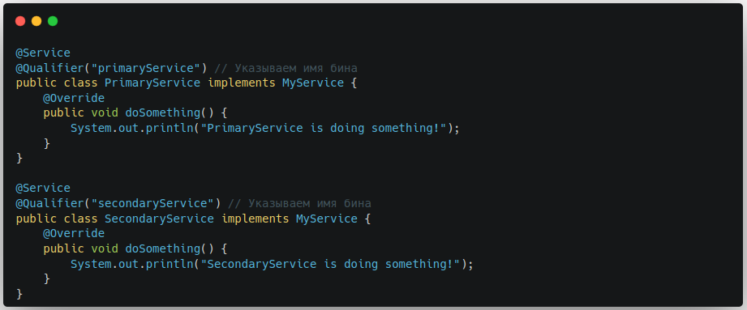

Теперь вы можете указать, какой бин использовать, с помощью `@Qualifier`:

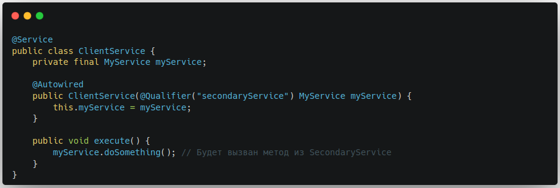

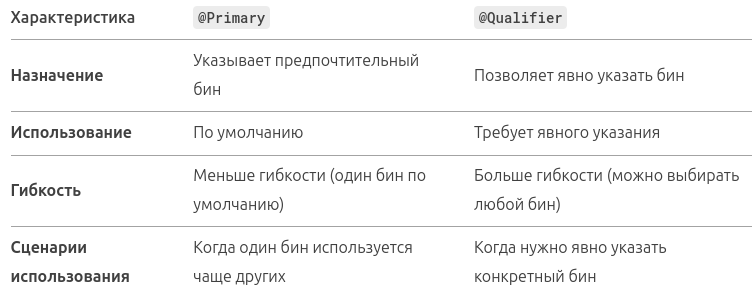

Вы можете использовать `@Primary` и `@Qualifier` вместе. В этом случае `@Qualifier` имеет приоритет над `@Primary`.

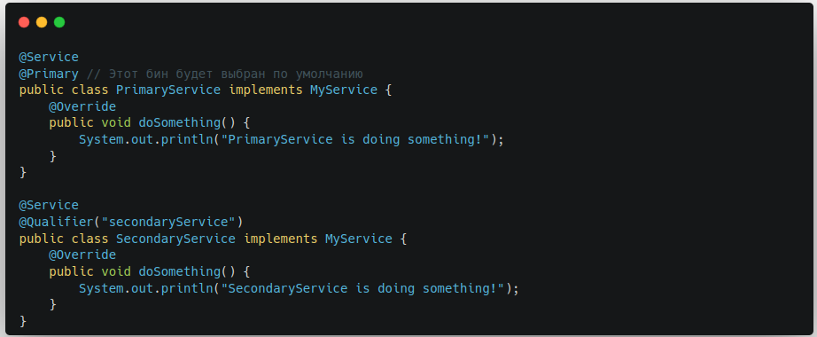

# 17. Как заинжектить примитив? Аннотация @Value
Spring Framework для внедрения примитивных значений (например, строк, чисел, булевых значений) или значений из конфигурационных файлов используется аннотация **`@Value`**. 

Эта аннотация позволяет внедрять значения из различных источников, таких как:
- **Файлы конфигурации** (например, `application.properties` или `application.yml`).
- **Системные переменные**.
- **Выражения SpEL** (Spring Expression Language).

SpEL (Spring Expression Language) — это мощный язык выражений, который интегрирован в Spring Framework. Он позволяет динамически вычислять значения, 
обращаться к свойствам объектов, вызывать методы и выполнять другие операции во время выполнения (runtime). SpEL используется в различных контекстах Spring, 
таких как конфигурация бинов, аннотации, безопасность и другие.

SpEL часто используется с аннотацией `@Value` для внедрения значений в поля.
Также SpEL активно используется в Spring в следующих контекстах:
- Аннотации: Например, @Value, @PreAuthorize, @PostAuthorize.
- Конфигурация XML: В Spring XML-конфигурациях.
- Spring Security: Для выражений в правилах безопасности.
- Шаблонизация: Например, в Thymeleaf или Spring MVC.

Пример использования SpEL c аннотацией `@Value`:

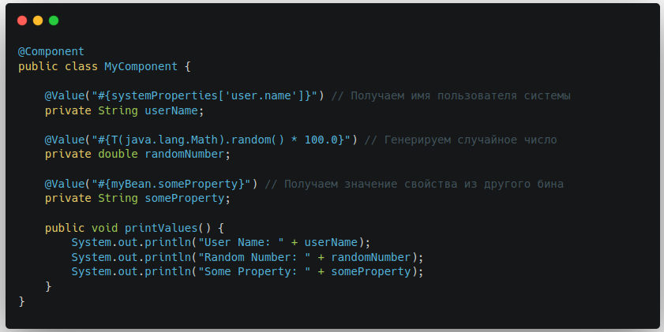

Аннотация `@Value` в Spring Framework позволяет:
- Внедрять примитивные значения (строки, числа, булевы значения).
- Использовать значения из конфигурационных файлов (`application.properties`, `application.yml`).
- Внедрять системные переменные.
- Использовать выражения SpEL для вычисления значений.

### **Как работает `@Value`?**
Аннотация `@Value` может быть применена к:
- **Полям**.
- **Параметрам конструктора**.
- **Методам**.

#### **Внедрение значения из конфигурационного файла**
Предположим, у нас есть файл `application.properties`:

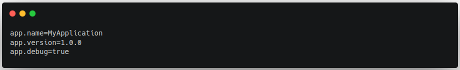

Теперь мы можем внедрить эти значения в ваш класс:

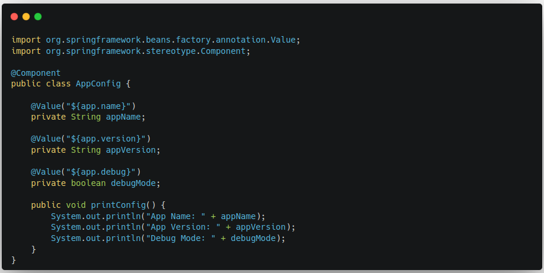

Если значение не найдено в конфигурации, можно указать значение по умолчанию:

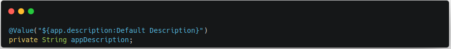

#### **Внедрение Map из файла свойств**
Предположим, у нас есть файл `application.properties` с такими свойствами:

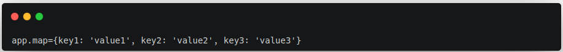

Теперь мы можем внедрить это значение в виде `Map`:

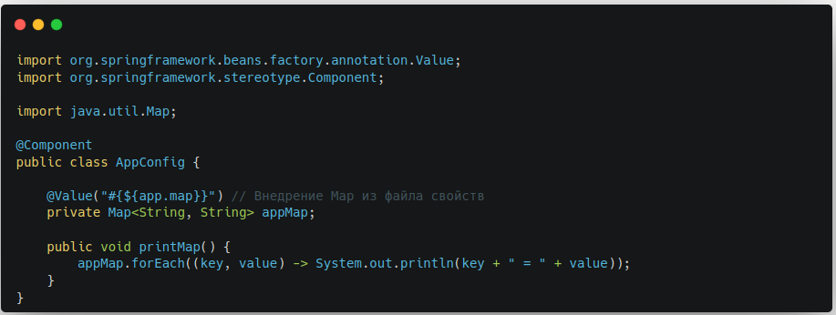

#### **Внедрение значения по ключу**
Если нам нужно извлечь значение по конкретному ключу, мы можете сделать это так:

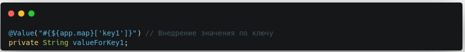

### **Безопасное извлечение значения (без исключений)**
Если мы не уверены, что ключ существует, можно использовать более безопасное выражение, которое вернет `null`, если ключ не найден:

#### **Фильтрация записей Map**
Если нам нужно отфильтровать записи `Map` перед внедрением (например, выбрать только те, где значение больше 1), можно использовать SpEL (Spring Expression Language):

Предположим, у нас есть такие свойства:

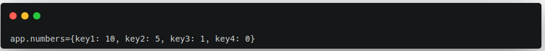

Теперь мы можем отфильтровать записи:

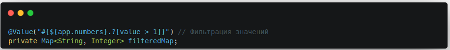

Вывод:

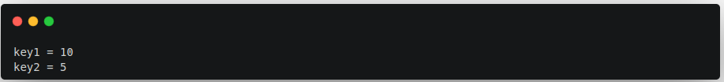

#### **Внедрение системных переменных**
Мы можем внедрить значение системной переменной:

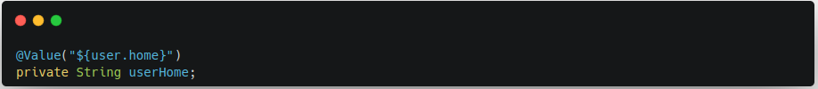

#### **Внедрение всех системных свойств**
Мы можем внедрить все текущие системные свойства в `Map` с помощью SpEL:

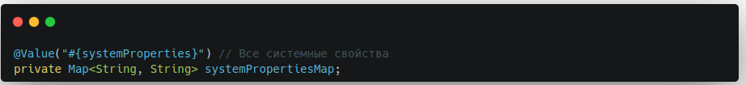

Теперь `systemPropertiesMap` будет содержать все системные свойства, такие как `java.version`, `user.home` и т.д.

#### **Внедрение через SpEL (Spring Expression Language)**
Мы можем использовать SpEL для вычисления значений:

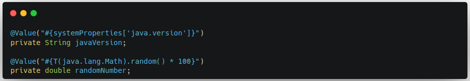

### **Использование `@Value` с конструкторами и методами**
#### **Внедрение через конструктор**

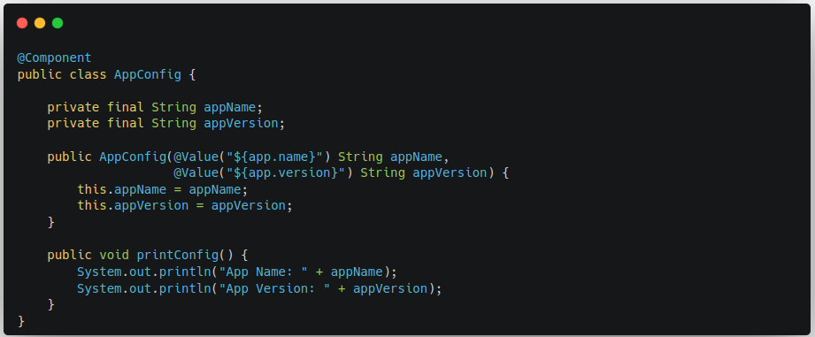

#### **Внедрение через метод**

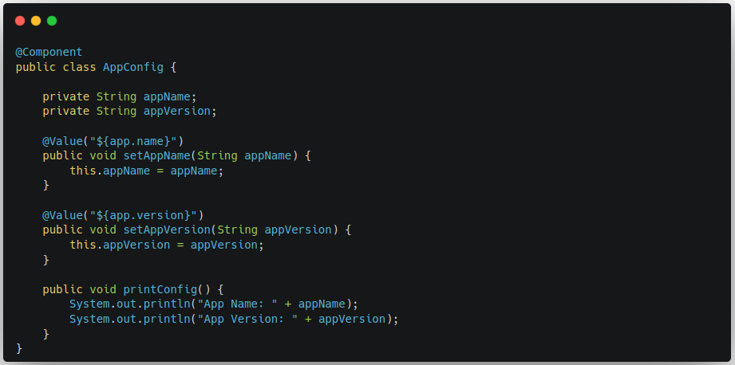

### **Пример с YAML-конфигурацией**
Если мы используем YAML-конфигурацию (`application.yml`), синтаксис внедрения будет немного другим:
##### **Обычные значения и YAML-файл**
Пример yaml-файла:

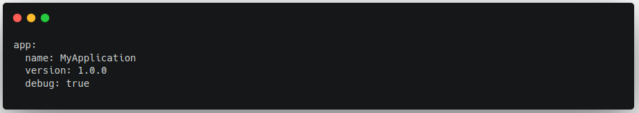

Внедрение значений из файла:

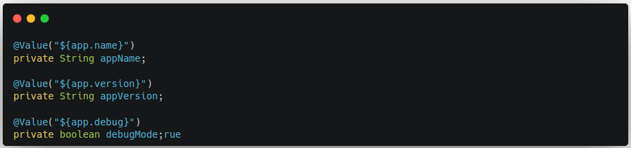

Мы можем внедрять массивы или списки, используя SpEL:

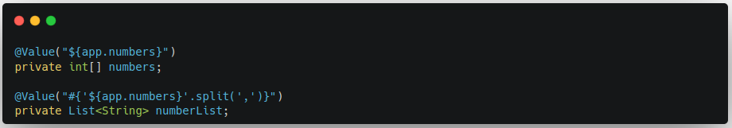

SpEL (Spring Expression Language) в сочетании с аннотацией @Value предоставляет мощный и гибкий механизм для внедрения 
значений в Spring-приложения. Этот инструмент позволяет получать данные из различных источников, включая системные 
свойства, переменные окружения, другие бины, коллекции, результаты методов и даже сложные выражения.

# 18. Как заинжектить коллекцию?
В Spring Framework можно внедрять коллекции (например, `List`, `Set`, `Map`) с использованием аннотации **`@Value`** или **`@Autowired`**. 
Это позволяет нам работать с набором значений, которые могут быть заданы в конфигурационных файлах, через SpEL (Spring Expression Language) или как бины.

### **Внедрение коллекции с помощью `@Value`**
##### **Внедрение `List` или `Set`**
Предположим, у нас есть файл `application.properties` с такими свойствами:

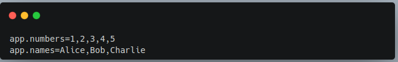

Теперь мы можем внедрить эти значения в `List` или `Set`:

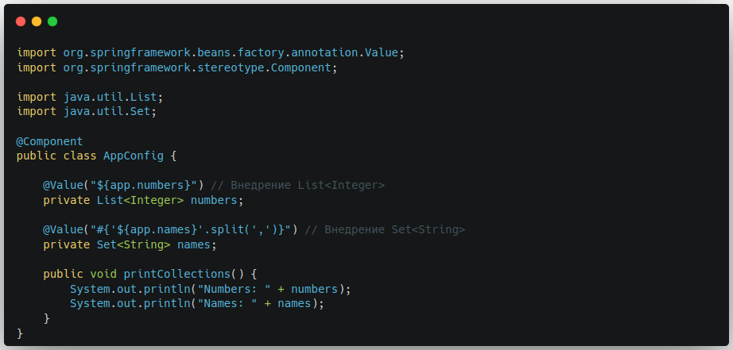

##### **Внедрение `Map`**
Если у нас есть свойства в формате `key:value`, вы можете внедрить их в `Map`.
**Примеры есть выше, в ответе на предыдущий вопрос!**

### **Внедрение коллекции бинов с помощью `@Autowired`**
Если у нас есть несколько бинов одного типа, вы можете внедрить их в коллекцию (например, `List`, `Set`, `Map`) с помощью `@Autowired`.

##### **Внедрение `List` или `Set`**
Предположим, у нас есть несколько бинов, реализующих интерфейс `MyService`:

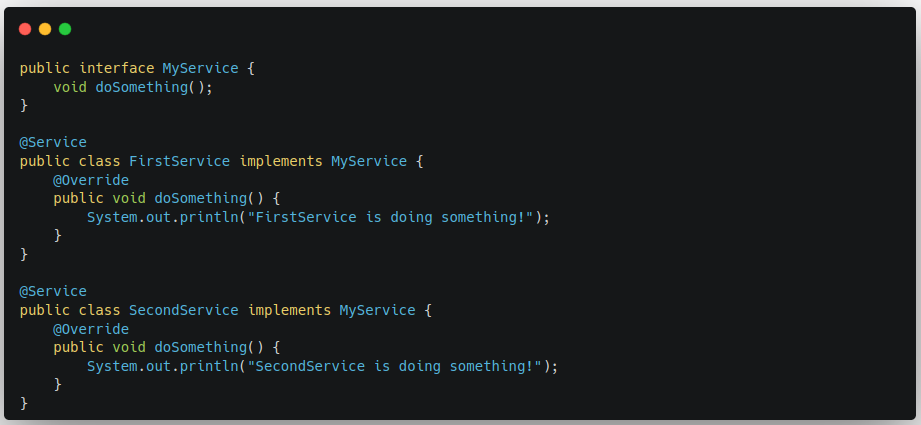

Теперь мы можем внедрить все бины типа `MyService` в `List` или `Set`:

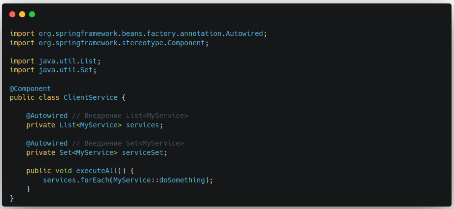

#### **Внедрение `Map`**
Если мы хотим внедрить бины в `Map`, где ключом будет имя бина, а значением — сам бин, вы можете сделать это так:

#### **Внедрение коллекции с использованием SpEL**
Мы можем также использовать SpEL (Spring Expression Language) для более сложных сценариев, таких как фильтрация или преобразование коллекций.

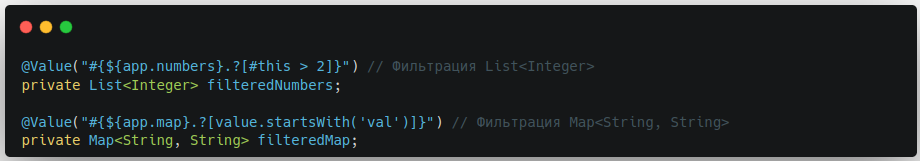

#### **Внедрение коллекции с использованием `@Bean` и `@Configuration`**
Мы можем создать коллекцию в конфигурационном классе и внедрить ее как бин:

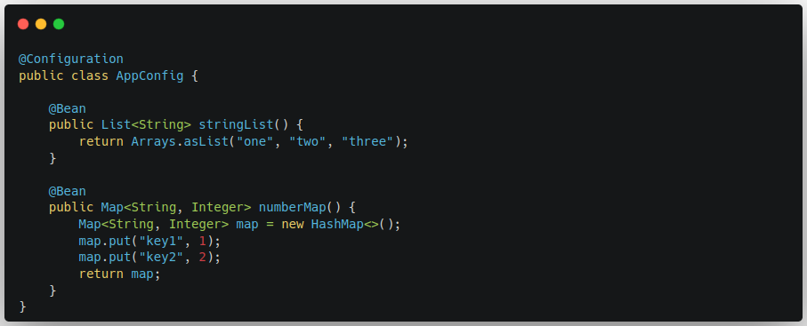

Теперь мы можем внедрить эти коллекции в другие бины:

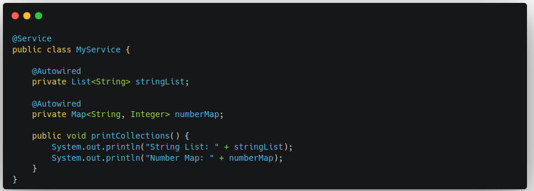

#### **Использование @Order для упорядочивания бинов в коллекции**
Бины могут быть упорядочены, когда они вставляются в СПИСОК (не Set или Map) или массив.

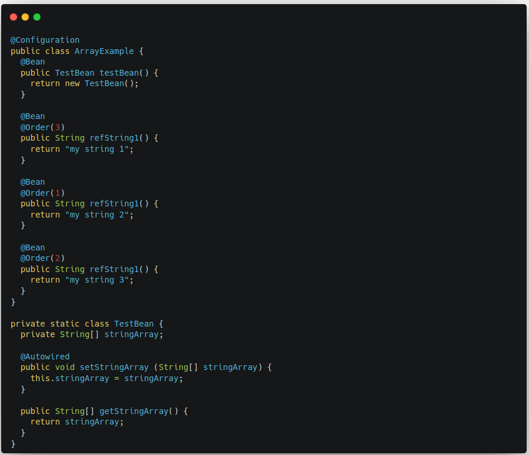

Массив будет выглядеть так:

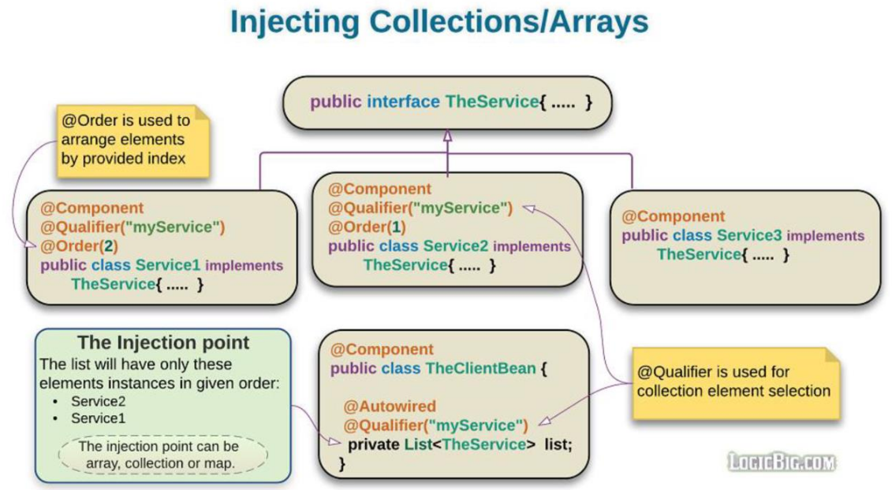

# 19. Расскажите про аннотацию @Conditional
Аннотация **`@Conditional`** в Spring Framework используется для **условного создания бинов**. Она позволяет 
определить условия, при которых бин должен быть создан и зарегистрирован в контексте Spring. Это особенно полезно в 
сценариях, где требуется включить или исключить бины на основе определенных условий.

Аннотация `@Conditional` принимает один или несколько классов, реализующих интерфейс **`Condition`**. Эти классы определяют логику, которая проверяет, должно ли создаваться условие для создания бина.

### **Функциональный интерфейс Conditional:**

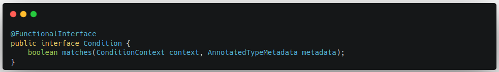

### **Метод matches**:
- Возвращает `true`, если условие выполнено, и бин должен быть создан. Или возвращает `false`, если условие не выполнено, и бин не должен быть создан.

**Аргумент ConditionContext**: Предоставляет доступ к контексту Spring (например, к `BeanFactory`, `Environment`, `ResourceLoader`).

**Аргумент AnnotatedTypeMetadata**: Предоставляет доступ к метаданным аннотации (например, атрибуты аннотации).

### **Пример использования:**
Предположим, мы хотите создать бин только в том случае, если в окружении установлено свойство `app.feature.enabled=true`.

Создадим класс, реализующий `Condition`:

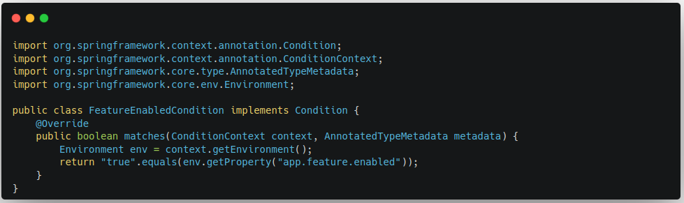

Теперь вы можете использовать `@Conditional` для создания бина только при выполнении условия:

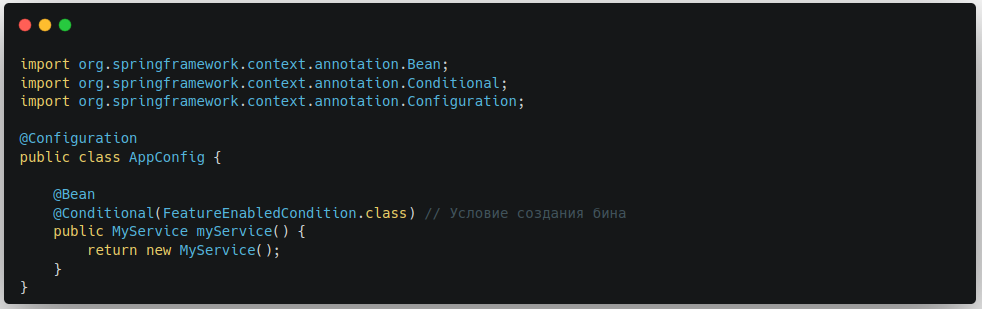

Создав свой класс и переопределив в нем метод `matches()` с нашей логикой, необходимо передать этот класс в аннотацию `@Conditional` в качестве параметра.

Если свойство `app.feature.enabled=true`, бин `myService` будет создан. В противном случае бин не будет зарегистрирован в контексте.

Если класс `@Configuration` помечен как `@Conditional`, то на все методы `@Bean`,
аннотации `@Import` и аннотации `@ComponentScan`, связанные с этим классом, также
будут распространяться указанные условия.

Для более детальной настройки классов, аннотированных `@Configuration`, предлагается использовать интерфейс `ConfigurationCondition`.

В одном классе – одно условие. Для создания более сложных условий можно
использовать классы `AnyNestedCondition`, `AllNestedConditions` и `NoneNestedConditions`.

#### **Встроенные условия в Spring**
В Spring Framework имеется множество готовых аннотаций (и связанных с ними классами-условиями, имплементирующими интерфейс `Condition`), 
которые можно применять совместно над одним определением бина:

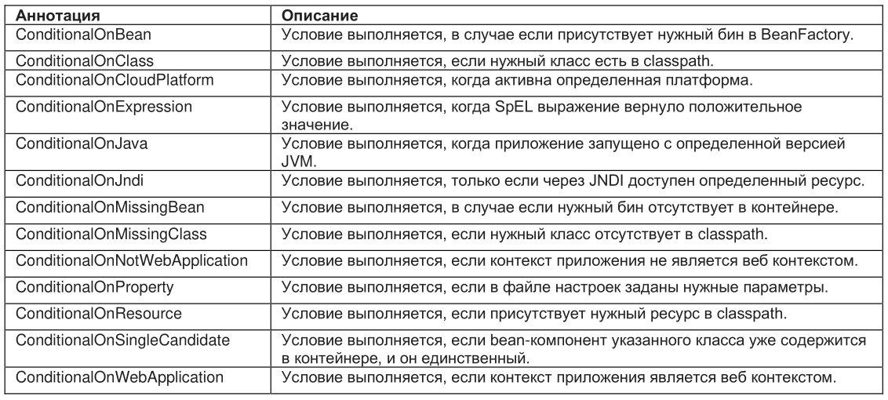

# 20. Расскажите про аннотацию @Profile
Профили — это ключевая особенность Spring Framework, позволяющая относить бины к разным профилям (логическим группам), например, dev, test, prod.

Аннотация `@Profile` в Spring Framework используется для указания, что определенный компонент (например, бин, 
конфигурация или метод) должен быть зарегистрирован в контексте приложения только в том случае, если активен указанный 
профиль. Профили позволяют управлять конфигурацией приложения в зависимости от окружения (например, dev, test, prod) или других условий.

Профили могут быть активированы через свойство `spring.profiles.active` (например, в `application.properties`, `application.yml`, через переменные окружения или аргументы командной строки).
-  `spring.profiles.active=dev`.

Аннотация `@Profile` может быть применена к классам, методам или компонентам.

Если указанный профиль активен, компонент будет зарегистрирован в контексте Spring. В противном случае он будет проигнорирован.

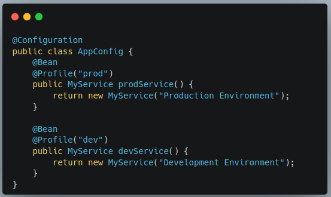

Можно использовать логические операторы для более сложных условий:
- `!` (отрицание): `@Profile("!prod")` — компонент будет зарегистрирован, если профиль `prod` не активен.
- `&` (логическое И): `@Profile("dev & cloud")` — компонент будет зарегистрирован, если активны оба профиля `dev` и `cloud`.
- `|` (логическое ИЛИ): `@Profile("dev | test")` — компонент будет зарегистрирован, если активен хотя бы один из профилей `dev` или `test`.

Аннотация `@Profile` принимает в качестве аргумента имя одного или нескольких
профилей. Она фактически реализована с помощью гораздо более гибкой аннотации
`@Conditional`.

По умолчанию, если профиль бина не определен, то он относится к профилю **“default”**.
Spring также предоставляет способ установить профиль по умолчанию, когда другой
профиль не активен, используя свойство `spring.profiles.default`.

В Spring Boot есть возможность иметь один файл настроек `application.properties`, в
котором будут основные настройки для всех профилей, и иметь по файлу настроек для
каждого профиля `application-dev.properties` и `application-prod.properties`, содержащие
свои собственные дополнительные настройки.

Также в Spring Boot можно объединять профили в группы через свойство `spring.profiles.group` в `application.properties` или `application.yml`. Например:

Тогда активация группы `production` автоматически активирует профили `prod` и `db-mysql`.

# 21. Расскажите про ApplicationContext и BeanFactory, чем отличаются? В каких случаях что стоит использовать?
`BeanFactory` — это интерфейс, который предоставляет механизм конфигурации,
способный управлять объектами любого типа, предоставляет инфраструктуру
конфигурации и основные функциональные возможности. Это центральный игрок,
отвечает за создание и хранение всех объектов (синглтонов).

`ApplicationContext` расширяет BeanFactory и полностью реализует его функционал,
добавляя больше специфических функций: предоставляет информацию о конфигурации приложения и услуги транзакций, АОП, 
является источником сообщений для интернационализации (i18n) и обработки событий в приложениях.

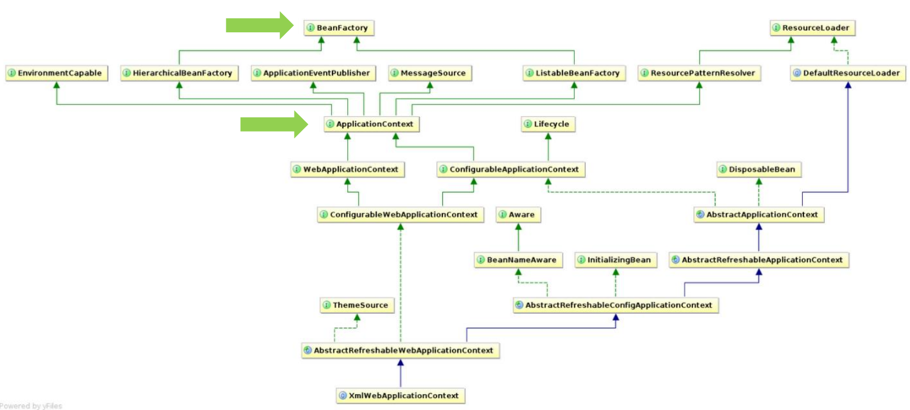

ApplicationContext предоставляет:
- Фабричные методы бина для доступа к компонентам приложения
- Возможность загружать файловые ресурсы в общем виде
- Возможность публиковать события и регистрировать обработчики на них
- Возможность работать с сообщениями с поддержкой интернационализации
- Наследование от родительского контекста

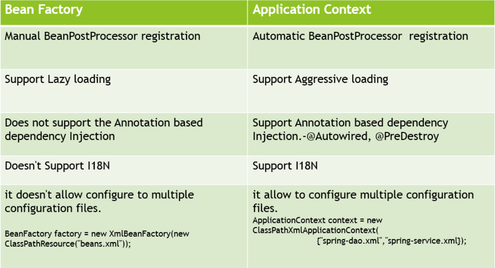

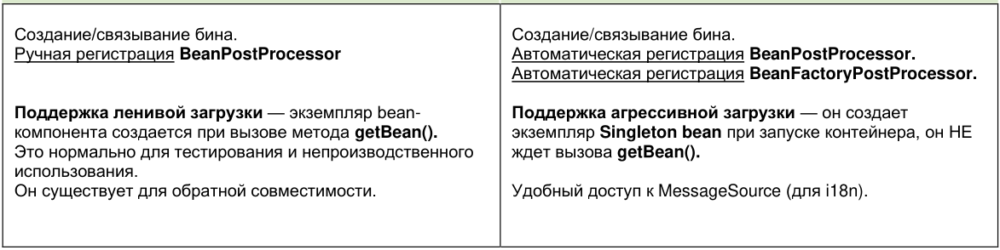

# 22. Расскажите про жизненный цикл бина, аннотации @PostConstruct и @PreDestroy
Bean – центральный объект заботы Spring Framework.
За кулисами фреймворка с ними происходит множество процессов. Во многие из них
можно вмешаться, добавив собственную логику в разные этапы жизненного цикла при необходимости.

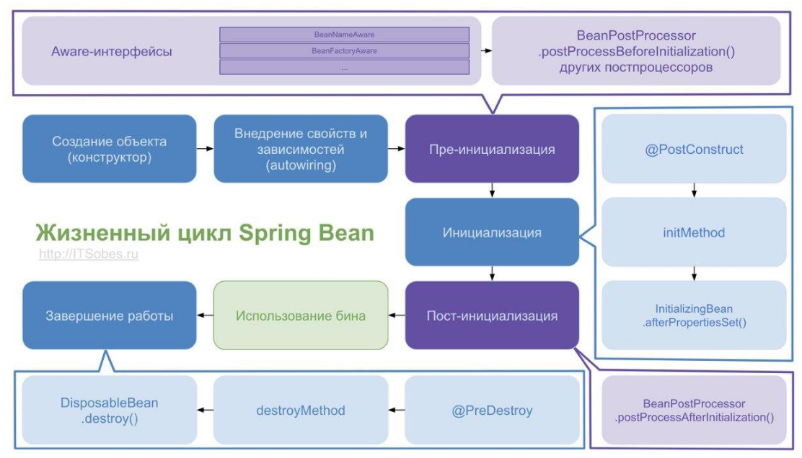

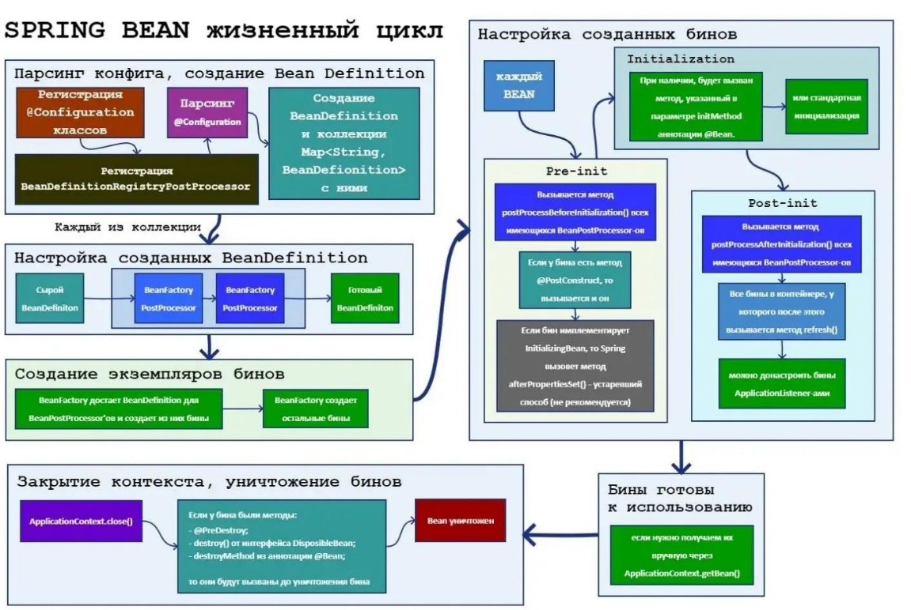

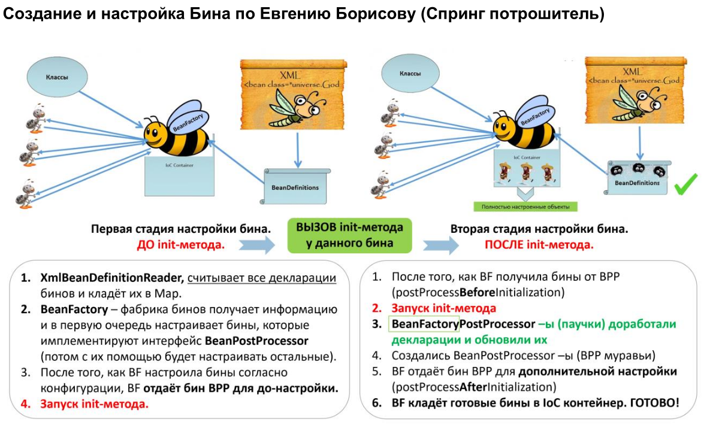

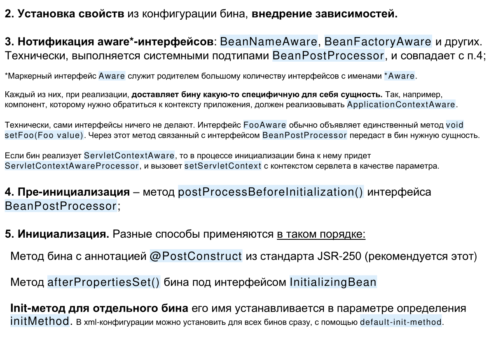
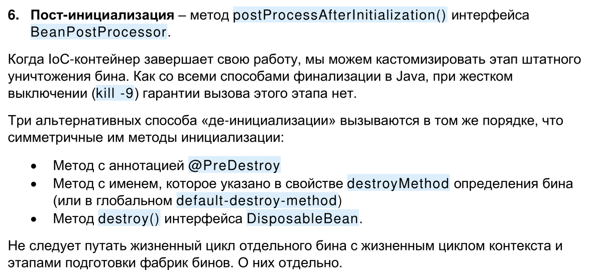
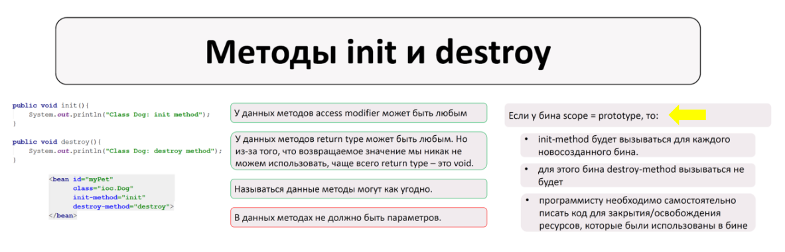

# 23. Расскажите про скоупы бинов? Какой скоуп используется по умолчанию?
В Spring Framework **скоуп (scope)** бина определяет жизненный цикл и видимость бина в контексте приложения. Spring предоставляет несколько встроенных скоупов, которые позволяют управлять тем, как и когда создаются и уничтожаются бины.

Атрибут scope – это строка-идентификатор, которая ставит бину в соответствие
экземпляр класса `org.springframework.beans.factory.config.Scope`.

Скоуп – реализация паттерна «стратегия» для фабрик бинов, инструкция по созданию
бизнес-объектов.

### **Singleton (Синглтон)**:

**Скоуп по умолчанию**. Если скоуп не указан явно, бин будет создан в скоупе `singleton`. В этом скоупе Spring создает **один экземпляр бина** на весь контекст приложения. Этот экземпляр используется всеми запросами и зависимостями.

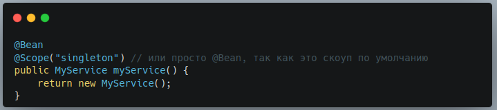

### **Prototype (Прототип)**:
В этом скоупе Spring создает **новый экземпляр бина** каждый раз, когда он запрашивается из контекста. 
Это полезно, когда состояние бина должно быть уникальным для каждого использования. В этом случае как говорилось ранее 
ApplicationContext будет хранить не сам бин, а его описание (инструкцию как создавать бин) `BeanDefinition`. 

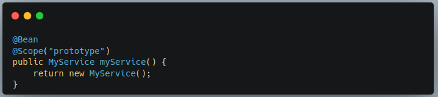

### **Request (Запрос)**:
- Этот скоуп доступен только в веб-приложениях. Spring создает **новый экземпляр бина для каждого HTTP-запроса**.

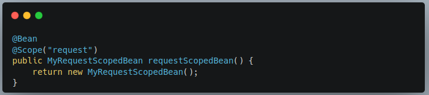

### **Session (Сессия)**:
- Также доступен только в веб-приложениях. Spring создает **новый экземпляр бина для каждой HTTP-сессии**.

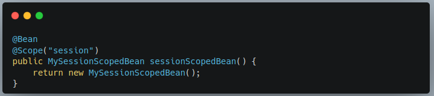

### **Application (Приложение)**:
- Этот скоуп похож на `singleton`, но ограничен **контекстом ServletContext** в веб-приложениях.
  
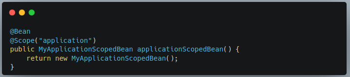

### **WebSocket (Веб-сокет)**:
- Этот скоуп используется в контексте WebSocket-соединений. Spring создает **новый экземпляр бина для каждого WebSocket-сеанса**.

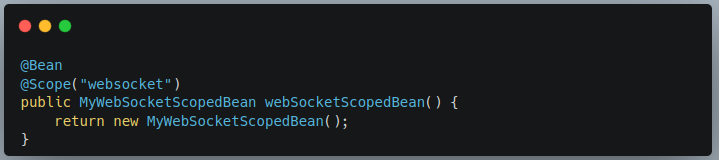

### Скоуп по умолчанию
По умолчанию, если скоуп не указан явно, Spring использует **скоуп `singleton`**. Это означает, что Spring создает только 
один экземпляр бина, который используется всеми зависимостями и запросами.

Скоуп бина можно указать с помощью аннотации `@Scope`. Или через `XML-конфигурацию`:

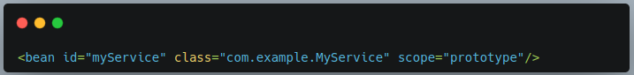

- **Singleton**:
  - Бины в этом скоупе создаются при старте контекста (если не указана ленивая инициализация). Они остаются в контексте до его закрытия.

- **Prototype**:
  - Бины создаются только при запросе к IoC контейнеру. Spring не управляет их жизненным циклом после создания (не вызывает методы уничтожения, если они определены).
- **Request, Session, Application, WebSocket**:
  - Эти скоупы доступны только в веб-приложениях. Они привязаны к жизненному циклу HTTP-запроса, сессии, контекста сервлета или WebSocket-сессии соответственно.

### Кастомные скоупы
Spring также позволяет создавать **пользовательские скоупы**. Для этого нужно реализовать 
интерфейс `org.springframework.beans.factory.config.Scope` и зарегистрировать его в контексте приложения.

Пример регистрации кастомного скоупа:

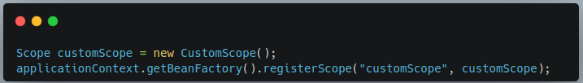

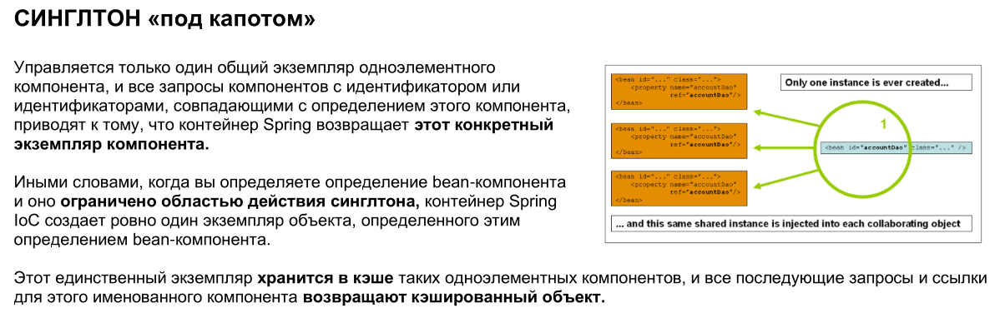

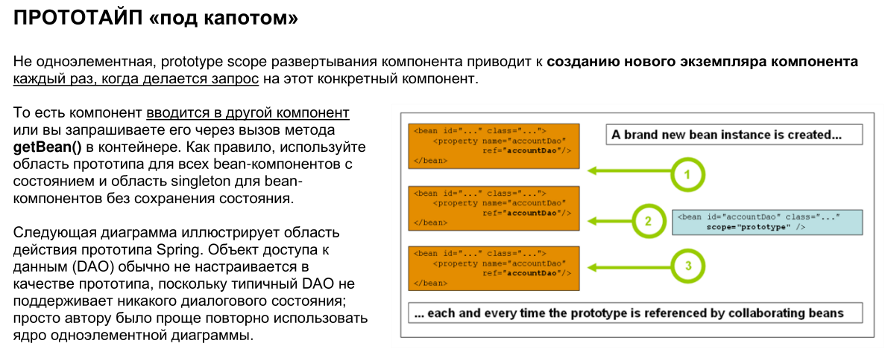
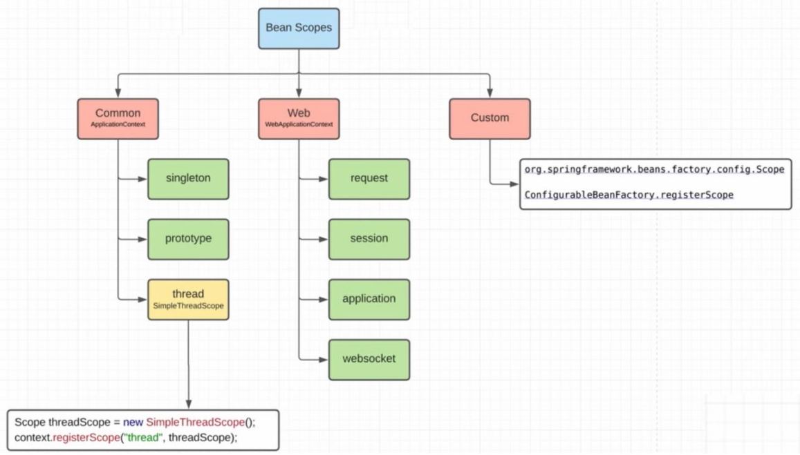

# 24. Что изменилось в Spring 5?
Spring Framework 5, выпущенный в 2017 году, принес множество новых функций, улучшений и поддержку современных технологий. 
Это крупное обновление, которое значительно расширило возможности фреймворка.

Когда начинают говорить про Spring 5 то самое главное нововведение это модуль для реактивного программирования.

###  **Поддержка Java 8+ и выше**
Spring 5 требует **минимум Java 8** и официально поддерживает Java 9, 10, 11 и более поздние версии.

Введена поддержка новых возможностей Java 8, таких как:
  - **Лямбда-выражения**.
  - **Stream API**.
  - **Функциональные интерфейсы**.
  - **Повторяемые аннотации** (с использованием `@Repeatable`).
  - **Параметры методов** (с помощью `java.util.Optional`).

### **Реактивное программирование**
Spring 5 представил поддержку **реактивного программирования** через проект **Spring WebFlux**.

**WebFlux** — это новый фреймворк для создания реактивных веб-приложений, который работает на основе **Reactor** (реализация Reactive Streams).
- Основные особенности:
  - Поддержка **неблокирующих** операций.
  - Работа с асинхронными потоками данных.
  - Совместимость с **Project Reactor** и **RxJava**.
  - Поддержка реактивных типов, таких как `Mono` и `Flux`.
- WebFlux может работать как с традиционными сервлетами (на основе Servlet 3.1+), так и с 
новыми серверами, такими как **Netty**.

### **Поддержка Kotlin**
Spring 5 добавил **официальную поддержку Kotlin**.

Введены специальные расширения и DSL (Domain-Specific Language) для Kotlin, упрощающие конфигурацию и разработку.

### **Улучшения в Spring MVC**
- Поддержка **Servlet 4.0** (включая HTTP/2).
- Введена поддержка **Jackson 2.9+** для улучшенной работы с JSON.
- Добавлены новые аннотации, такие как `@Nullable` и `@NonNullApi`, для улучшения поддержки null-safety.

### **Поддержка HTTP/2**
- Spring 5 добавил поддержку **HTTP/2** для улучшения производительности веб-приложений.
- HTTP/2 поддерживает мультиплексирование, сжатие заголовков и другие оптимизации.

### **Улучшения в тестировании**
- Введена поддержка **JUnit 5** (Jupiter) как основного фреймворка для тестирования.
- Добавлены новые аннотации, такие как `@SpringJUnitConfig` и `@SpringJUnitWebConfig`, для упрощения интеграции Spring и JUnit 5.
- Поддержка **параллельного выполнения тестов**.

### **Улучшения в Spring Core**
- Введена поддержка **реактивных типов** (`Mono` и `Flux`) в ядре Spring.
- Улучшена производительность и уменьшено использование памяти.
- Добавлены новые методы в `ApplicationContext` и `BeanFactory` для работы с реактивными потоками.

###  **Устаревание и удаление**
Устарели или удалены некоторые устаревшие функции:
Поддержка **Portlet**, **Velocity**, **JasperReports**, **XML-конфигураций** (частично).

Удалена поддержка **Tiles 2** и **Guava**.
  - Устарели некоторые API, такие как `HibernateTemplate` и `JpaTemplate`.

### **Новые аннотации**
- **`@NonNull`** и **`@Nullable`**:
  - Позволяют явно указывать, может ли метод или параметр возвращать `null`.
- **`@Indexed`**:
  - Улучшает производительность за счет индексации компонентов при сканировании пакетов.

### **Поддержка современных библиотек**
- Обновлены зависимости до последних версий:
  - **Hibernate 5**.
  - **Jackson 2.9+**.
  - **Reactor 3.1+**.
  - **Kotlin 1.1+**.

### **Улучшения в Spring Data**
- Добавлена поддержка **реактивных репозиториев** (Reactive Repositories) для работы с реактивными базами данных, такими как MongoDB и Cassandra.
- Улучшена интеграция с **NoSQL** и **NewSQL** базами данных.

### **Поддержка GraalVM**
- Spring 5 начал подготовку к поддержке **GraalVM** для компиляции Spring-приложений в нативные исполняемые файлы (native images).

### **Улучшения в Spring Security**
- Добавлена поддержка **реактивных потоков** в Spring Security.
- Улучшена интеграция с OAuth2 и OpenID Connect.
- В **Spring 5** (и Spring Security 5) **PasswordEncoder включен по умолчанию**. По умолчанию используется **`DelegatingPasswordEncoder`**, который поддерживает несколько алгоритмов хеширования (например, BCrypt, SHA-256 и другие).

Spring 5 стал важным шагом в эволюции фреймворка, добавив поддержку современных технологий, таких как реактивное программирование, Kotlin, HTTP/2 и JUnit 5. Эти изменения сделали Spring более гибким, производительным и готовым к разработке современных приложений.

# 25. Расскажите про аннотацию @ComponentScan
Аннотация `@ComponentScan` в Spring Framework используется для автоматического обнаружения и регистрации компонентов (бинов) в 
контексте приложения. Она позволяет Spring сканировать указанные пакеты и находить классы, помеченные аннотациями, такими 
как `@Component`, `@Service`, `@Repository`, `@Controller`, и регистрировать их как бины.

`@ComponentScan` сканирует пакеты и подпакеты, чтобы найти классы, которые должны быть зарегистрированы как бины.

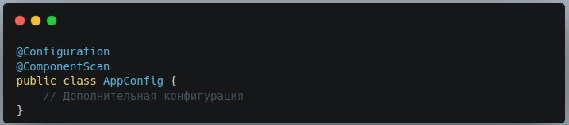

В этом случае Spring сканирует пакет, в котором находится `AppConfig`, и все его подпакеты.

В Spring Boot аннотация `@ComponentScan` не требуется в большинстве случаев, так как Spring Boot автоматически настраивает сканирование компонентов.

Spring Boot использует аннотацию `@SpringBootApplication`, которая является комбинацией трех аннотаций:
- @Configuration: Указывает, что класс является конфигурационным.
- @EnableAutoConfiguration: Включает автоматическую конфигурацию Spring Boot.
- @ComponentScan: Сканирует пакеты на наличие компонентов (например, @Component, @Service, @Repository, @Controller).

Таким образом, когда мы используем `@SpringBootApplication`, Spring Boot автоматически сканирует текущий пакет и все его подпакеты на наличие компонентов.

### Еще примеры с использованием аннотации `@ComponentScan`:
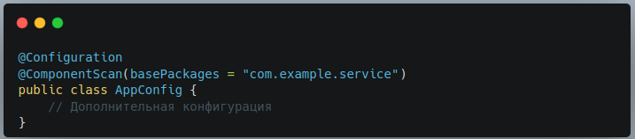

Здесь Spring сканирует пакет `com.example.service` и все его подпакеты.

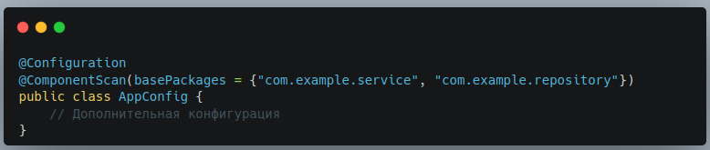

Spring сканирует несколько пакетов: `com.example.service` и `com.example.repository`.

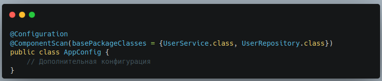

Spring сканирует пакеты, в которых находятся классы `UserService` и `UserRepository`.

### Дополнительные параметры `@ComponentScan`
- **`basePackages`**: Указывает пакеты для сканирования.

- **`basePackageClasses`**: Указывает классы, пакеты которых нужно сканировать.

- **`includeFilters`**: Позволяет включать классы, которые не помечены стандартными аннотациями (`@Component`, `@Service` и т.д.). 

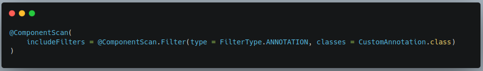

- **`excludeFilters`** Позволяет исключать классы из сканирования. 

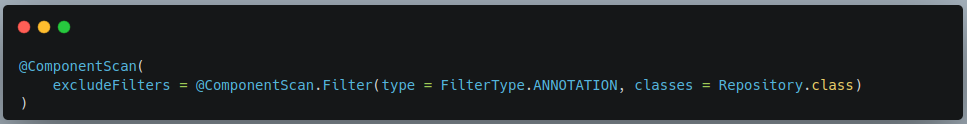

- **`useDefaultFilters`**: Определяет, использовать ли фильтры по умолчанию (например, для `@Component`, `@Service`, `@Repository`, `@Controller`). 
По умолчанию `true`. Если установлено `false`, Spring будет сканировать только те классы, которые явно указаны в `includeFilters`. 

### **Фильтры для ComponentSacn.Filter:**
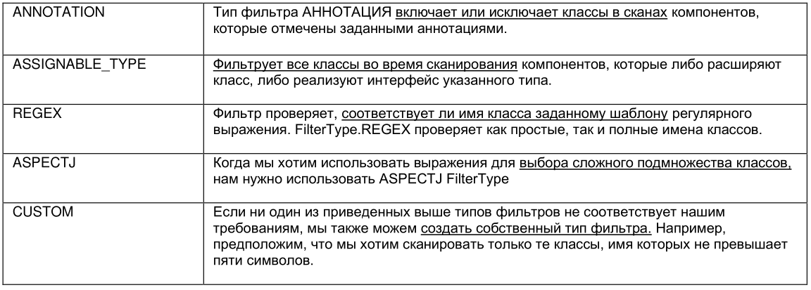

**Производительность**:
- Сканирование большого количества пакетов может замедлить запуск приложения. Рекомендуется указывать только необходимые пакеты.

**Конфликты имен**:
- Если два класса имеют одинаковое имя (например, `UserService` в разных пакетах), Spring выбросит исключение. Решение: использовать аннотацию `@Qualifier` или явно указать имя бина.

**Ленивая инициализация**:
- По умолчанию бины создаются при старте контекста. Если нужно отложить создание, используйте аннотацию `@Lazy`.

# 26. Как Spring работает с транзакциями? + 27. Расскажите про аннотацию @Transactional
Транзакция - набор каких либо SQL выражений которые должны выполняться все вместе или не выполняться вовсе.

Транзакция в реляционной базе данных должна соответствовать принципам ACID.  

Транзакция Имеет ДВА состояния:
Выполняется полностью – commit **ИЛИ** Откатывается полностью – rollback

Spring Framework позволяет абстрагироваться от низкоуровневых деталей работы с транзакциями и позволяет сосредоточиться на разработке бизнес-логики.

Работа с транзакциями в Spring основана на **декларативном** и **программном** подходах.

## **Декларативный подход управления транзакциями**
**Декларативное управление транзакциями** — это подход, при котором управление транзакциями (начало, завершение, откат) осуществляется не вручную в коде, а декларативно, с помощью метаданных (например, аннотаций или XML-конфигурации). Spring автоматически обрабатывает транзакции на основе этих метаданных (основной способ).

Управление транзакциями с помощью XML – это устаревший способ, поскольку он был
вытеснен гораздо более простого способа с использованием аннотации `@Transactional` (современный способ). Поэтому забываем XML как страшный сон и не вспоминаем его. Далее речь идет только про аннотацию.
## Основные особенности декларативного подхода (Declarative Transaction Management):
Для работы с транзакциями Spring Framework использует AOP-прокси:

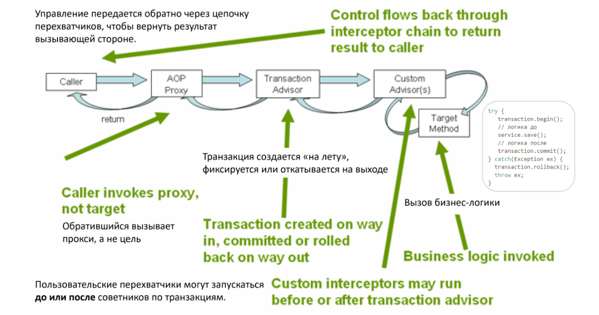

Для включения возможности управления транзакциями первым делом нужно разместить аннотацию `@EnableTransactionManagement` 
у класса-конфигурации `@Configuration`

Это означает, что классы, помеченные `@Transactional`, должны быть обернуты
АСПЕКТОМ транзакций. Однако, если используем Spring Boot и имеем зависимости
spring-data-* или spring-tx, то управление транзакциями будет включено по умолчанию.

`@EnableTransactionManagement` отвечает за регистрацию необходимых компонентов Spring, таких как TransactionInterceptor 
и советы прокси (proxy advices- набор инструкций, выполняемых на точках среза - Pointcut).

Регистрируемые компоненты помещают перехватчик в стек вызовов при вызове
методов `@Transactional`.

Аннотация `@Transactional` применяется к методам или классам и указывает, что метод или все методы класса должны 
выполняться в рамках транзакции. Spring автоматически будет управлять началом, завершением и откатом транзакции.

Он автоматически создает прокси-объект вокруг бина, чтобы управлять транзакциями.

Аннотация `@Transactional` — это метаданные, которые указывают Spring, как управлять транзакциями. 
Spring использует эти метаданные для создания прокси-объектов, которые автоматически обрабатывают транзакции. 
Spring автоматически начинает транзакцию перед выполнением метода и завершает её после выполнения 
(или откатывает в случае ошибки). Декларативный подход проще, чище и рекомендуется для большинства сценариев. 
Мы можем легко настроить поведение транзакций с помощью параметров аннотации.

Spring создает прокси для всех классов, помеченных `@Transactional` (либо если любой
из методов класса помечен этой аннотацией). Прокси-объекты позволяют Spring
Framework вводить транзакционную логику до и после вызываемого метода - главным
образом для запуска и коммита / отката транзакции.

UserService проксируется на лету, и прокси управляет транзакциями для вас.
Но НЕ сам прокси управляет всем этим транзакционным состоянием (открыть,
зафиксировать, закрыть), прокси делегирует эту работу менеджеру транзакций.

Spring предлагает интерфейс PlatformTransactionManager / TransactionManager,
который по умолчанию поставляется с парой удобных реализаций. Одна из них – это
менеджер транзакций источника данных.

Менеджер транзакций источника данных использует «под капотом» при управлении
транзакциями точно такой же код, который мы использовали в разделе JDBC.

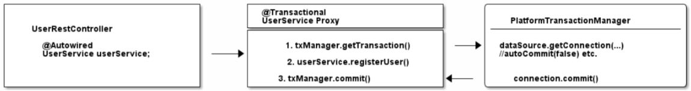

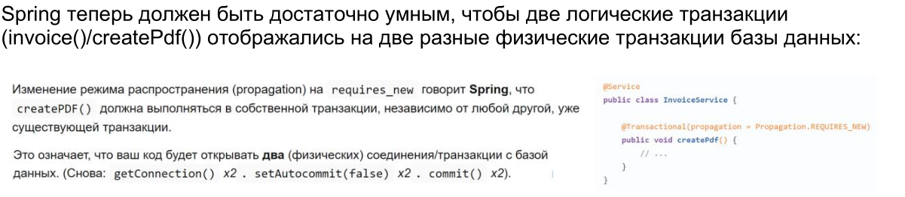

**Пример метода который помечен аннотацией @Transactional:**

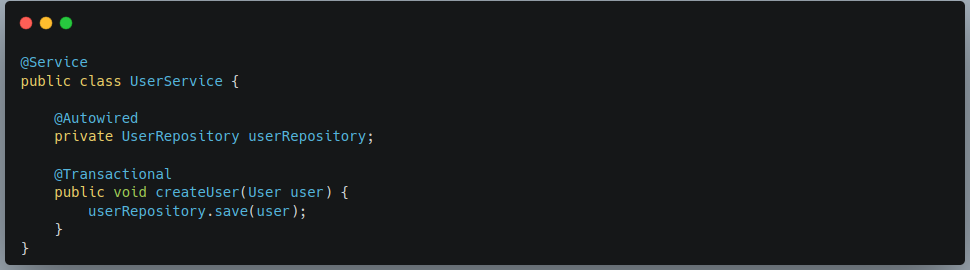

В этом примере:
- Метод `createUser` выполняется в рамках транзакции.
- Если метод завершается успешно, транзакция фиксируется (commit).
- Если возникает исключение, транзакция откатывается (rollback).

Мы можем настраивать поведение транзакций с помощью параметров аннотации, таких как `propagation`, `isolation`, `timeout`, `rollbackFor` и других.

## Параметры аннотации `@Transactional`
1) **`propagation`**: Определяет поведение распространения транзакции.
   Например, `Propagation.REQUIRED` (по умолчанию) — если транзакция уже существует, используется она, иначе создается новая.

2) **`isolation`**: Определяет уровень изоляции транзакции.
   Например, `Isolation.DEFAULT` — используется уровень изоляции по умолчанию для базы данных.

3) **`readOnly`**: Указывает, является ли транзакция только для чтения.
   Например, `readOnly = true` — транзакция используется только для чтения данных.

4) **`timeout`**: Определяет время ожидания завершения транзакции (в секундах).

5) **`rollbackFor`**: Указывает исключения, которые должны вызывать откат транзакции.
   Например, `rollbackFor = Exception.class` — откат при любом исключении.

6) **`noRollbackFor`**: Указывает исключения, которые не должны вызывать откат транзакции.

**Пример с параметрами:** 

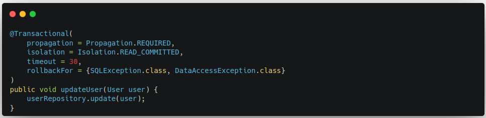

## Распространение транзакций (Propagation)
**Propagation** — это набор правил, которые определяют, как транзакции взаимодействуют друг с другом. Вы выбираете подходящее поведение в зависимости от того, как должны работать ваши методы: в одной общей транзакции, в отдельных транзакциях или вообще без транзакций.

Простыми словами, это правила, которые говорят Spring:
- Создавать новую транзакцию или использовать существующую.
- Что делать, если транзакция уже запущена.
- Как обрабатывать вложенные транзакции.

Spring поддерживает несколько вариантов поведения распространения транзакций.

**Простая аналогия и все типы распространения транзакций.**
Представьте, что вы находитесь в комнате (это транзакция):
- **REQUIRED**: Если вы уже в комнате, оставайтесь там. Если нет, зайдите в комнату.
- **REQUIRES_NEW**: Выйдите из текущей комнаты и зайдите в новую.
- **SUPPORTS**: Если вы в комнате, оставайтесь там. Если нет, ничего не делайте.
- **NOT_SUPPORTED**: Выйдите из комнаты, если вы в ней.
- **MANDATORY**: Вы должны быть в комнате, иначе будет ошибка.
- **NEVER**: Вы не должны быть в комнате, иначе будет ошибка.
- **NESTED**: Если вы в комнате, создайте внутри неё ещё одну маленькую комнату.

**Что использовать:**
- Используйте **REQUIRED** для большинства случаев.
- Используйте **REQUIRES_NEW**, если нужно выполнить действие независимо от текущей транзакции.
- Используйте **NESTED**, если нужно частично откатывать изменения.

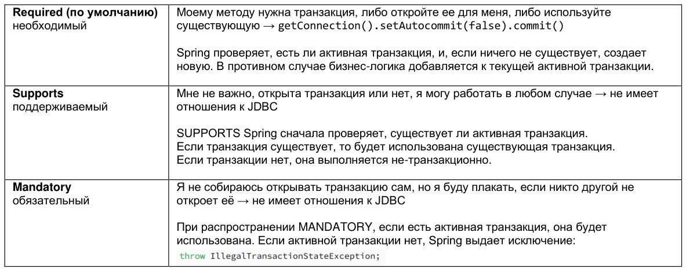
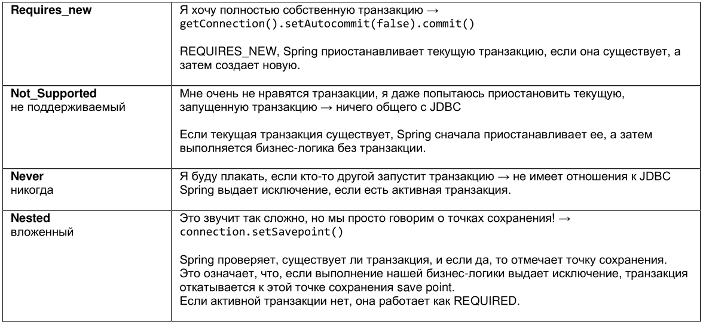

Большинство режимов, уровней распространения Propagation Levels не имеют ничего
общего с базой данных или JDBC, но больше с тем, как вы структурируете свою
программу со Spring: КАК, ГДЕ и КОГДА Spring ожидает присутствия транзакций.

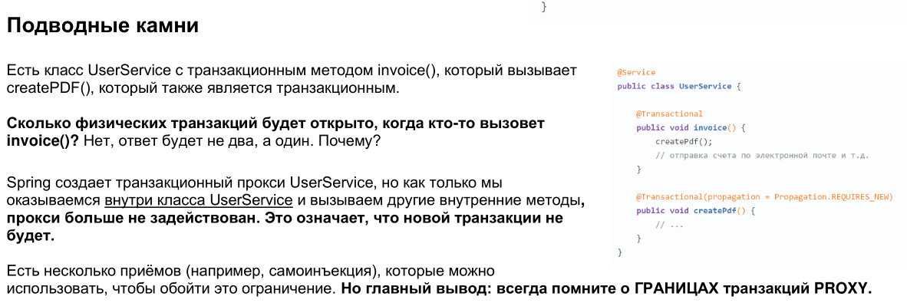

## **Программный подход управление транзакциями**
Для сравнения, **программное управление транзакциями** предполагает явное управление транзакциями в коде (редко используется).

Оно реализуется с помощью **`TransactionTemplate`** или **`PlatformTransactionManager`**.

### **PlatformTransactionManager**:
Это основной интерфейс для управления транзакциями в Spring.
Он предоставляет методы для начала, завершения и отката транзакций.

**Примеры реализаций данного интерфейса:**
- `DataSourceTransactionManager` для JDBC.
- `JpaTransactionManager` для JPA.
- `HibernateTransactionManager` для Hibernate.
- `JtaTransactionManager` для распределенных транзакций (JTA).

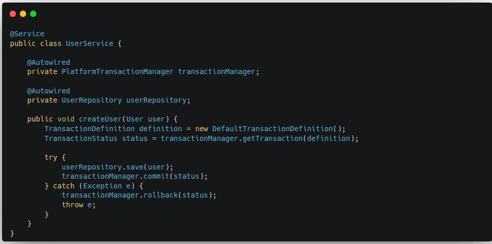

### **TransactionTemplate**
Дополнить!!!

## Типы транзакций
- **Локальные транзакции**: Управляются в рамках одного ресурса (например, одной базы данных).
- **Глобальные (распределенные) транзакции**: Управляются через JTA и могут охватывать несколько ресурсов (например, 
несколько баз данных или очередей сообщений).

## Откат транзакции:
- По умолчанию Spring откатывает транзакцию при **непроверяемых исключениях** (наследниках `RuntimeException`).
- Для **проверяемых исключений** (наследников `Exception`) откат не выполняется, если не указано иное.
- Откат можно настроить с помощью параметров `rollbackFor` и `noRollbackFor` в аннотации `@Transactional`.

## Уровни изоляции (Isolation)
Spring поддерживает стандартные уровни изоляции транзакций (как в SQL, кроме DEFAULT):

**`DEFAULT`**:
Уровень изоляции по умолчанию для базы данных.

**`READ_UNCOMMITTED`**:
Разрешает "грязное" чтение (чтение незафиксированных данных).

**`READ_COMMITTED`**:
Запрещает "грязное" чтение, но разрешает неповторяемое чтение и фантомные записи.

**`REPEATABLE_READ`**:
Запрещает "грязное" и неповторяемое чтение, но разрешает фантомные записи.

**`SERIALIZABLE`**:
Самый строгий уровень изоляции. Запрещает все проблемы параллельного доступа.

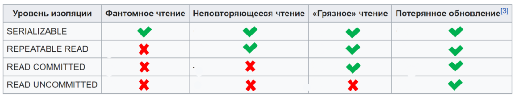

### Интеграция с JTA (Java Transaction API)
Spring поддерживает распределенные транзакции через **JTA**. Для этого используется `JtaTransactionManager`. Это позволяет 
управлять транзакциями, охватывающими несколько ресурсов (например, базы данных и очереди сообщений).

[//]: # (TODO: Разобрать по возможности)
**Из методички:**

Вот так Spring "под капотом" устанавливает уровни изоляции для соединения с базой данных:

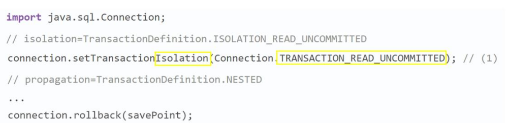

Вложенные транзакции в Spring — это просто точки сохранения JDBC / базы данных.
Поддержка Savepoints (точек сохранения) зависит от драйвера JDBC.

Метод Connection.setSavepoint устанавливает объект Savepoint в текущей транзакции.

Метод Connection.rollback перегружен, чтобы принимать аргумент точки сохранения.

В то время как в обычном JDBC есть только один способ управлять транзакциями,
setAutocommit(false), Spring предлагает множество различных, более удобных
способов добиться того же самого.

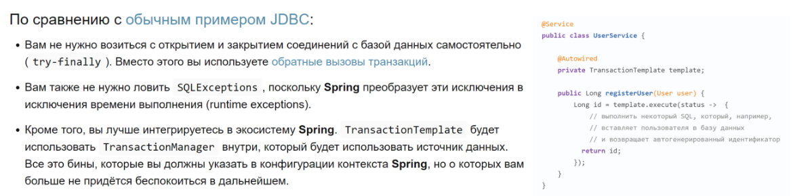

# 28. Расскажите про аннотации @Controller и @RestController. Чем они отличаются?
Аннотации **`@Controller`** и **`@RestController`** в Spring Framework используются для создания веб-контроллеров, которые обрабатывают HTTP-запросы. Они похожи по назначению, но имеют ключевые различия.

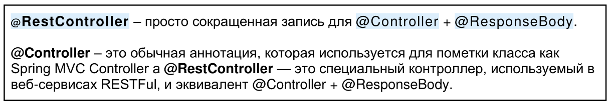

### Аннотация `@Controller`
`Controller` – это один из стереотипных аннотаций Spring Framework. Компоненты такого типа обычно занимаются обработкой сетевых запросов. Контроллер состоит из набора методов-обработчиков, помеченных аннотацией @RequestMapping.

Ответ на запрос можно сформировать разными способами: например, просто вернуть из обработчика строку с именем jsp-файла, или же вернуть ResponseBodyEmitter, который будет асинхронно заполняться данными позже. Все возможные варианты перечислены в документации.
https://docs.spring.io/spring-framework/docs/current/reference/html/web.html#mvc-ann-return-types

Большинство современных API реализуется по архитектуре REST.
В ней каждая сущность доступна под собственным URI*.

URI — унифицированный идентификатор ресурса, последовательность символов, идентифицирующая абстрактный или физический ресурс.

Ранее назывался Universal Resource Identifier — универсальный идентификатор ресурса.

В методе-обработчике возвращается экземпляр класса этой сущности, который
преобразуется в ответ сервера одним из **HttpMessageConverter-ов**. Например, в JSON
его превратит **MappingJackson2HttpMessageConverter**.

Чтобы использовать этот способ ответа, метод, или весь контроллер, должен иметь
аннотацию `@ResponseBody.`

`@Controller` используется для создания **Spring MVC-контроллеров**, которые обрабатывают HTTP-запросы и возвращают **представления (views)**.

Методы контроллера возвращают **имя представления** (например, `"home"`), которое соответствует HTML-странице.

Spring автоматически находит это представление и отображает его пользователю.

Обычно используется в традиционных веб-приложениях, где контроллер возвращает имя представления (например, JSP, Thymeleaf, Freemarker), которое затем рендерится на стороне сервера.

**Серверный рендеринг** — это подход к генерации HTML-страниц, при котором **весь HTML-код создается на стороне сервера** и отправляется клиенту (например, браузеру) в готовом виде. Это классический способ работы веб-приложений, который использовался задолго до появления современных JavaScript-фреймворков, таких как React, Angular или Vue.js.

Как работает серверный рендеринг?
- Пользователь открывает страницу в браузере, и браузер отправляет HTTP-запрос на сервер.
- Сервер получает запрос, обрабатывает его (например, извлекает данные из базы данных) и генерирует HTML-страницу.
- Сервер отправляет готовый HTML-код клиенту.
- Браузер получает HTML-код и отображает его пользователю.

**Преимущества серверного рендеринга**
- **Быстрая загрузка:** Пользователь сразу видит готовую страницу, так как HTML-код уже сгенерирован на сервере.
- **SEO-дружественность**: Поисковые системы легко индексируют страницы, так как они получают готовый HTML-код.
- **Совместимость с любыми браузерами**: Поскольку HTML-код генерируется на сервере, он работает даже в старых браузерах, которые не поддерживают современный JavaScript.
- **Простота разработки**: Не нужно писать сложный JavaScript-код для рендеринга на стороне клиента.

**Недостатки серверного рендеринга**
- **Высокая нагрузка на сервер**: Сервер должен генерировать HTML-код для каждого запроса, что может быть ресурсоемким при большом количестве пользователей.
- **Медленное взаимодействие**: При каждом действии пользователя (например, переход на другую страницу) браузер отправляет новый запрос на сервер, что может замедлять работу приложения.
- **Ограниченная интерактивность**: Страницы менее динамичны по сравнению с клиентским рендерингом, где JavaScript может обновлять контент без перезагрузки страницы.

Серверный рендеринг может быть реализован с использованием различных технологий:
- **JSP (JavaServer Pages):** Технология для создания динамических веб-страниц на Java.
- **Thymeleaf:** Современный шаблонизатор для Java, который интегрируется с Spring.
- **Freemarker**: Еще один популярный шаблонизатор для Java.

Серверный рендеринг отлично подходит для традиционных веб-сайтов и SEO-критичных приложений, но может быть менее эффективным для высокоинтерактивных приложений. В таких случаях часто используется гибридный подход (например, **SSR — Server-Side Rendering** в React или Angular).

Для возврата данных в формате JSON или XML нужно использовать дополнительно над методами аннотацию `@ResponseBody`.

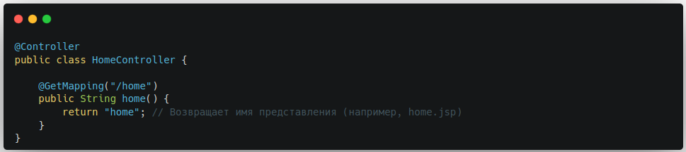

### Аннотация `@RestController`
`@RestController` — это специализированная версия `@Controller`, предназначенная для создания **RESTful веб-сервисов**.

Она объединяет функциональность `@Controller` и `@ResponseBody`, что упрощает создание REST API.

Все методы такого контроллера автоматически возвращают данные в формате JSON или XML, а не представления.

Методы контроллера возвращают **объекты данных**, которые автоматически преобразуются в JSON или XML с помощью библиотек, таких как Jackson или Gson.
Spring отправляет эти данные напрямую клиенту (например, браузеру или мобильному приложению).

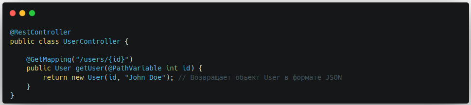

Возвращает **данные** (например, JSON или XML), а не представления.

Подходит для создания REST API, где клиент (например, фронтенд или мобильное приложение) сам отвечает за отображение данных.

Не требует использования `@ResponseBody`, так как он уже встроен в `@RestController`.

# 29. Как вернуть ответ со своим статусом (например, 213)?
В Spring Framework мы можем вернуть HTTP-ответ с **пользовательским статусом** (например, 213) с помощью класса **`ResponseEntity`**. Этот класс позволяет контролировать не только тело ответа, но и статус код, а также заголовки.

### Использование `ResponseEntity`
`ResponseEntity` — это универсальный способ вернуть ответ с любым статусом, телом и заголовками. 
Мы можем указать статус вручную, используя метод `status()`.

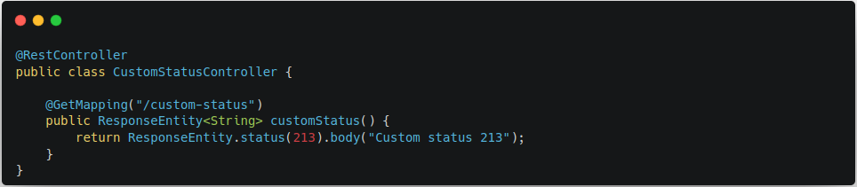

В этом примере:
`ResponseEntity.status(213)` устанавливает статус ответа на 213.
`body("Custom status 213")` задает тело ответа.

### Использование `HttpStatus` для стандартных статусов ответа
Если мы хотим использовать стандартные HTTP-статусы, мы можем воспользоваться перечислением **`HttpStatus`**.

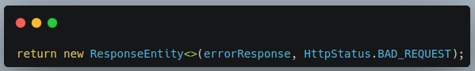

### Использование `@ResponseStatus`
Аннотация **`@ResponseStatus`** позволяет указать статус ответа для метода контроллера. Однако она **не поддерживает пользовательские статусы** (например, 213), так как принимает только значения из перечисления `HttpStatus`.

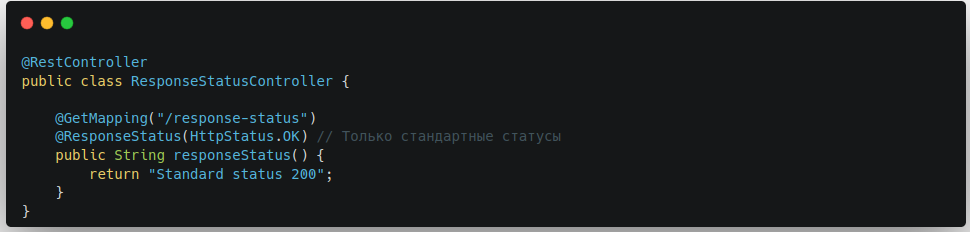

# 30. Что такое ViewResolver?
**ViewResolver** в Spring Framework — это компонент, который отвечает за 
**определение представления (view)**, которое будет отображаться пользователю в ответ на 
HTTP-запрос. Он связывает имя представления, возвращаемое контроллером, с конкретным файлом (например, JSP, Thymeleaf, HTML) или другим ресурсом, который будет использоваться для рендеринга ответа.

Когда вы работаете с Spring MVC, контроллеры возвращают **имя представления** (например, `"home"` или `"user/profile"`). Однако Spring не знает, где именно находятся файлы представлений и как их обрабатывать. 

**ViewResolver** решает эту задачу:
1. Он принимает имя представления, возвращаемое контроллером.
2. Находит соответствующий файл или ресурс (например, JSP, Thymeleaf, HTML).
3. Возвращает объект **View**, который отвечает за рендеринг содержимого.

### Как работает ViewResolver?
1. Контроллер возвращает имя представления (например, `"home"`).
2. Spring передает это имя в **ViewResolver**.
3. **ViewResolver** находит соответствующий файл (например, `home.jsp` или `home.html`).
4. Spring использует объект **View** для рендеринга содержимого и отправки его клиенту.

Spring предоставляет несколько реализаций **ViewResolver** для работы с различными технологиями представлений. Вот основные из них:
### **InternalResourceViewResolver**
Используется для работы с **JSP** (JavaServer Pages).
Ищет JSP-файлы в указанной директории (обычно `/WEB-INF/views/`).

Пример конфигурации:

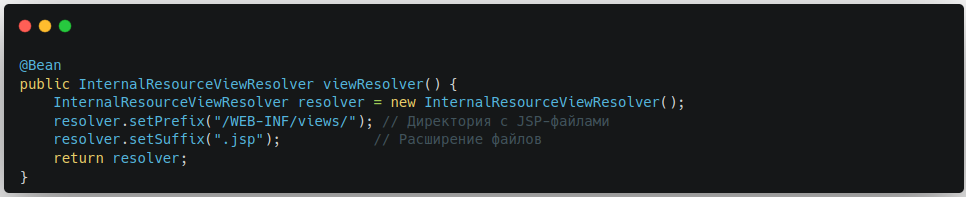

Пример использования: 

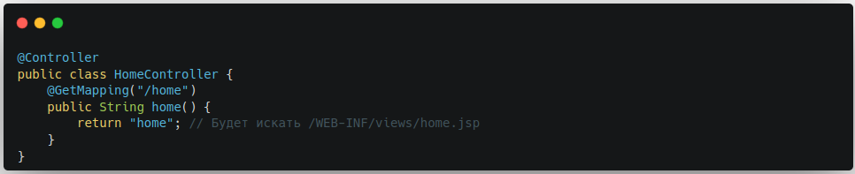

### **ThymeleafViewResolver**
Используется для работы с **Thymeleaf** (шаблонизатор для HTML).
Ищет HTML-файлы в указанной директории (обычно `/templates/`).

Пример конфигурации:

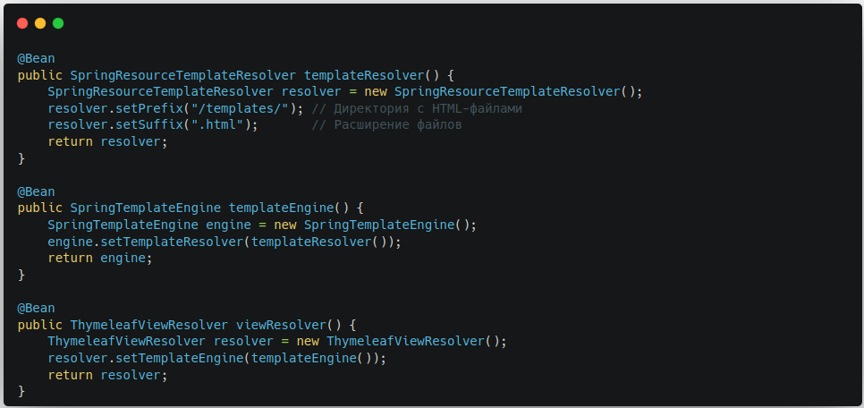

Пример использования в контроллере:

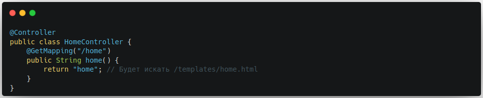

### **ResourceBundleViewResolver**
Используется для работы с представлениями, определенными в файле свойств (properties).

Пример конфигурации:

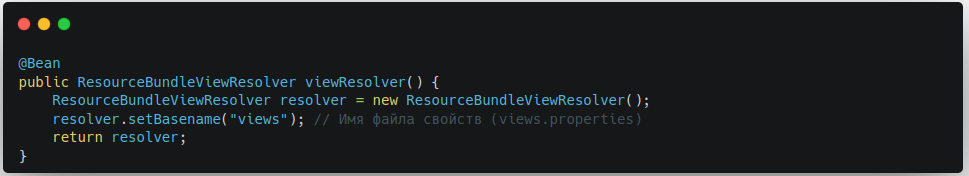

Пример файла `views.properties`:

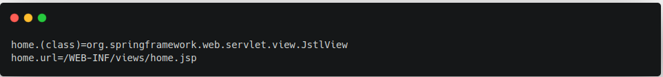

### **ContentNegotiatingViewResolver**
Используется для выбора представления на основе типа содержимого (Content-Type), запрошенного клиентом (например, JSON, XML, HTML).

Пример конфигурации:

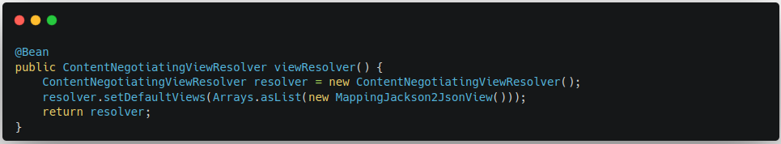

### Как выбрать ViewResolver?
- Если мы используем **JSP**: `InternalResourceViewResolver`.
- Если мы используем **Thymeleaf**: `ThymeleafViewResolver`.
- Если мы хотим поддерживать несколько типов представлений (например, JSON и HTML), используем `ContentNegotiatingViewResolver`.

# 31. Чем отличаются Model, ModelMap и ModelAndView?
В Spring Framework **Model**, **ModelMap** и **ModelAndView** используются для передачи данных между контроллером и представлением (view). Они похожи по назначению, но имеют различия в использовании и функциональности.

### **Model**
**Model** — это интерфейс, который предоставляет способ добавления атрибутов (данных), которые будут доступны в представлении (например, JSP, Thymeleaf).

#### Как используется?
- Обычно передается в качестве параметра метода контроллера.
- Данные добавляются с помощью метода `addAttribute()`.

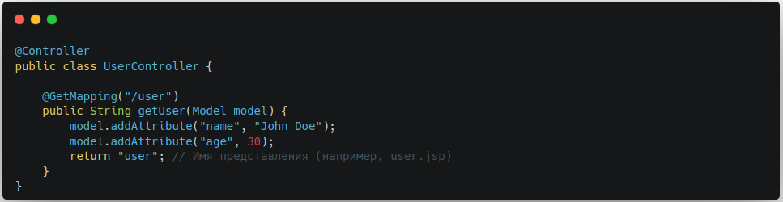

#### Особенности:
- **Легковесный**: Просто добавляет атрибуты для передачи в представление.
- **Не управляет представлением**: Только передает данные.

### **ModelMap**
**ModelMap** — это реализация интерфейса `Model`, которая предоставляет дополнительные методы для работы с атрибутами.

#### Как используется?
- Аналогично `Model`, но с дополнительными методами, такими как `addAllAttributes()`, `mergeAttributes()` и другими.

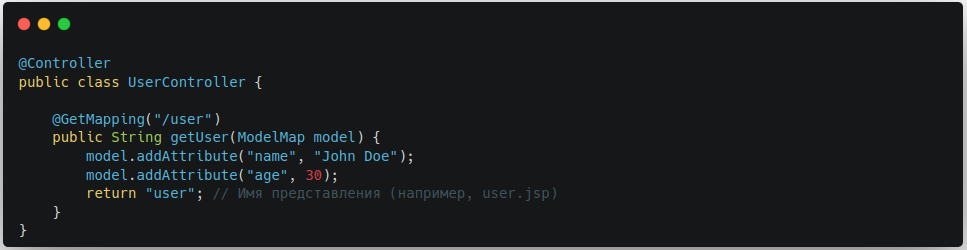

#### Особенности:
- **Более функциональный**: По сравнению с `Model`, предоставляет больше методов для управления атрибутами.
- **Не управляет представлением**: Только передает данные.

### **ModelAndView**
**ModelAndView** — это класс, который объединяет **модель** (данные) и **представление** (view) в одном объекте. Позволяет одновременно управлять данными и указывать, какое представление использовать.

#### Как используется?
- Создается в методе контроллера и возвращается вместо строки с именем представления.
- Данные добавляются с помощью метода `addObject()`.
- Представление задается с помощью метода `setViewName()`.

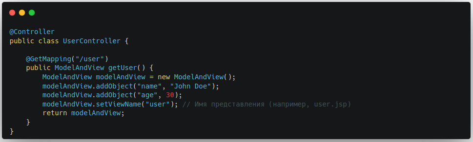

#### Особенности:
- **Управляет и данными, и представлением**: Объединяет функциональность `Model` и указание представления.
- **Более гибкий**: Позволяет динамически выбирать представление и передавать данные.

# 32. Расскажите про паттерн MVC, как он реализован в Spring?
**MVC (Model-View-Controller)** — это паттерн проектирования, который разделяет приложение на три основные компонента:
1. **Model** (Модель) — компонент который отвечает за данные в приложении. Обычно это POJO (Plain Old Java Object), которые содержат бизнес-логику и данные. Или Entity объект. Модель передается между контроллером и представлением.
2. **View** (Представление) — отвечает за отображение данных пользователю. View отображает данные и определяет внешний вид приложения. В Spring MVC может быть использовано для этого JSP, Thymeleaf, FreeMarker, HTML и другие технологии.
3. **Controller** (Контроллер) — компонент, отвечающий за связь между View и Model. Обрабатывает HTTP-запросы, взаимодействует с моделью и возвращает представление. В Spring MVC контроллеры реализуются с помощью аннотаций, таких как `@Controller` или `@RestController`.

Spring Framework предоставляет мощную поддержку для реализации паттерна MVC через отдельный модуль **Spring MVC**.

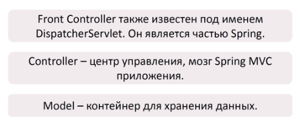
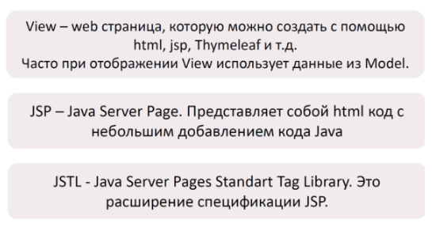

## Как Spring MVC реализует паттерн MVC?
1. **Пользовательский запрос**: Пользователь отправляет HTTP-запрос на сервер.
2. **DispatcherServlet**: Получает запрос и определяет, какой контроллер должен его обработать.
3. **Controller**: Обрабатывает запрос, взаимодействует с моделью и возвращает имя представления или данные.
4. **Model**: Содержит данные, которые передаются в представление.
5. **View**: Рендерит данные из модели в HTML-код.
6. **Ответ пользователю**: Готовый HTML-код отправляется обратно пользователю.

### 1. **Пользовательский запрос**
Пользователь взаимодействует с веб-приложением, например, через браузер. Браузер отправляет **HTTP-запрос** на сервер. Это может быть GET-запрос (например, для отображения страницы) или POST-запрос (например, для отправки формы).

**Пример:**
- Пользователь вводит URL: `http://example.com/user/1`.
- Браузер отправляет GET-запрос на сервер для получения информации о пользователе с ID = 1.

### 2. **DispatcherServlet**
**DispatcherServlet** — это центральный компонент Spring MVC, который действует как **фронт-контроллер**. Он получает все HTTP-запросы и делегирует их соответствующим контроллерам.
#### Как работает?
1. **Получение запроса**: DispatcherServlet получает HTTP-запрос от клиента (браузера).
2. **Определение контроллера**: DispatcherServlet использует **HandlerMapping** для определения того, какой контроллер должен обработать запрос. Например, если запрос идет на `/user/1`, DispatcherServlet определяет, что этот запрос должен обработать `UserController`.
3. **Вызов контроллера**: DispatcherServlet передает запрос соответствующему контроллеру.

### 3. **Controller**
**Контроллер** — это компонент, который обрабатывает запросы пользователя. Он взаимодействует с **моделью** (например, извлекает данные из базы данных) и возвращает имя представления или данные.

#### Как работает?
1. **Обработка запроса**: Контроллер получает запрос от DispatcherServlet. Он может извлекать параметры запроса (например, ID пользователя) и выполнять бизнес-логику.
2. **Взаимодействие с моделью**: Контроллер взаимодействует с сервисным слоем или репозиторием для получения данных. Например, он может вызвать метод `userService.getUserById(id)`.
3. **Возврат результата**: Контроллер возвращает имя представления (например, `"user"`) или данные (например, JSON).

### 4. **Model**
**Model** — это объект, который содержит данные, которые должны быть отображены в представлении. Контроллер передает данные в модель, и они становятся доступными в представлении.
#### Как используется?
Контроллер добавляет данные в модель с помощью метода `addAttribute()`.
Эти данные могут быть простыми объектами (например, строками, числами) или сложными объектами (например, DTO).

### 5. **View**
**View** — это компонент, который отвечает за отображение данных пользователю.  В Spring MVC это может быть использовано JSP, Thymeleaf, FreeMarker, HTML и другие технологии.

#### Как работает?
1. **Определение представления**: Spring MVC использует **ViewResolver** для определения, какое представление использовать на основе имени, возвращенного контроллером. Например, если контроллер вернул `"user"`, ViewResolver ищет файл `user.jsp` или `user.html`.
2. **Рендеринг представления**: Spring MVC передает данные из модели в представление и рендерит его. Например, в JSP данные могут быть доступны через `${user.name}`.

### 6.**Ответ пользователю**
После рендеринга представления Spring MVC отправляет готовый **HTML-код** обратно пользователю. Браузер получает HTML и отображает его пользователю.

# 33. Расскажите про паттерн Front Controller, как он реализован в Spring?
Паттерн **Front Controller** — это паттерн проектирования, который централизует обработку запросов в одном компоненте. В Spring Framework этот паттерн реализован с помощью **DispatcherServlet**, который действует как единая точка входа для всех HTTP-запросов.

**Front Controller** — это паттерн, при котором все запросы сначала обрабатываются одним центральным компонентом (так называемым фронт-контроллером), а затем делегируются соответствующим обработчикам (контроллерам). Это упрощает управление запросами, обеспечивает единую точку для обработки общих задач и улучшает структуру приложения.

**Front Controller** в Spring реализован через **DispatcherServlet**, который:
1. Получает все HTTP-запросы.
2. Определяет соответствующий контроллер с помощью `HandlerMapping`.
3. Вызывает контроллер через `HandlerAdapter`.
4. Определяет представление с помощью `ViewResolver`.
5. Рендерит представление и отправляет ответ пользователю.

### Пример полного цикла
1. Пользователь отправляет запрос: `GET /user/1`.
2. `DispatcherServlet` получает запрос и определяет, что его должен обработать `UserController`.
3. `UserController` извлекает данные о пользователе с ID = 1 и возвращает имя представления `"user"`.
4. `DispatcherServlet` использует `ViewResolver` для поиска представления `user.jsp`.
5. `View` рендерит HTML-код с данными о пользователе.
6. Готовый HTML-код отправляется обратно пользователю.

### 1. **Инициализация DispatcherServlet**
При запуске приложения Spring инициализирует `DispatcherServlet`. `DispatcherServlet` загружает конфигурацию Spring (например, `applicationContext.xml` или аннотации) и создает необходимые бины.

`DispatcherServlet` расширяет `HttpServlet` и переопределяет метод `init()`.
В методе `init()` он инициализирует контекст Spring и настраивает компоненты, такие как `HandlerMapping`, `HandlerAdapter`, `ViewResolver` и другие.

### 2. **Получение запроса**
Пользователь отправляет HTTP-запрос (например, через браузер). Запрос перехватывает `DispatcherServlet`.

`DispatcherServlet` переопределяет метод `service()` из `HttpServlet`.
Внутри `service()` он определяет тип запроса (GET, POST и т.д.) и вызывает соответствующий метод (`doGet()`, `doPost()` и т.д.).

### 3. **Определение контроллера (HandlerMapping)**
`DispatcherServlet` определяет, какой контроллер должен обработать запрос.

`DispatcherServlet` использует **HandlerMapping** для сопоставления запроса с контроллером.

Spring предоставляет несколько реализаций `HandlerMapping`, таких как:
- `RequestMappingHandlerMapping` (для аннотаций `@RequestMapping`).
- `BeanNameUrlHandlerMapping` (для сопоставления по имени бина).

`HandlerMapping` возвращает **HandlerExecutionChain**, который содержит контроллер и (опционально) интерцепторы.

### 4. **Вызов контроллера (HandlerAdapter)**
`DispatcherServlet` вызывает соответствующий контроллер для обработки запроса.

`DispatcherServlet` использует **HandlerAdapter** для вызова метода контроллера.

Spring предоставляет несколько реализаций `HandlerAdapter`, таких как:
- `RequestMappingHandlerAdapter` (для аннотаций `@RequestMapping`).
- `HttpRequestHandlerAdapter` (для обработчиков, реализующих `HttpRequestHandler`).

`HandlerAdapter` вызывает метод контроллера и возвращает **ModelAndView** (или данные, если это REST-контроллер).

### 5. **Обработка запроса в контроллере**
Контроллер обрабатывает запрос, взаимодействует с моделью (например, извлекает данные из базы данных) и возвращает имя представления или данные.

Контроллер может использовать аннотации, такие как `@GetMapping`, `@PostMapping`, `@RequestParam`, `@PathVariable` и другие.
Он взаимодействует с сервисным слоем или репозиторием для получения данных.
Контроллер возвращает имя представления (например, `"user"`) или данные (например, JSON).

### 6. **Обработка результата (ViewResolver)**
`DispatcherServlet` определяет, какое представление использовать для отображения данных.

`DispatcherServlet` использует **ViewResolver** для поиска представления на основе имени, возвращенного контроллером.

Spring предоставляет несколько реализаций `ViewResolver`, таких как:
- `InternalResourceViewResolver` (для JSP).
- `ThymeleafViewResolver` (для Thymeleaf).
- `ContentNegotiatingViewResolver` (для выбора представления на основе типа содержимого).

`ViewResolver` возвращает объект **View**, который отвечает за рендеринг данных.

### 7. **Рендеринг представления (View)**
Spring MVC рендерит представление с данными из модели.

Объект **View** (например, `JstlView`, `ThymeleafView`) рендерит HTML-код с использованием данных из модели.

Данные из модели доступны в представлении через выражения (например, `${user.name}` в JSP).

### 8. **Отправка ответа пользователю**
Готовый HTML-код отправляется обратно пользователю.

`DispatcherServlet` отправляет ответ через `HttpServletResponse`.
Ответ может быть HTML, JSON, XML или другим типом содержимого, в зависимости от запроса и конфигурации.

Однако иногда необходимо определить два и более DispatcherServlet-а, которые будут
отвечать за свой собственный функционал. Например, чтобы один обрабатывал REST-
запросы с маппингом “/api”, а другой обычные запросы с маппингом “/default”.

Spring предоставляет нам такую возможность, и для начала нужно понять, что:

Spring может иметь НЕСКОЛЬКО КОНТЕКСТОВ одновременно. Одним из них будет корневой контекст, а все остальные контексты будут дочерними.

Все дочерние контексты могут получить ДОСТУП К БИНАМ, определенным в корневом контексте, но НЕ наоборот.

Корневой контекст НЕ может получить доступ к бинам дочерних контекстов.

Каждый дочерний контекст внутри себя может переопределить бины из корневого контекста.

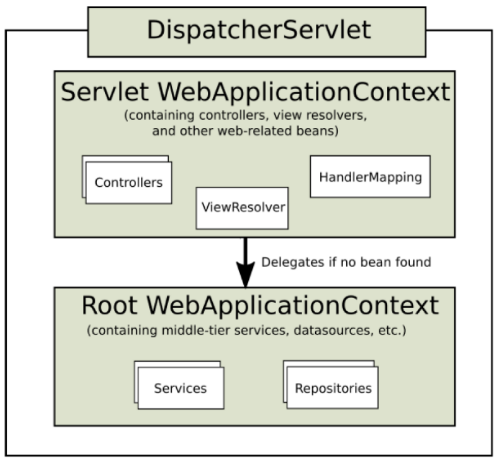

Он принимает входящий URI и находит правильную комбинацию контроллера и вида.
Веб-приложение может определять любое количество DispatcherServlet-ов. Каждый из
них будет работать в своем собственном пространстве имен, загружая свой собственный дочерний WebApplicationContext (на рисунке - Servlet WebApplicationContext) с вьюшками, контроллерами и т.д.

Например, когда необходимо в одном Servlet WebApplicationContext определить обычные контроллеры, а в другом REST-контроллеры.

WebApplicationContext расширяет ApplicationContext (создаёт и управляет бинами и
т.д.), но помимо этого он имеет дополнительный метод getServletContext(), через
который у него есть возможность получать доступ к ServletContext-у.

ContextLoaderListener создает корневой контекст приложения
(на рисунке - Root WebApplicationContext) и будет использоваться всеми дочерними
контекстами, созданными всеми DispatcherServlet.

Корневой контекст приложения будет общим и может быть только один.

RootWebApplicationContext содержит компоненты, которые видны всем дочерним
контекстам, такие как сервисы, репозитории, компоненты инфраструктуры и т.д.

После создания корневого контекста приложения он сохраняется в ServletContext
как атрибут, имя которого: WebApplicationContext.class.getName() + ".ROOT"

Чтобы из контроллера любого дочернего контекста обратиться к корневому контексту приложения, можно использовать класс WebApplicationContextUtils, содержащий статические методы.

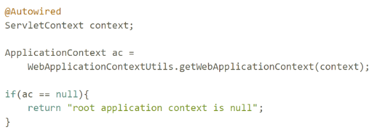

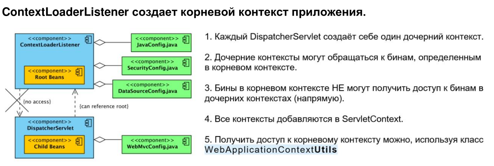

# 34. Что такое AOP? Как реализовано в Spring Framework?
Аспектно-ориентированное программирование (АОП) — это парадигма программирования являющейся дальнейшим развитием процедурного и объектно-ориентированного программирования (ООП). Идея АОП заключается в выделении так называемой сквозной функциональности.

Сквозные задачи — это функциональность, которая затрагивает несколько модулей приложения, например:
- Логирование.
- Управление транзакциями.
- Безопасность (аутентификация и авторизация).
- Кэширование.
- Обработка исключений.

Т.е. есть функциональность которая затрагивает несколько модулей, но она не имеет прямого отношения к бизнес коду, и ее хорошо бы вынести в отдельное место.

Join point — следующее понятие АОП, это точки наблюдения, присоединения к коду, где планируется введение функциональности.

Pointcut — это срез, запрос точек присоединения, — это может быть одна и более точек. Правила запросов точек очень разнообразные, на рисунке выше, запрос по аннотации на методе и конкретный метод. Правила можно объединять по &&, ||,!

Advice — набор инструкций выполняемых на точках среза (Pointcut). Инструкции можно выполнять по событию разных типов:
- **Before** — перед вызовом метода
- **After** — после вызова метода
- **After returning** — после возврата значения из функции
- **After throwing** — в случае exception
- **After finally** — в случае выполнения блока finally
- **Around** — можно сделать пред., пост., обработку перед вызовом метода, а также вообще обойти вызов метода.
  на один Pointcut можно «повесить» несколько Advice разного типа.

Aspect — модуль в котором собраны описания Pointcut и Advice.

AOP позволяет вынести такую функциональность в отдельные модули, называемые **аспектами (aspects)**, и применять их к основному коду без его изменения.

## **Основные понятия AOP**
### **Аспект (Aspect)**:
Модуль, который инкапсулирует сквозную функциональность. Например, аспект для логирования.

### **Совет (Advice)**
Действие, выполняемое аспектом в определенной точке программы.

Типы советов:
- **Before**: Выполняется перед методом.
- **After**: Выполняется после метода (независимо от результата).
- **AfterReturning**: Выполняется после успешного завершения метода.
- **AfterThrowing**: Выполняется, если метод выбрасывает исключение.
- **Around**: Оборачивает метод, позволяя выполнить код до и после его вызова.

### **Точка соединения (Join Point)**:
Точка в программе, где может быть применен аспект. В Spring это обычно вызов метода.

### **Срез (Pointcut)**:
Выражение, которое определяет, где именно должен быть применен совет.
Например, "все методы в пакете `com.example.service`".

### **Внедрение (Weaving)**:
- Процесс подключения аспектов к основному коду.
- В Spring это происходит во время выполнения (runtime).

### Как AOP реализовано в Spring Framework?
Spring предоставляет мощную поддержку AOP через модуль **Spring AOP**.

**Основные особенности:**
- Spring AOP использует **прокси-объекты** для внедрения аспектов.
- Поддерживает **AspectJ** (мощный фреймворк для AOP) через аннотации и конфигурацию.
- Работает на основе **динамических прокси** (для интерфейсов) и **CGLIB** (для классов).

## Реализация AOP в Spring
Для использования AOP в Spring нужно:

Добавить зависимость в `pom.xml` (если используется Maven):

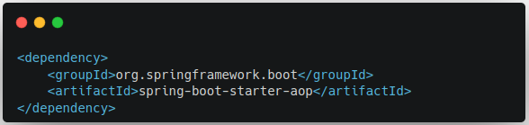

Включить поддержку AOP в конфигурации, указав аннотацию `@EnableAspectAutoProxy`:

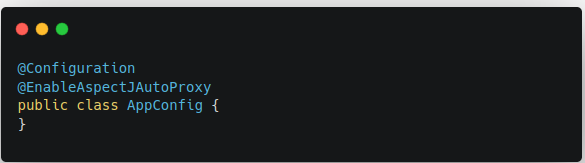

Можно подключить также с помощью XML конфигурации.

Аспект — это класс, помеченный аннотацией `@Aspect`. Внутри аспекта определяются **советы (advices)** и **срезы (pointcuts)**.

Пример аспекта для логирования:

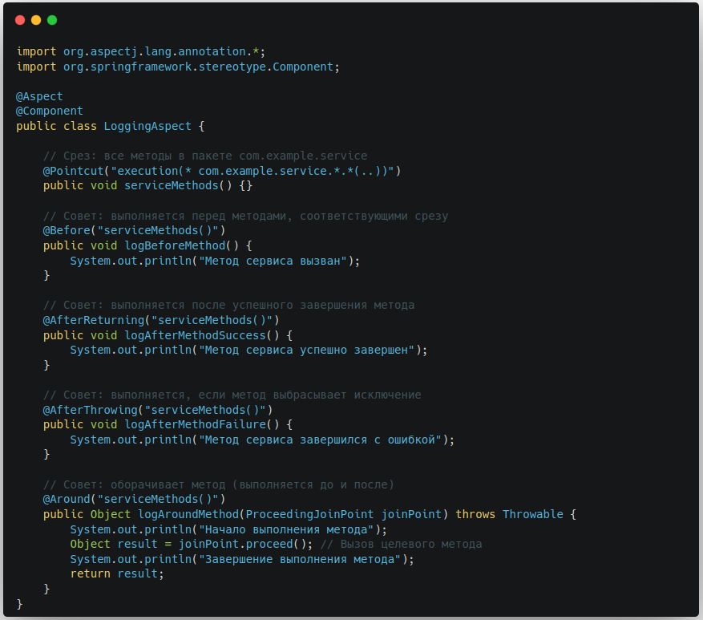

Аспект автоматически применяется к методам, которые соответствуют срезу. Например, если у вас есть сервис:

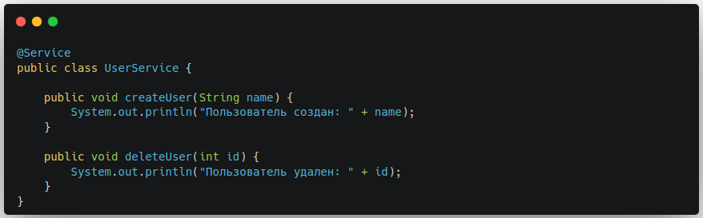

Аспект `LoggingAspect` будет применяться к методам `createUser` и `deleteUser`, так как они находятся в пакете `com.example.service`.

При вызове метода `createUser` вывод будет следующим

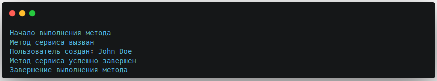

### **Преимущества AOP в Spring**
**Разделение ответственности**: Сквозные задачи вынесены в отдельные модули (аспекты), что упрощает поддержку кода.

**Гибкость**: Аспекты можно легко включать или отключать без изменения основного кода.

**Повторное использование**: Один аспект можно применять к нескольким методам или классам.

**Упрощение кода**: Основная бизнес-логика остается чистой и простой.

### **Ограничения Spring AOP**
- Spring AOP поддерживает только вызовы методов (не конструкторы, поля и т.д.).
- Аспекты применяются только к бинам, управляемым Spring.
- Использование прокси может немного замедлить выполнение.

# 35. PROXY что это, для чего и как применяется в Spring
**Прокси (Proxy)** — это объект, который выступает в роли промежуточного слоя между клиентом и целевым объектом. Прокси перехватывает вызовы к целевому объекту, позволяя выполнять дополнительную логику до или после вызова.

Паттерн Заместитель (Proxy) предоставляет объект-заместитель, который управляет
доступом к другому объекту.

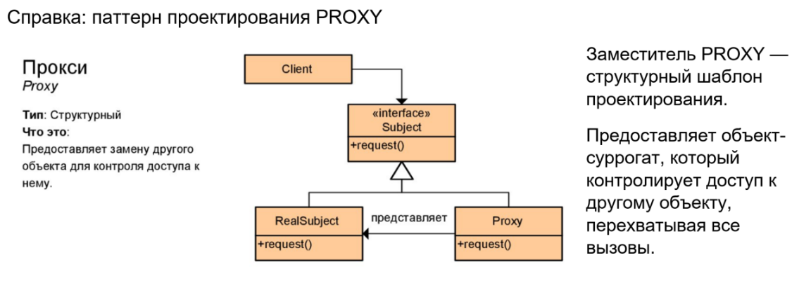

В Spring прокси просто оборачивает bean, он может добавить логику до и после
выполнения методов.

В Spring прокси используются для реализации таких функций, как:
- **AOP (Aspect-Oriented Programming)** — для внедрения аспектов (например, логирование, управление транзакциями).
- **Управление транзакциями** — для автоматического начала, завершения или отката транзакций.
- **Ленивая инициализация** — для отложенного создания объектов.

### Как прокси работают в Spring?
Spring использует два типа прокси:
1. **JDK Dynamic Proxy**:
  - Создается для интерфейсов.
  - Использует встроенные возможности Java для создания динамических прокси.
  - Подходит, если целевой объект реализует интерфейс.

2. **CGLIB Proxy**:
  - Создается для классов (в том числе без интерфейсов).
  - Использует библиотеку CGLIB для создания прокси путем наследования.
  - Подходит, если целевой объект не реализует интерфейс.

## Для чего используются прокси в Spring?
### **Реализация AOP**:
Прокси позволяют внедрять аспекты (например, логирование, управление транзакциями) в методы целевого объекта.

**Пример:** аспект для логирования может добавлять логи до и после вызова метода.

Пример аспекта для логирования:

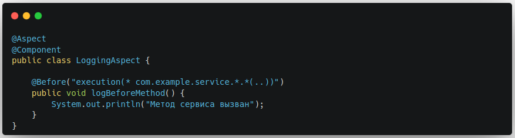

Spring создаст прокси для сервиса `UserService`, чтобы добавить логирование перед вызовом его методов.

### **Управление транзакциями**:
Spring использует прокси для автоматического управления транзакциями.

**Пример**: если метод помечен аннотацией `@Transactional`, прокси начинает транзакцию перед вызовом метода и завершает её после.

Пример сервиса с транзакцией:

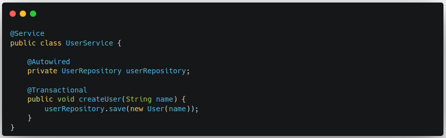

Spring создаст прокси для `UserService`, чтобы автоматически управлять транзакциями при вызове метода `createUser`.

### **Ленивая инициализация**:
Прокси могут откладывать создание объекта до его первого использования.

**Пример**: если бин помечен аннотацией `@Lazy`, Spring создает прокси, который инициализирует объект только при первом вызове.

## Как Spring создает прокси?
Spring автоматически создает прокси для бинов, если это необходимо (например, при использовании AOP или аннотации `@Transactional`).

Процесс создания прокси включает следующие шаги:
1. **Определение необходимости прокси**: Spring анализирует конфигурацию бина (например, наличие аннотаций `@Transactional`, `@Aspect`).
2. **Выбор типа прокси**: Если бин реализует интерфейс, Spring использует **JDK Dynamic Proxy**. Если бин не реализует интерфейс, Spring использует **CGLIB Proxy**. Динамические прокси-серверы JDK предпочтительнее, когда у вас есть выбор.
3. **Создание прокси**: Spring создает прокси-объект, который перехватывает вызовы к целевому объекту. Прокси добавляет дополнительную логику (например, вызов аспектов, управление транзакциями).
4. **Подмена бина**: Spring заменяет оригинальный бин на прокси в контексте приложения.

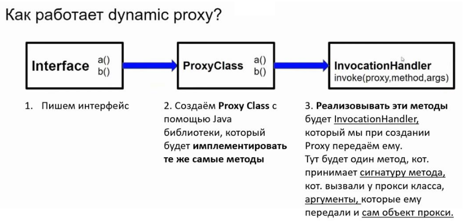

Если вы хотите принудительно использовать проксирование CGLIB (например,
проксировать каждый метод, определенный для целевого объекта, а не только те,
которые реализованы его интерфейсами), вы можете это сделать.

Чтобы принудительно использовать прокси CGLIB, установите для атрибута proxy-
target-class элемента `aop:config` значение true.

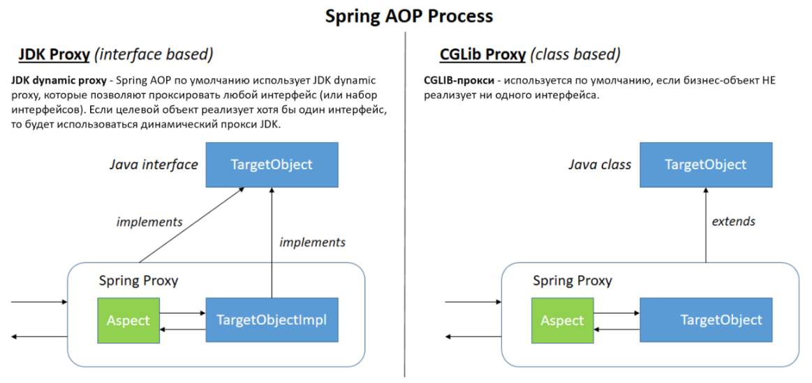

### Как проверить, что бин является прокси?
Вы можете проверить тип объекта в контексте Spring:

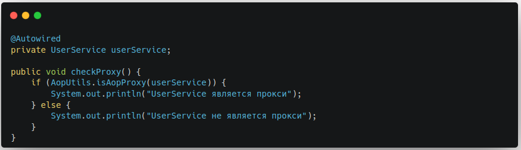

# 36. В чем разница между Filters, Listeners and Interceptors?
**Filters**, **Listeners** и **Interceptors** — это три различных механизма в Java EE и Spring, которые используются для обработки запросов и событий в веб-приложениях. Они выполняют разные задачи и применяются на разных этапах жизненного цикла запроса.

**Filters**:
Используются для обработки запросов и ответов на уровне веб-контейнера.
Подходят для задач, таких как аутентификация, логирование, сжатие данных.

**Listeners**:
Используются для реагирования на события жизненного цикла приложения, сессии или запроса.
Подходят для задач, таких как инициализация ресурсов, логирование событий.

**Interceptors**:
Используются для перехвата вызовов методов контроллеров в Spring MVC.
Подходят для задач, таких как логирование, проверка прав доступа.

### 1. **Filters (Фильтры)**
**Фильтры** — это компоненты, которые обрабатывают HTTP-запросы и ответы до того, как они достигнут целевого ресурса (например, сервлета или контроллера).

#### Как работают?
Фильтры перехватывают запросы и ответы, выполняют свою логику и передают управление следующему фильтру или целевому ресурсу.
Они могут быть сконфигурированы для определенных URL-путей или типов запросов.

Это ИНТЕРФЕЙС из пакета javax.servlet, имплементации которого выполняют задачи
фильтрации либо по пути ЗАПРОСА к ресурсу (сервлету, либо по статическому
контенту), либо по пути ОТВЕТА от ресурса, либо в ОБОИХ направлениях.

Фильтры выполняют фильтрацию в методе doFilter(). Каждый фильтр имеет доступ к
объекту FilterConfig, из которого он может получить параметры инициализации, и ссылку на ServletContext, который он может использовать, например, для загрузки ресурсов, необходимых для задач фильтрации. Фильтры настраиваются в дескрипторе
развертывания веб-приложения.

В веб-приложении мы можем написать несколько фильтров, которые вместе называются цепочкой фильтров. Веб-сервер решает, какой фильтр вызывать первым, в
соответствии с порядком регистрации фильтров.

Когда вызывается метод doFilter(ServletRequest request, ServletResponse response, FilterChain chain) первого фильтра, веб-сервер создает объект FilterChain, представляющий цепочку фильтров, и передаёт её в метод.

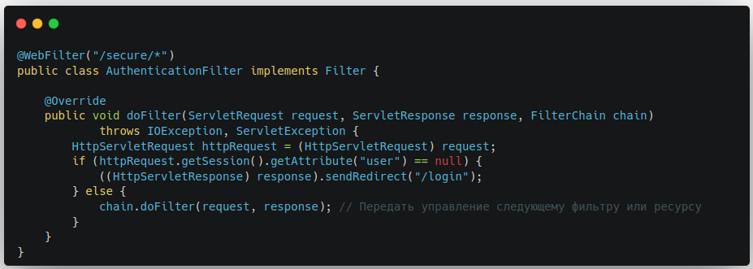

#### Когда использовать?
Для задач, которые должны выполняться до или после обработки запроса (например, аутентификация, логирование).

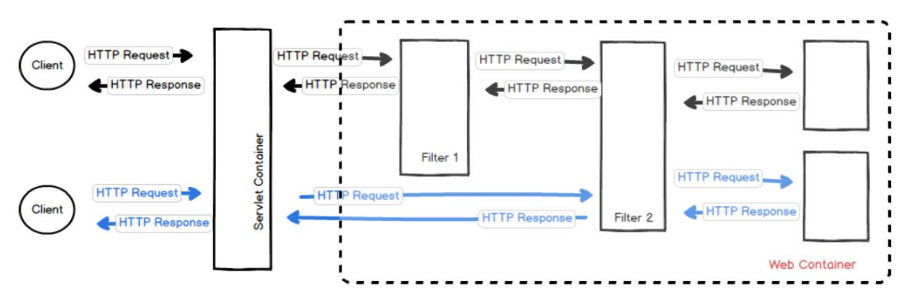

### 2. **Listeners (Слушатели)**
**Listener (Слушатель)** - это класс, который реализует интерфейс
`javax.servlet.ServletContextListener`. Это компоненты, которые реагируют на события жизненного цикла приложения, сессии или запроса.

Он инициализируется только ОДИН раз при запуске веб-приложения и уничтожается при остановке веб-приложения.

Слушатель сидит и ждет, когда произойдет указанное событие, затем «перехватывает» событие и запускает собственное событие.

Например, необходимо инициализировать пул соединений с базой данных до запуска
веб-приложения. ServletContextListener – это то, что нужно. Он будет запускать код до
запуска веб-приложения.

Все ServletContextListener -s уведомляются об инициализации контекста до
инициализации любых фильтров или сервлетов в веб-приложении, а также уведомляются об уничтожении контекста после того, как все сервлеты и фильтры уничтожены.

Чтобы создать свой `Listener`, достаточно создать класс, имплементирующий интерфейс
`ServletContextListener` и поставить над ним аннотацию `@WebListener`.

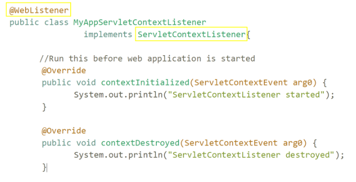

Они используются для выполнения задач, таких как:
- Инициализация ресурсов при запуске приложения.
- Очистка ресурсов при завершении приложения.
- Отслеживание создания и уничтожения сессий.
- Отслеживание изменений атрибутов.

#### Как работают?
Слушатели регистрируются в веб-контейнере и автоматически вызываются при наступлении определенных событий.

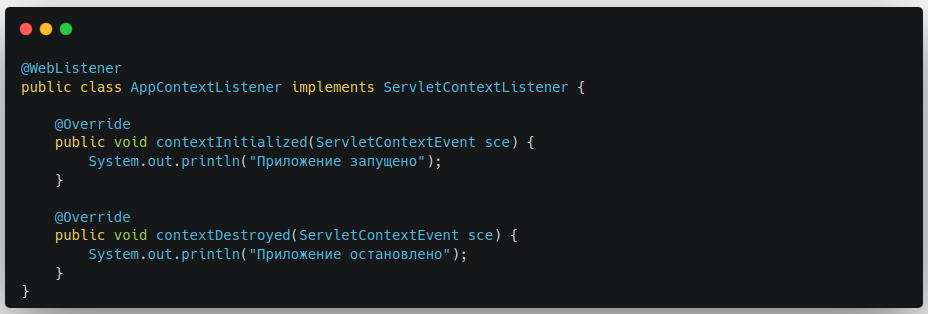

#### Когда использовать?
Для выполнения задач, связанных с жизненным циклом приложения, сессии или запроса (например, инициализация ресурсов, логирование событий).

### 3. **Interceptors (Перехватчики)**
Это `ИНТЕРФЕЙС` из пакета `org.aopalliance.intercept`, предназначенный для AOP
аспектно-ориентированного программирования.

В Spring, когда запрос отправляется в Controller, перед тем как он в него попадёт, он
может пройти через перехватчики Interceptor (0 или более). Это одна из реализаций АОП в Spring. Можно использовать Interceptor для выполнения таких задач, как запись в Log, добавление или обновление конфигурации перед тем, как запрос обработается Controller- ом.

Стек перехватчиков: он предназначен для связывания перехватчиков в цепочку в
определенном порядке. При доступе к перехваченному методу или полю перехватчик в цепочке перехватчиков вызывается в том порядке, в котором он был определен.

Можно использовать Interceptor-ы для выполнения логики до попадания в контроллер,
после обработки в контроллере, а также после формирования представления. Также
можно запретить выполнение метода контроллера или указать любое количество
перехватчиков.

Перехватчики работают с `HandlerMaping` и поэтому должны реализовывать интерфейс
`HandlerInterceptor` или наследоваться от готового класса `HandlerInterceptorAdapter`.

В случае реализации `HandlerInterceptor` нужно переопределить 3 метода, а в случае
`HandlerInterceptor`, только те, что необходимы:

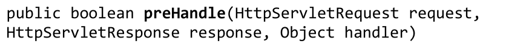

Вызывается после того, как `HandlerMaping` определил соответствующий контроллер, но до того, как HandlerAdapter вызовет метод контроллера.

С помощью этого метода каждый перехватчик может решить, прервать цепочку
выполнения или направить запрос на исполнение дальше по цепочке перехватчиков до
метода контроллера.

С помощью этого метода каждый перехватчик может решить, прервать цепочку
выполнения или направить запрос на исполнение дальше по цепочке перехватчиков до
метода контроллера.

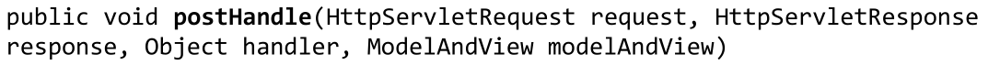

Отработает после контроллера, но перед формированием представления. Мы можем
использовать этот метод для добавления дополнительных атрибутов в ModelAndView или для определения времени, затрачиваемого методом-обработчиком на обработку запроса клиента. Вы можете добавить больше объектов модели в представление, но вы не можете изменить HttpServletResponse, так как он уже зафиксирован.

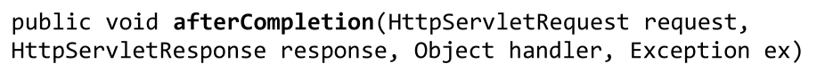

Отработает после формирования представления. Вызывается только в том случае,
ЕСЛИ метод preHandle этого перехватчика успешно завершен и вернул true!

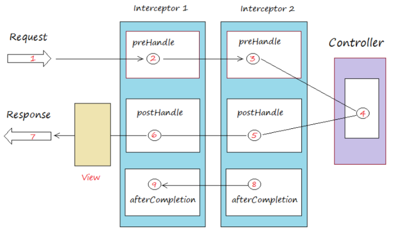

HandlerInterceptor связан с бином DefaultAnnotationHandlerMapping,
который отвечает за применение перехватчиков к любому классу,
помеченному аннотацией @Controller. Чтобы добавить перехватчики в конфигурацию Spring, нужно переопределить метод addInterceptors() внутри класса, который реализует WebMvcConfigurer.

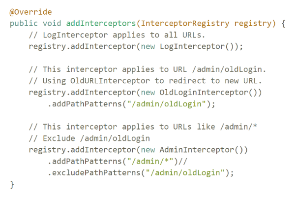

**Перехватчики** — это компоненты, которые перехватывают вызовы методов в Spring (например, методы контроллеров).

Они используются для выполнения задач, таких как:
- Логирование.
- Проверка прав доступа.
- Изменение данных запроса или ответа.

#### Как работают?
Перехватчики работают на уровне Spring MVC и перехватывают вызовы методов контроллеров.
Они могут быть применены до и после выполнения метода, а также вокруг него.

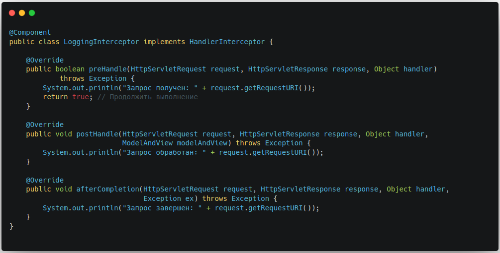

#### Когда использовать?
Для задач, которые должны выполняться до или после вызова методов контроллеров (например, логирование, проверка прав доступа).

Filter vs. Interceptor
- Перехватчик основан на механизме `Reflection`, а фильтр основан на обратном вызове функции.
- Фильтр зависит от контейнера сервлета, тогда как перехватчик не зависит от него.
- Перехватчики могут работать только с запросами к контроллерам, в то время как фильтры могут работать почти со всеми запросами (например, js, .css и т.д.).
- Перехватчики в отличии от фильтров могут обращаться к объектам в контейнере Spring, что даёт им более изощренный функционал.

Порядок работы:
- Фильтры до
- Перехватчики до
- Метод контроллера
- Перехватчики после
- Фильтры после

`HandlerInterceptor` в основном похож на Servlet Filter, но в отличие от него он просто
позволяет настраивать предварительную обработку с возможностью запретить
выполнение самого обработчика и настраивать постобработку.

Согласно документации Spring, фильтры более мощные, например, они позволяют
обмениваться объектами запроса и ответа, которые передаются по цепочке. Это
означает, что фильтры работают больше в области запроса/ответа, в то время как
HandlerInterceptor -s являются бинами и могут обращаться к другим компонентам в
приложении.

Фильтр настраивается в web.xml, а `HandlerInterceptor` в контексте приложения.

# 37. Можно ли передать в запросе один и тот же параметр несколько раз? Как?
В Spring можно передать один и тот же параметр несколько раз в запросе, и обработать его разными способами.

### 1. **Использование `List` или массива в `@RequestParam`**
Spring автоматически соберет все значения параметра в список или массив.

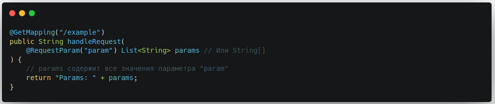

**Запрос:**

Результат:

### 2. **Использование `MultiValueMap`**
Можно получить все параметры запроса в виде `MultiValueMap`, где каждый ключ может иметь несколько значений.

Spring автоматически связывает параметры запроса с `MultiValueMap`, если использовать аннотацию `@RequestParam`.

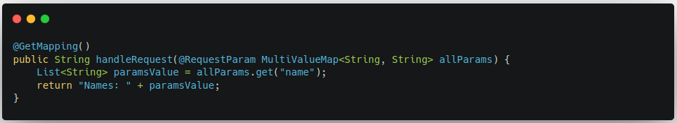

**Запрос:**

**Результат:**

**MultiValueMap** — это интерфейс в Spring Framework, который представляет собой структуру данных, где каждый ключ может быть связан с **несколькими значениями**. Это удобно для работы с параметрами запроса, заголовками HTTP и другими данными, где одному ключу может соответствовать несколько значений.

В отличие от обычной `Map`, где каждый ключ связан только с одним значением, `MultiValueMap` позволяет хранить несколько значений для одного ключа.

Определен в пакте: `package org.springframework.util`. 

Spring предоставляет несколько реализаций `MultiValueMap`, например:
- `LinkedMultiValueMap` — сохраняет порядок добавления ключей и значений.
- `LinkedCaseInsensitiveMap` — игнорирует регистр ключей.

`MultiValueMap` часто используется для работы с:
- Параметрами HTTP-запроса (например, `?param=value1&param=value2`).
- Заголовками HTTP (например, `Accept: application/json, text/plain`).

`MultiValueMap` также используется для работы с заголовками HTTP.

# 38. Как работает Spring Security? Как сконфигурировать? Какие интерфейсы используются?
**Spring Security** — это мощный фреймворк для обеспечения безопасности в Spring-приложениях. Он предоставляет механизмы для аутентификации, авторизации, защиты от атак (например, CSRF, XSS) и других аспектов безопасности.

**Он Spring Security предоставляет:**
- Гибкую конфигурацию через Java или XML.
- Поддержку аутентификации (например, форма входа, JWT).
- Авторизацию на основе ролей и прав.
- Защиту от атак (CSRF, XSS).

Spring Security работает на основе **фильтров (Filters)**, которые перехватывают HTTP-запросы и выполняют проверки безопасности.

1. **Запрос поступает в приложение**: Пользователь отправляет HTTP-запрос (например, через браузер).

2. **Фильтры Spring Security**: Запрос проходит через цепочку фильтров Spring Security, которые выполняют различные задачи:
  - **Аутентификация**: Проверка, кто пользователь (например, по логину и паролю).
  - **Авторизация**: Проверка, имеет ли пользователь доступ к запрашиваемому ресурсу.
  - **Защита от атак**: Проверка на CSRF, XSS и другие уязвимости.

3. **Аутентификация**: Если пользователь не аутентифицирован, Spring Security перенаправляет его на страницу входа. Если аутентификация успешна, создается объект `Authentication`, который хранится в `SecurityContext`.

4. **Авторизация**: Spring Security проверяет, имеет ли пользователь доступ к запрашиваемому ресурсу, на основе его ролей и прав.

5. **Ответ пользователю**: Если все проверки пройдены, запрос передается в контроллер, и пользователь получает ответ.

Spring Security можно сконфигурировать двумя способами:
1. **Через XML** (устаревший способ).
2. **Через Java-конфигурацию** (рекомендуемый способ).

Для аутентификации используем POST запрос и обязательные поля сущности:
• username
• password

Spring ждёт эти поля и будет генерировать если явно их не обозначим. Когда эти данные «летят» в HttpServletRequest, то фильтры будут выдёргивать именно эти данные.

Необходимо использовать csrf токен – это защита от скрытых полей и редиректа на вредоносные ресурсы.
#### Пример конфигурации через Java
**Добавление зависимости**:  
Если мы используем Maven, добавим зависимость Spring Boot Starter Security в `pom.xml`: 

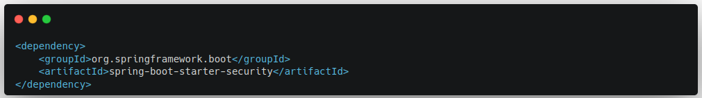

**Создание класса конфигурации**:  
Создайте класс, который расширяет `WebSecurityConfigurerAdapter` (в Spring Security 5.7+ придется использовать `SecurityFilterChain`).

Указываем аннотацию `@EnableWebSecurity` на классе чтобы активировать Spring Security.  

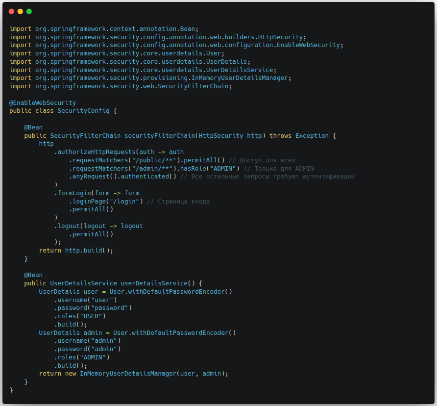

В этом примере:
`/public/**` доступен для всех.
`/admin/**` доступен только для пользователей с ролью `ADMIN`.
Все остальные запросы требуют аутентификации.
Используется встроенная форма входа.

**Настройка пользователей**:
В примере выше пользователи хранятся в памяти (`InMemoryUserDetailsManager`).
В реальных приложениях пользователи обычно хранятся в базе данных.

### Основные интерфейсы Spring Security
Основные интерфейсы:
- `UserDetails`, `UserDetailsService`,`Authentication`,`SecurityContext`,`GrantedAuthority`, `PasswordEncoder`.

### **UserDetails**:
Представляет информацию о пользователе (логин, пароль, роли).

### **UserDetailsService**:
Предоставляет информацию о пользователе.

### **Authentication**:
Представляет аутентифицированного пользователя. Содержит информацию о пользователе (`Principal`), его учетных данных (`Credentials`) и правах (`Authorities`).

### **SecurityContext**:
Хранит информацию о текущем аутентифицированном пользователе (`Authentication`).

### **GrantedAuthority**:
Представляет право или роль пользователя (например, `ROLE_ADMIN`).

### **PasswordEncoder**:
Используется для хеширования и проверки паролей.

### Пример защиты для REST API
Если мы разрабатываем REST API, можно использовать JWT (JSON Web Token) для аутентификации.

**Добавление JWT**:
Используйте библиотеку, например, `jjwt`, для создания и проверки токенов.

**Настройка фильтра**:
Создайте фильтр, который проверяет JWT в заголовке запроса.

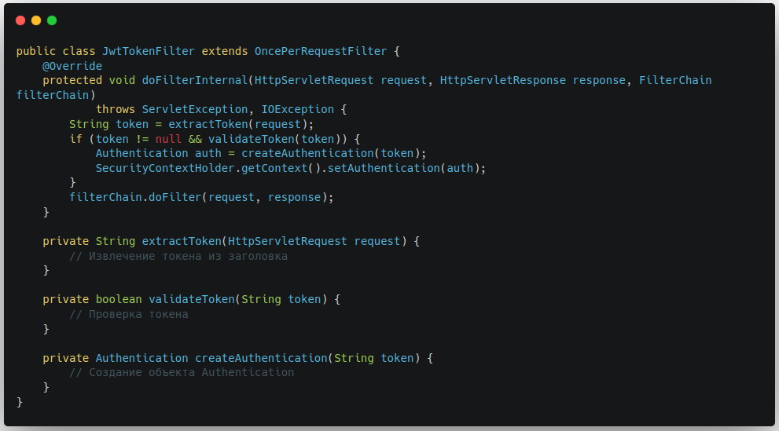

**Регистрация фильтра**:
Добавьте фильтр в цепочку Spring Security.

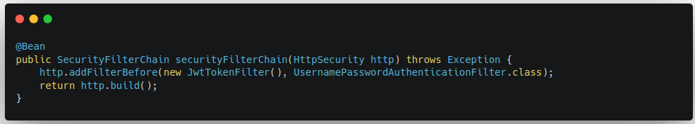

Principal principal – это информация о текущем пользователе, которая хранится
в контексте Spring Security: principal.getName() – так получаем имя аутентифицированного пользователя.
Идемпотентность в контроллер-методе.

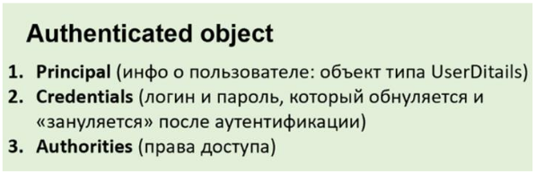

## Авторизация
Где и как хранится инфо о пользователях?

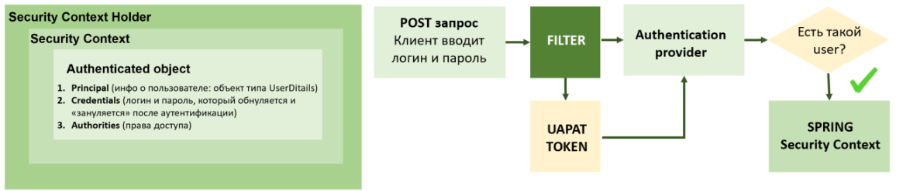

Идентификация – уточнение имени и пароля.

Аутентификация – это процедура проверки подлинности пользователя путём сравнения введённого им логина и пароля с сохранёнными в базе данных.

Авторизация – это проверка и определение полномочий на выполнение определённых
действий в соответствии с ранее выполненной аутентификацией.

Как это работает?
1) Пользователь формирует POST запрос
2) Фильтр перехватывает и выдёргивает из запроса логин и пароль, далее формирует UAPAT токен (Username And Password Authorization token)
3) Токен летит дальше и попадает в Authentication provider. Его задача провести аутентификацию и сказать, существует ли такой пользователь? И если да, то кладём его в SPRING Security Context.

Зачем тут нужны UserService и Authentication provider?
- Провайдер получает токен (логин и пароль).
- Провайдер обращается к UserDitailsService: есть у тебя такой юзер?
- UserDitailsService знает, где юзеры хранятся и по username (byUserName) получает и возвращает настоящего юзера в виде объекта UserDitails (principal).
- Далее Authentication provider берёт из токена пароль и делает проверку equals()
- Если они равны, кладёт их в Spring Security Context.

Задачи Authentication provider: запросить настоящего юзера у UserDitailsService, сравнить пароль, почистить credentials (логин и пароль не сохраняются).
Spring хранит только Authorities (права доступа), а если нужна полная информация о
клиенте, то нужно обратиться в базу данных.

ФИКСИРУЕМ
DaoAuthenticationProvider — это реализация AuthenticationProvider, которая
использует UserDetailsService и PasswordEncoder для проверки подлинности имени
пользователя и пароля.

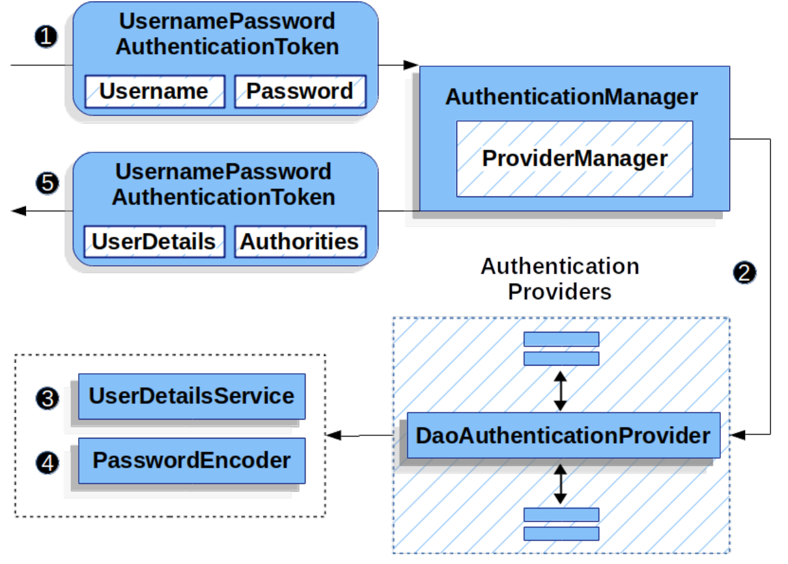

### Когда пользователь посылает POST request, то «формируется посылка». КАК?

№1 В цепочке фильтров стоит фильтр, который обрабатывает и выдёргивает TOKEN

№2 Далее действует Authentication Manager, в котором есть Provider Manager.
Он может состоять не из одного провайдера, а из многих, настроенных на разные
реакции.

В DaoAuthenticationProvider записаны:
№3 UserDetailsService (возвращает пользователя по имени) и …
№4 PasswordEncoder (преобразовывает введённый пароль к хэшу)

Если все ОК, то возвращается UPAT TOKEN
• UserDetails (принципал)
• Authorities (права доступа)

Если аутентификация прошла успешно, возвращаемая проверка подлинности имеет тип UsernamePasswordAuthenticationToken и имеет принципала, который представляет
собой UserDetails, возвращаемый настроенной службой UserDetailsService.

В конечном итоге возвращенный UPAT устанавливается в SecurityContextHolder
фильтром аутентификации.

# 39. Что такое SpringBoot? Какие у него преимущества? Как конфигурируется? Подробно.
**Spring Boot** — это фреймворк для создания Spring-приложений, который значительно упрощает процесс разработки, настройки и запуска приложений. Он предоставляет готовые решения для типичных задач, таких как настройка серверов, управление зависимостями и конфигурацией, что позволяет разработчикам сосредоточиться на реализации бизнес-логики.
#### Преимущества Spring Boot:
1. **Упрощение разработки**: Spring Boot автоматически настраивает многие компоненты, что избавляет разработчиков от написания boilerplate-кода.
2. **Встроенный сервер**: Spring Boot по умолчанию использует встроенный сервер (например, Tomcat, Jetty или Undertow), что упрощает запуск приложения без необходимости настройки внешнего сервера.
3. **Конфигурация через свойства**: Настройки приложения можно выносить в файлы `application.properties` или `application.yml`, что делает конфигурацию гибкой и удобной для управления.
4. **Стартеры (Starters)**: Spring Boot предоставляет набор стартеров, которые автоматически **добавляют необходимые зависимости** и **настраивают бины** для решения конкретных задач.
5. **Микросервисная архитектура**: Spring Boot идеально подходит для создания микросервисов благодаря своей легкости и быстрой настройке.
6. **Метрики и мониторинг**: Spring Boot Actuator предоставляет готовые инструменты для мониторинга и управления приложением.

#### Основные сущности фреймворка Spring Boot – это стартеры.

Стартеры — это зависимости с названиями вида `spring-boot-starter-xxx`, которые выполняют две основные задачи:
1. **Добавляют набор типичных сторонних библиотек-зависимостей**.
2. **Регистрируют типичные бины и их конфигурации**.

Кроме того, Spring Boot предоставляет ряд полезных функций, таких как:
- **Embedded-сервер** (встроенный сервер).
- **Конфигурация web-приложения без `web.xml`**.
- **Properties**, вынесенные из кода во внешние файлы.

#### Примеры стартеров:
**`spring-boot-starter-data-jpa`**: Предоставляет все необходимые зависимости для работы с JPA (Java Persistence API) и ORM (Object-Relational Mapping) в Spring-приложениях. Этот стартер автоматически добавляет библиотеки, которые упрощают взаимодействие с базами данных через JPA, а также настраивает необходимые бины в контексте Spring.

**ПОДРОБНО ПРО ДАННЫЙ СТАРТЕР В СЛЕДУЮЩЕМ ВОПРОСЕ!**

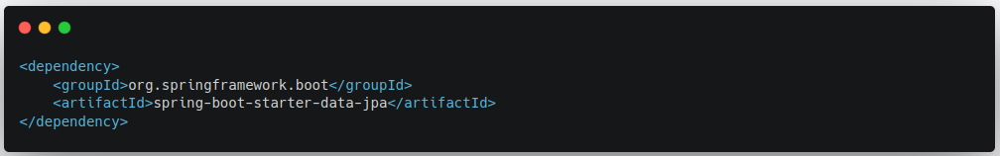

После добавления этого стартера вы можете сразу начать использовать JPA-репозитории, не настраивая их вручную.

**`spring-boot-starter-web`**: Этот стартер добавляет зависимости для создания веб-приложений, включая Spring MVC и имеет встроенный сервер Tomcat.

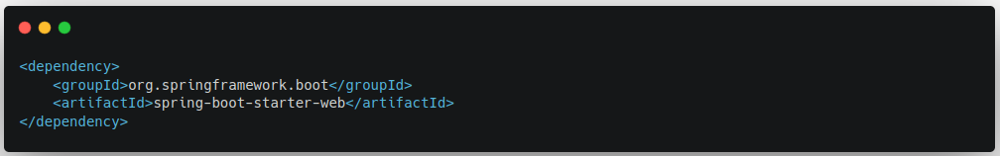

После добавления этого стартера мы можем сразу создавать REST-контроллеры и запускать приложение на встроенном сервере.

**`spring-boot-starter-actuator`**: Этот стартер добавляет инструменты для мониторинга и управления приложением, такие как метрики, health checks и т.д.

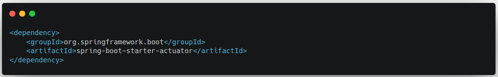

#### Конфигурация Spring Boot:
Spring Boot предоставляет несколько способов конфигурации приложения:

### **Файлы `application.properties` или `application.yml`**:

В `application.properties`:

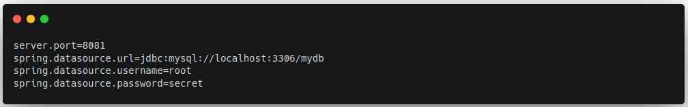

В `application.yml`:

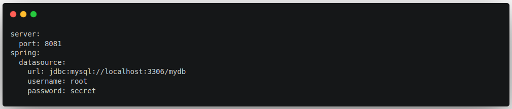

### **Программная конфигурация**:
Вы можете настроить бины и параметры в коде с помощью аннотаций, таких как `@Configuration`, `@Bean`, `@Value` и других.

### Профили:
Spring Boot позволяет использовать разные профили для различных окружений (например, `dev`, `test`, `prod`).

Активировать профиль можно через параметр `spring.profiles.active`.

#### Преимущества и недостатки:
**Преимущества**:
- Ускорение разработки за счет автоматизации конфигурации.
- Упрощение конфигурации и управления зависимостями.
- Идеально подходит для микросервисной архитектуры.

**Недостатки**:
- Избыточность зависимостей может привести к увеличению размера приложения.
- Некоторое снижение производительности из-за автоматической конфигурации и использования встроенных инструментов.

# 40. Какие задачи решает Spring Data?
**Spring Data** — это проект в экосистеме Spring, который упрощает работу с различными источниками данных, такими как реляционные базы данных, NoSQL-хранилища, REST API и другие. Основная задача Spring Data — уменьшить количество шаблонного кода и упростить доступ к данным, предоставляя удобные абстракции и инструменты.

Основная часть работы в Spring Data строится вокруг интерфейса Repository.
Это маркерный интерфейс. От него наследуются интерфейсы-специализации, которые
уже содержат методы для работы с сущностями базы данных. Все эти интерфейсы
параметризуются двумя типами: самой сущности и её идентификатора.

Spring Data состоит из множества отдельных библиотек для разных случаев жизни.
Вот самые популярные из них:
- Spring Data JPA – адаптер для реализаций Java Persistence API, таких как Hibernate.
- Spring Data JDBC – более простой и ограниченный чем JPA адаптер для JDBC-драйверов.
- Spring Data REST – создание готовых hypermedia-driven RESTful сервисов на основе репозиториев.
- Spring Data KeyValue – работа с хранилищами типа ключ-значение.
- Библиотеки поддержки конкретных реализаций хранилищ: MongoDB, Redis, Cassandra, LDAP, и других.

**Упрощение работы с репозиториями**:
Spring Data предоставляет интерфейсы (например, `CrudRepository`, `JpaRepository`), которые автоматически реализуют базовые операции CRUD (Create, Read, Update, Delete). Это избавляет разработчика от необходимости писать стандартный код для работы с данными.

**Поддержка различных источников данных**:
Spring Data поддерживает множество технологий, включая:
Реляционные базы данных (через Spring Data JPA).
NoSQL-базы данных (например, MongoDB, Cassandra, Redis).
Поисковые системы (например, Elasticsearch).
REST API (через Spring Data REST).

**Автоматическая генерация запросов**:
Spring Data позволяет создавать запросы к данным на основе имен методов в репозиториях.
Например, метод `findByLastName(String lastName)` автоматически генерирует SQL-запрос для поиска по полю `lastName`.

**Поддержка пагинации и сортировки**:
Spring Data предоставляет встроенные механизмы для работы с большими наборами данных, такие как пагинация и сортировка.

**Интеграция с Spring**:
Spring Data легко интегрируется с другими модулями Spring, такими как Spring MVC, Spring Security и Spring Boot.

**Поддержка транзакций**:
Spring Data интегрируется с механизмом управления транзакциями Spring, что упрощает работу с транзакциями в приложениях.

**Поддержка кастомных запросов**:
Если автоматически сгенерированных запросов недостаточно, Spring Data позволяет писать кастомные запросы с использованием JPQL, SQL или нативных запросов.

**Абстракция над различными технологиями**:
Spring Data предоставляет единый API для работы с разными типами хранилищ, что упрощает переход между ними.
### Стартер для работы Spring Data JPA:
**`spring-boot-starter-data-jpa`** — это один из стартеров Spring Boot, который предоставляет все необходимые зависимости для работы с JPA (Java Persistence API) и ORM (Object-Relational Mapping) в Spring-приложениях. Этот стартер автоматически добавляет библиотеки, которые упрощают взаимодействие с базами данных через JPA, а также настраивает необходимые бины в контексте Spring.

Что входит в `spring-boot-starter-data-jpa`?
**Spring Data JPA**:
Основная библиотека для работы с JPA в Spring. Предоставляет абстракции для создания репозиториев, которые упрощают выполнение CRUD-операций (Create, Read, Update, Delete) и запросов к базе данных.

**Hibernate**:
Hibernate — это одна из самых популярных реализаций JPA.
Обеспечивает ORM-функциональность, позволяя отображать Java-объекты на таблицы базы данных и выполнять запросы в объектно-ориентированном стиле.

**JPA API (javax.persistence)**:
Стандартный API для работы с JPA, который включает аннотации и интерфейсы для определения сущностей, их связей и запросов.

**Spring ORM**:
Интеграция Spring с ORM-фреймворками, такими как Hibernate.
Упрощает управление транзакциями и сессиями.

**Spring JDBC**:
Упрощает работу с JDBC (Java Database Connectivity), предоставляя шаблоны для выполнения SQL-запросов.

**Транзакции (Spring Transaction Management)**:
Поддержка декларативного управления транзакциями через аннотацию `@Transactional`.

**Зависимости для работы с базой данных**:
Например, драйверы для работы с конкретными базами данных (например, MySQL, PostgreSQL, H2 и т.д.). Однако сам драйвер базы данных нужно добавлять отдельно, так как он зависит от выбранной СУБД.

**Встроенные базы данных (опционально)**:
Если вы используете встроенные базы данных, такие как H2 или HSQLDB, стартер может автоматически настроить их для тестирования и разработки.

**Пример зависимостей, которые добавляет** `spring-boot-starter-data-jpa`:

После добавления этой зависимости в наш проект, мы получим доступ к следующим возможностям:
- **Автоматическая настройка JPA**: Spring Boot автоматически настраивает `EntityManagerFactory`, `DataSource` и другие бины, необходимые для работы с JPA.
- **Репозитории**: Вы можете создавать репозитории, расширяя интерфейс `JpaRepository`, и Spring Data JPA автоматически реализует методы для работы с базой данных.
- **Поддержка транзакций**: Вы можете использовать аннотацию `@Transactional` для управления транзакциями.
- **Миграции базы данных**: Spring Boot интегрируется с инструментами, такими как Flyway или Liquibase, для управления миграциями базы данных.

# 41. Какова иерархия интерфейсов/классов репозитория в Spring Data JPA?
В Spring Data JPA иерархия интерфейсов и классов репозитория построена таким образом, чтобы предоставить разработчикам максимальную гибкость и минимизировать количество шаблонного кода. Основные интерфейсы и классы образуют иерархию, которая начинается с базовых интерфейсов и заканчивается специализированными, такими как `JpaRepository`.

### **Repository<T, ID>**
Это корневой интерфейс в иерархии Spring Data. Он является маркерным интерфейсом и не предоставляет никаких методов. Используется для указания, что интерфейс является репозиторием.

### **CrudRepository<T, ID>**
Расширяет `Repository` и предоставляет базовые операции CRUD (Create, Read, Update, Delete).

**Основные методы:**
- `save(S entity)`: Сохраняет сущность.
- `findById(ID id)`: Находит сущность по ID.
- `findAll()`: Возвращает все сущности.
- `deleteById(ID id)`: Удаляет сущность по ID.
- `count()`: Возвращает количество сущностей.

### **PagingAndSortingRepository<T, ID>**:
Интерфейс PagingAndSortingRepository расширяет интерфейс CrudRepository и предоставляет дополнительные методы для извлечения сущностей с помощью разбиения на страницы и сортировки.

Основные методы:
- `findAll(Pageable pageable)`: Возвращает страницу сущностей.
- `findAll(Sort sort)`: Возвращает все сущности, отсортированные по указанным критериям.
### **JpaRepository<T, ID>**
Интерфейс JpaRepository расширяет интерфейс PagingAndSortingRepository и QueryByExampleExecutor, предоставляя некоторые специфичные пакетные методы.

Основные методы:
- `flush()`: Синхронизирует изменения с базой данных.
- `saveAndFlush(S entity)`: Сохраняет сущность и сразу синхронизирует изменения.
- `deleteInBatch(Iterable<T> entities)`: Удаляет несколько сущностей в одном пакете.
- `findAll()`: Возвращает список сущностей (в отличие от `Iterable` в `CrudRepository`).

### **QueryByExampleExecutor< T>**
Интерфейс **`QueryByExampleExecutor<T>`** в Spring Data JPA не является частью основной иерархии репозиториев (например, `Repository`, `CrudRepository`, `JpaRepository`). Вместо этого он предоставляет дополнительную функциональность для выполнения запросов по примеру (**Query by Example, QBE**), которая может быть добавлена к любому репозиторию.

**Что такое Query by Example (QBE)?**
**Query by Example** — это подход, при котором запросы формируются на основе примера сущности. Например, если у вас есть сущность `User` с полями `firstName` и `lastName`, вы можете создать экземпляр `User`, установить значение для `lastName`, и Spring Data автоматически сгенерирует запрос для поиска пользователей с таким `lastName`.
#### Основные методы:
- `findOne(Example<S> example)`: Находит одну сущность, соответствующую примеру.
- `findAll(Example<S> example)`: Находит все сущности, соответствующие примеру.
- `findAll(Example<S> example, Pageable pageable)`: Находит страницу сущностей, соответствующих примеру.
- `findAll(Example<S> example, Sort sort)`: Находит все сущности, соответствующие примеру, с сортировкой.
- `count(Example<S> example)`: Возвращает количество сущностей, соответствующих примеру.
- `exists(Example<S> example)`: Проверяет, существует ли хотя бы одна сущность, соответствующая примеру.

### SimpleJpaRepository
`SimpleJpaRepository` — это реализация интерфейсов `CrudRepository` и `PagingAndSortingRepository`. Она добавляет поддержку пагинации и сортировки данных. Этот класс реализован для работы с конкретными ORM-фреймворками, такими как Hibernate, EclipseLink и другие, используя JPA.

QueryDslJpaRepository – это класс.

# 42. Как преодолеть проблему блокирующих вызовов?
### **Модель «поток на запрос»**
Традиционный способ разработки веб-приложения с помощью Spring – это использование MVC и его развертывание в контейнере сервлетов, таком как Tomcat. Контейнер сервлетов имеет выделенный пул потоков для обработки HTTP-запросов, где каждому входящему запросу будет назначен поток, и этот поток будет обрабатывать весь жизненный цикл запроса (модель «поток на запрос»). По умолчанию для сервера Tomcat установлено 200 подключений.

Это означает, что приложение сможет обрабатывать количество одновременных запросов, равное размеру пула потоков. Можно настроить размер пула потоков, но поскольку каждый поток резервирует некоторую память (обычно 1 МБ), чем больший размер пула потоков мы настраиваем, тем выше потребление памяти.

Если приложение разработано в соответствии с архитектурой на основе микросервисов, то у нас есть лучшие возможности для масштабирования в зависимости от нагрузки, но за высокое использование памяти по-прежнему приходится платить (потоки часто блокируются в ожидании ответа от другой службы, что приводит к огромной трате ресурсов).

### **Ожидание операций ввода/вывода**
Такой же тип потерь также возникает при ожидании завершения других типов операций ввода-вывода, таких как вызов базы данных или чтение из файла. Во всех этих ситуациях поток, выполняющий запрос ввода-вывода, будет заблокирован и
будет ожидать, пока операция ввода-вывода не будет завершена, это называется блокирующим вводом-выводом. Такие ситуации, когда выполняющийся поток блокируется, просто ожидая ответа, означают потерю потоков и, следовательно, потерю памяти (рисунок слева).

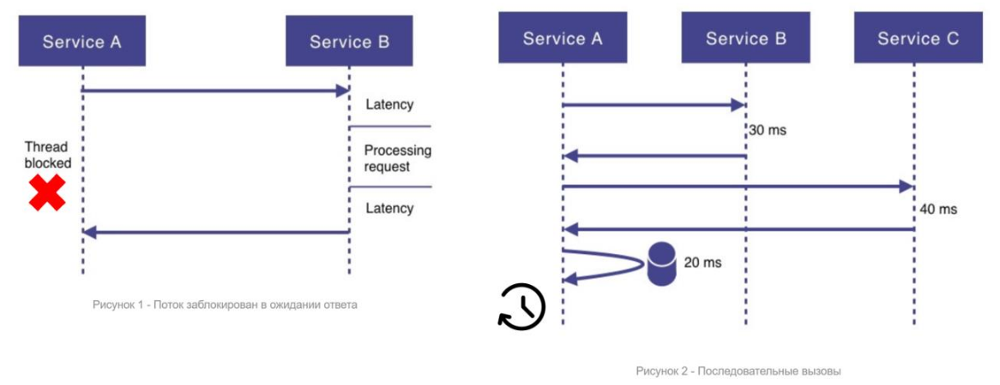

### **Время ответа**
Другой проблемой традиционного императивного программирования является время отклика, когда службе необходимо выполнить более одного запроса ввода-вывода (рисунок справа). Например, службе A может потребоваться вызвать службы B и C, а также выполнить поиск в базе данных, а затем вернуть в результате некоторые агрегированные данные.

**Это будет означать, что время ответа службы A, помимо времени ее обработки, будет суммой следующих значений:**
- время отклика услуги B (задержка сети + обработка)
- время отклика службы C (задержка сети + обработка)
- время ответа на запрос к базе данных (сетевая задержка + обработка)

Если нет никакой реальной логической причины выполнять эти вызовы последовательно, то, безусловно, если эти вызовы будут выполняться параллельно, это очень положительно повлияет на время отклика службы А.

### **Перегрузка клиента**
Другой тип проблемы, которая может возникнуть в ландшафте микросервисов, - когда сервис A запрашивает некоторую информацию у сервиса B, скажем, например, обо всех заказах, размещенных в течение последнего месяца. Если количество заказов окажется огромным, для службы А может возникнуть проблема получить всю эту информацию сразу. Служба A может быть перегружена большим объемом данных, что может привести, например, к ошибке нехватки памяти.

### Все эти проблемы решает **реактивное программирование.**

**Перечислим преимущества:**
• отходим от модели «поток на запрос» и можем обрабатывать больше запросов с небольшим количеством потоков
• предотвращаем блокировку потоков при ожидании завершения операций ввода-
вывода
• упрощаем параллельные вызовы
• поддерживаем «обратное давление», давая клиенту возможность сообщить серверу, с какой нагрузкой он может справиться

То есть это не от слова «реактивный = высокоскоростной», это НЕ про ускорение.
Это про оптимизацию управления тредами, потоками: количество обрабатываемых
запросов за единицу времени (от слова «реакция» … на события).
Не ждём, а работаем: реактивность добавляет возможность обрабатывать данные
потоком, разбивая задачу на множество подзадач.

Говорят, когда Генри Форд придумал свой конвейер, он повысил производительность труда в четыре раза, благодаря чему ему удалось сделать автомобили доступными.

Здесь мы видим то же самое: у нас не большие порции данных, а конвейер с потоком данных, и каждый обработчик пропускает через себя эти данные, каким-то образом их преобразовывая.

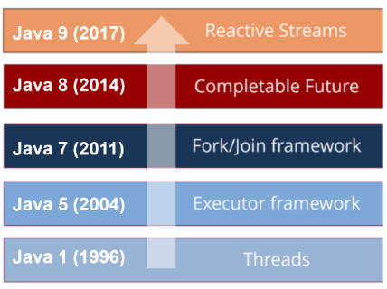

**Проблема блокирующих вызовов** — это ситуация, когда выполнение программы приостанавливается (блокируется) на время выполнения какой-либо операции, например, чтения данных из файла, запроса к базе данных или вызова внешнего API. Это приводит к неэффективному использованию ресурсов, особенно в системах, которые должны обрабатывать множество запросов одновременно.

Блокирующий вызов — это операция, которая останавливает выполнение текущего потока до тех пор, пока не завершится.
- Чтение данных из файла.
- Запрос к базе данных.
- Вызов внешнего API.
- Ожидание ответа от сети.
  Пока такая операция выполняется, поток, который её вызвал, не может делать ничего другого. Он просто "висит" и ждет.

В традиционной модели "один поток на запрос" количество потоков ограничено.
Если все потоки заблокированы, новые запросы не могут быть обработаны, даже если система не загружена.

**Неблокирующая обработка запросов** — это подход к обработке запросов, при котором сервер не блокирует поток выполнения (thread) на время выполнения операции, а вместо этого освобождает его для обработки других задач. Это позволяет эффективно использовать ресурсы сервера и обрабатывать больше запросов одновременно.

**Блокирующая обработка**: Сервер выделяет один поток (thread) на каждый запрос. Если запрос требует выполнения долгой операции (например, запрос к базе данных или внешнему API), поток блокируется и ждет, пока операция завершится. Это приводит к тому, что сервер быстро исчерпывает доступные потоки и не может обрабатывать новые запросы.

**Неблокирующая обработка**: Сервер не блокирует поток на время выполнения операции. Вместо этого он передает задачу в фоновый режим и сразу переходит к обработке других запросов. Когда задача завершается, сервер получает уведомление и возвращает результат клиенту.

**Преимущества неблокирующих потоков:**
- **Эффективное использование ресурсов**: Сервер может обрабатывать тысячи запросов одновременно, используя минимальное количество потоков.
- **Масштабируемость**: Неблокирующие серверы лучше справляются с высокой нагрузкой.
- **Быстрая реакция на запросы**: Сервер не тратит время на ожидание и может сразу переходить к следующей задаче.

В Java неблокирующая обработка реализуется с помощью:
**Reactive Streams** (например, Project Reactor, RxJava).

### **Как решить проблему блокирующих вызовов?**
**Project Reactor** — это библиотека для реактивного программирования на Java, которая позволяет эффективно решать проблему блокирующих вызовов. Она основана на принципах **Reactive Streams** и предоставляет мощные инструменты для работы с асинхронными и неблокирующими операциями. Давайте разберем, как Project Reactor помогает решить проблему блокирующих вызовов.

Спецификацию Reactive Streams можно свести к четырем определениям интерфейсов: Publisher, Subscriber, Subscription и Processor.

### **Что такое реактивный поток?**
### **Компоненты реактивного потока**
Реактивные потоки состоят из четырех основных компонентов:

**Publisher (Издатель)**:
- Источник данных, который генерирует элементы и отправляет их подписчику.
- Пример: `Flux` и `Mono` в Project Reactor.

**Subscriber (Подписчик)**:
- Получатель данных, который обрабатывает элементы, опубликованные `Publisher`.
- Пример: методы `subscribe` в Project Reactor.

**Subscription (Подписка)**:
- Связь между `Publisher` и `Subscriber`. Через `Subscription` подписчик может запрашивать данные или отменять подписку.

**Processor (Процессор)**:
- Компонент, который одновременно является и `Publisher`, и `Subscriber`. Он может принимать данные, обрабатывать их и передавать дальше.

Для работы наблюдатель должен лишь подписаться на поток. Это необходимое
условие — иначе работа не начнет выполняться.

Реактивное программирование требует иного мышления, отличного от принятого в императивном программировании. Вместо описания последовательности шагов, которые необходимо выполнить, реактивное программирование предполагает определение конвейера, по которому будут проходить данные. По мере прохождения по конвейе­ру данные могут изменяться или использоваться каким-то образом.

Mono и Flux два основных типов Reactor.
Оба являются реактивными реализация­ми Publisher.

Flux представляет конвейер из произвольного количества (от нуля до бесконечности) элементов данных.

Mono – это специализированный реактивный тип, оптимизированный для случаев, когда известно, что набор данных содержит не более одного элемента данных.

Чтобы добавить поддержку Reactor в приложение, нужно включить
следующую зависимость в спецификацию сборки:

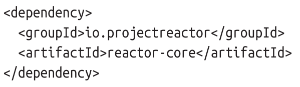

Reactor также имеет отличную поддержку тестирования. Если вы собираетесь писать много тестов для своего кода Reactor, то обязательно добавьте следующую зависимость:

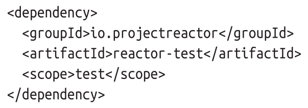

### **Отдельный сервер Netty вместо Tomcat**
Если вы создаете **Spring WebFlux** приложение с использованием **Spring Boot**, и у вас в зависимостях подключен только `spring-boot-starter-webflux`, то по умолчанию будет подниматься **Netty**, а не Tomcat. Это происходит потому, что Spring Boot автоматически настраивает Netty как встроенный сервер для реактивных приложений.

- **Netty** — это асинхронный неблокирующий сервер, который идеально подходит для реактивной модели программирования, используемой в WebFlux.
- **Tomcat** изначально был разработан для синхронных, блокирующих операций (как в Spring MVC). Хотя Tomcat поддерживает асинхронные операции, Netty более оптимизирован для реактивных приложений.

В этом случае Spring Boot:
1. Подключает Netty через транзитивную зависимость `spring-boot-starter-reactor-netty`.
2. Настраивает Netty как встроенный сервер.

Вы можете использовать Tomcat, но для этого нужно явно исключить Netty и подключить Tomcat.

Flux и Mono предлагают более 500 операций, которые можно условно разделить на следующие категории. Создание, комбинирование, преобразование, логика.

Потоки Mono и Flux поддерживают множество одинаковых операций, поэтому в большинстве случаев нет необходимости показывать одну и ту же операцию дважды, один раз для Mono и один раз для Flux.

Вместо возврата обычных объектов или коллекций, методы репозитория возвращают реактивные типы:
`Mono<T>` — для одного объекта (аналог `Optional<T>`).
`Flux<T>` — для потоков данных (аналог `List<T>` или `Iterable<T>`).

В реактивном мире транзакции управляются через `TransactionalOperator`, а не через аннотацию `@Transactional`. Это связано с тем, что реактивные потоки работают асинхронно и не блокируют поток выполнения.

Для работы с базой данных используются реактивные драйверы (например, `r2dbc-postgresql` для PostgreSQL). Эти драйверы не блокируют потоки выполнения, что позволяет обрабатывать множество запросов одновременно с минимальными ресурсами.

R2DBC (реактивный аналог JDBC) не предоставляет возможностей ORM (Object-Relational Mapping), таких как ленивая загрузка, кэширование или автоматическое управление связями между сущностями. Это означает, что вам придется вручную управлять связями и загрузкой данных.

В R2DBC нет концепции ленивой загрузки (lazy loading), как в JPA, потому что R2DBC не поддерживает управление состоянием объектов (ORM). Все связи между сущностями должны быть явно загружены.

В R2DBC нет кэширования первого уровня (как в JPA), потому что это реактивная модель, и каждый запрос к базе данных выполняется независимо.

Реактивные драйверы R2DBC могут не поддерживать все возможности SQL, такие как сложные JOIN, оконные функции или хранимые процедуры. Это может ограничить вашу способность выполнять сложные запросы.

Многие инструменты для работы с базами данных (например, Flyway или Liquibase) не поддерживают реактивный доступ к базе данных. Это может усложнить процесс миграции и управления схемой базы данных.

Хотя Spring Data R2DBC поддерживает пагинацию и сортировку, реализация может быть менее гибкой, чем в блокирующих репозиториях (например, Spring Data JPA).

### **Что же такое WebFlux?**
Это асинхронный и неблокирующий микро-фреймворк, который позволяет
одновременно обрабатывать огромное количество соединений.
Модуль WebFlux является альтернативой Spring MVC и представляет собой реактивный
подход для написания веб-сервисов. Он построен на библиотеке Reactor и работает, начиная с версии SpringBoot 2 и выше. По умолчанию он использует Netty (не Tomcat).

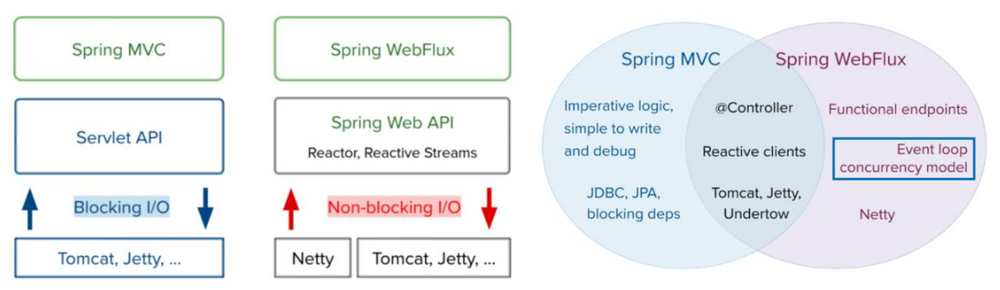

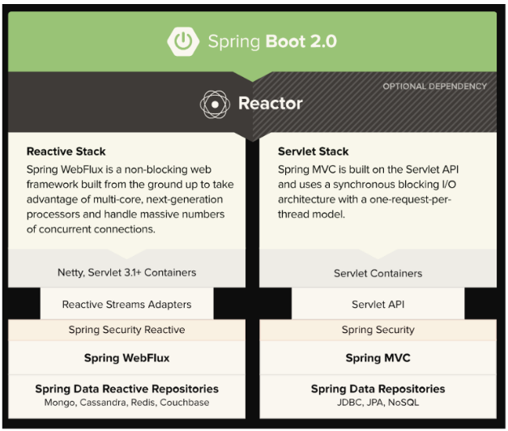

Spring Framework поддерживает реактивное программирование, начиная с пятой версии. Эта поддержка построена на основе Project Reactor.

Project Reactor или просто Reactor — это библиотека Reactive для создания неблокирующих приложений на JVM, основанная на спецификации Reactive Streams.

Это основа реактивного стека в экосистеме Spring.

Spring WebFlux использует модель обработки запросов EventLoop (цикл событий).

Когда на сервер Netty приходит запрос, он немедленно отвечает объектом Future, таким образом, не блокируя клиента. Тем временем он может делать все, что хочет.
Бонусом является то, что Netty обрабатывает большое количество соединений.

События – это и запросы Request, и ответы Callback, которые регистрирует Netty.

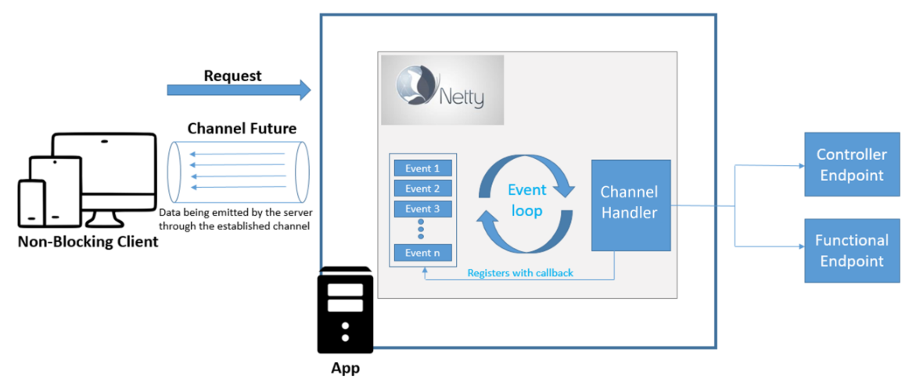

Соединение между клиентом и сервером устанавливается через канал. EventLoop Netty ищет события. У него есть внутренняя очередь, в которой он хранит события и

Цикл Событий, принимающий в порядке FIFO (первый вошёл, первый вышел), до тех пор, пока он не обработает их все.

ChannelHandler ищет правильную конечную точку для вызова: либо Controller Endpoint
(в классах, аннотированных @RestController), либо Functional Endpoint (функциональная
конечная точка). Цикл событий Netty связывает каждый запрос с каналом, и таким
образом он знает, на какой канал ему нужно отправить ответ.

Посмотрим, сколько вычислительных ресурсов расходуют Netty и Tomcat на выполнение одного запроса. Throughput — это общее количество обработанных данных. При небольшой нагрузке, до первых 300 пользователей у RxNetty и Tomcat оно
одинаковое, а после Netty (красная линия) уходит в отрыв — почти в 2 раза!

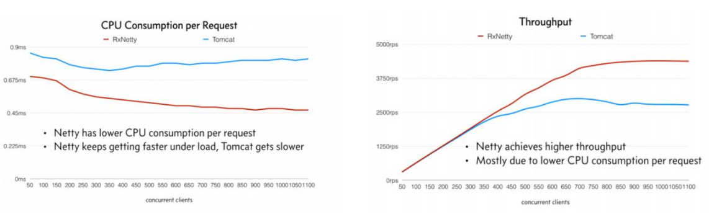

# 43. Как вызвать транзакционный метод из того же класса?
В Spring Framework существует аннотация **@Transactional**, которая применяется к методам или классам для выполнения их кода в рамках транзакции. Обычно подразумевается транзакция базы данных, но это зависит от используемого **transactionManager**. Параметры аннотации, такие как уровень изоляции, стратегия отката (rollback) и другие, позволяют гибко настраивать поведение транзакции.

В теории, аннотация **@Transactional** делает метод транзакционным для класса и всех его наследников. Однако на практике, если вызвать транзакционный метод, например, `Foo.bar()`, из другого метода того же класса, например, `Foo.baz()`, транзакция **не будет создана**. Это происходит из-за того, что Spring AOP по умолчанию использует **динамические прокси** для управления транзакциями. Вместо оригинального класса `Foo` инжектится прокси-объект, который добавляет логику открытия и закрытия транзакции. При вызове метода внутри того же класса прокси не используется, и транзакционные настройки игнорируются.

### Первый вариант решения: Использование TransactionTemplate
Один из способов обойти эту проблему — отказаться от аннотации **@Transactional** и вручную управлять транзакциями с помощью **TransactionTemplate**. Этот подход позволяет явно указать, где должна начинаться и заканчиваться транзакция.

Пример использования:

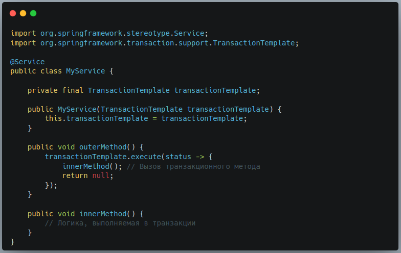

Подробнее о программируемом управлении транзакциями можно прочитать в статье: [Spring Programmatic Transaction Management](https://www.baeldung.com/spring-programmatic-transaction-management).

### Второй вариант решения: Использование AspectJ
Более универсальный, но сложный в настройке способ — переключить режим работы Spring AOP с динамических прокси на **AspectJ**. Это позволяет избежать ограничений, связанных с проксированием, и поддерживает **self-invocation** (вызов методов внутри того же класса).

**Для этого необходимо:**
Переключить режим управления транзакциями на AspectJ:

Настроить **weaving** (вплетение аспектов) на этапе компиляции. Для этого добавьте соответствующий плагин в сборку:
- Для Maven: **aspectj-maven-plugin**
- Для Gradle: **gradle-aspectj**

Пример конфигурации для Maven:

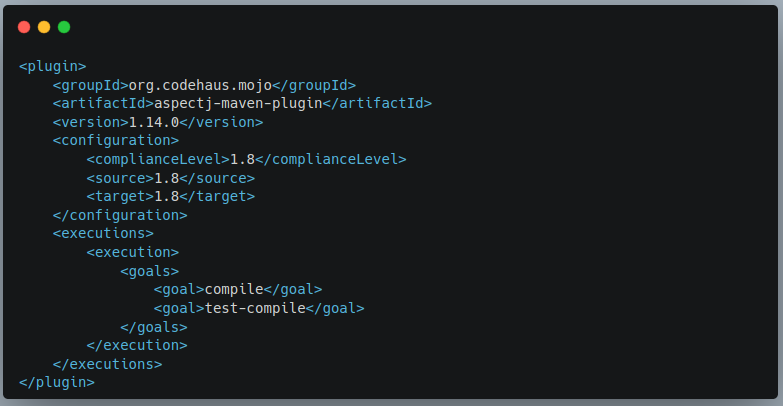

После настройки AspectJ будет вплетать код управления транзакциями непосредственно в классы, что позволит вызывать транзакционные методы из того же класса.

- По умолчанию вызов транзакционного метода из того же класса не работает из-за ограничений Spring AOP.
- Используйте **TransactionTemplate** для ручного управления транзакциями или **AspectJ** для поддержки self-invocation.
- AspectJ требует дополнительной настройки, но предоставляет более гибкий и мощный механизм управления транзакциями.
# 44. Когда отрабатывает @Autowired а когда @Transactional? Почему?
Аннотации **@Autowired** и **@Transactional** в Spring Framework выполняют разные задачи и отрабатывают на разных этапах жизненного цикла приложения. Давайте разберем, когда и почему они используются.

### Когда отрабатывает **@Autowired**?
Аннотация **@Autowired** используется для **внедрения зависимостей** (Dependency Injection, DI). Она указывает Spring, что нужно автоматически подставить (инжектировать) подходящий бин в поле, конструктор или метод.

**На этапе инициализации контекста Spring**:
Когда Spring создает контекст приложения, он сканирует классы на наличие аннотаций, таких как **@Component**, **@Service**, **@Repository** и других. Для каждого бина Spring ищет зависимости, помеченные **@Autowired**, и инжектирует их. Это происходит **один раз** при старте приложения.

**Как это работает?**
Spring ищет подходящий бин в контексте (по типу или имени). Если бин найден, он инжектируется в поле, конструктор или метод. Если бин не найден, Spring выбрасывает исключение `NoSuchBeanDefinitionException` (если не указано `required = false`).

### Когда отрабатывает **@Transactional**?
Аннотация **@Transactional** используется для управления **транзакциями**. Она указывает Spring, что метод или класс должен выполняться в рамках транзакции. Обычно это транзакции базы данных, но могут быть и другие типы (например, JMS).

**На этапе выполнения метода**:
Когда вызывается метод, помеченный **@Transactional**, Spring создает прокси вокруг этого метода. Перед выполнением метода Spring открывает транзакцию (если она еще не открыта). После выполнения метода Spring фиксирует (commit) транзакцию, если не произошло исключения. Если возникает исключение, Spring откатывает (rollback) транзакцию (в зависимости от настроек аннотации).

**Как это работает?**
Spring AOP создает прокси-объект для класса, содержащего метод с **@Transactional**.
При вызове метода через прокси Spring управляет транзакцией (открывает, фиксирует или откатывает). Если метод вызывается **внутри того же класса**, прокси не используется, и транзакция не создается (это ограничение Spring AOP).

# 45. Почему нельзя отработать @Transactional в другом методе?
Проблема с тем, что аннотация **@Transactional** не работает при вызове из другого метода **того же класса**, связана с тем, как Spring реализует управление транзакциями через **AOP (Aspect-Oriented Programming)** и **прокси-объекты**. Давайте разберем это подробнее.

### **Почему @Transactional не работает при вызове из другого метода того же класса?**
**Механизм работы Spring AOP**:
Spring использует **прокси-объекты** для управления транзакциями. Когда вы помечаете метод аннотацией **@Transactional**, Spring создает прокси вокруг вашего класса.

Прокси перехватывает вызовы методов и добавляет логику для управления транзакциями (открытие, фиксация, откат).

**Self-invocation (самовызов)**:
Когда вы вызываете метод с **@Transactional** из другого метода **того же класса**, вызов происходит **напрямую**, минуя прокси. Поскольку прокси не участвует в вызове, логика управления транзакциями не применяется.

**Пример:**

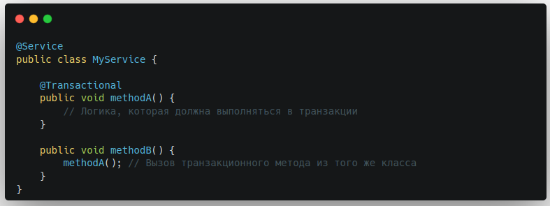

В этом примере:
- При вызове `methodB()` извне, Spring создает прокси для `MyService`.
- Однако вызов `methodA()` внутри `methodB()` происходит **напрямую**, минуя прокси, и транзакция не создается.

### Почему Spring не может обработать **@Transactional** в таком случае?
**Ограничение проксирования**:
- Spring AOP использует **динамические прокси** (на основе интерфейсов или CGLIB для классов без интерфейсов).
- Эти прокси перехватывают только вызовы, которые идут **извне** класса. Внутренние вызовы (self-invocation) не проходят через прокси.

**Производительность**:
- Если бы Spring обрабатывал все внутренние вызовы через прокси, это могло бы привести к значительным накладным расходам на производительность, так как каждый вызов метода потребовал бы создания транзакции и других операций.

# 46. Структура HTTP запроса, ответа
### **Что такое HTTP**

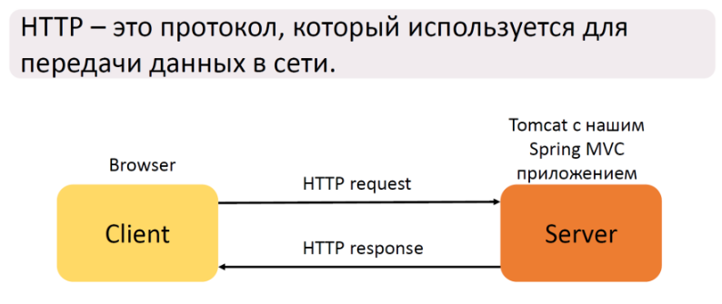

**HTTP (HyperText Transfer Protocol)** — это протокол прикладного уровня, используемый для передачи данных в сети Интернет. Он является основой для обмена информацией между клиентами (например, веб-браузерами) и серверами. HTTP лежит в основе работы всемирной паутины (World Wide Web) и позволяет запрашивать и передавать веб-страницы, изображения, видео и другие ресурсы.

### **Основные характеристики HTTP**
**Текстовый протокол**: HTTP использует текстовый формат для запросов и ответов. Это делает его удобным для чтения и отладки.

**Клиент-серверная архитектура**:
- **Клиент** (например, браузер) отправляет запрос на сервер.
- **Сервер** обрабатывает запрос и возвращает ответ.

**Статус соединения**: HTTP является **независимым от состояния (stateless)** протоколом. Это означает, что каждый запрос обрабатывается сервером независимо от предыдущих запросов. Для поддержания состояния (например, аутентификации пользователя) используются механизмы, такие как **куки (cookies)**.

**Методы запросов**: HTTP определяет набор методов (или "глаголов"), которые указывают, какое действие нужно выполнить с ресурсом. Основные методы:
- **GET**: Запрос данных от сервера.
- **POST**: Отправка данных на сервер (например, форма).
- **PUT**: Обновление существующего ресурса.
- **DELETE**: Удаление ресурса.
- **PATCH**: Частичное обновление ресурса.
- **HEAD**: Запрос метаданных ресурса (без тела ответа).

**Коды состояния (Status Codes)**: Каждый ответ сервера содержит код состояния, который указывает на результат обработки запроса. Основные группы кодов:
- **1xx (Информационные)**: Запрос принят, обработка продолжается.
- **2xx (Успешные)**: Запрос успешно обработан (например, 200 OK).
- **3xx (Перенаправления)**: Требуется дополнительное действие (например, 301 Moved Permanently).
- **4xx (Ошибки клиента)**: Запрос содержит ошибку (например, 404 Not Found).
- **5xx (Ошибки сервера)**: Сервер не смог обработать запрос (например, 500 Internal Server Error).

**Заголовки (Headers)**: Заголовки содержат метаданные о запросе или ответе. Они могут указывать тип содержимого, кодировку, кэширование, аутентификацию и другие параметры.

### **Версии HTTP**
**HTTP/1.0**: Первая широко используемая версия. Поддерживает базовые функции, но имеет ограничения, такие как отсутствие постоянных соединений.

**HTTP/1.1**: Улучшенная версия, которая добавила поддержку постоянных соединений, кэширования, сжатия и других функций.

**HTTP/2**: Современная версия, которая использует бинарный формат вместо текстового, поддерживает мультиплексирование запросов и уменьшает задержки.

**HTTP/3**: Новейшая версия, основанная на протоколе QUIC (работает поверх UDP вместо TCP). Улучшает производительность и безопасность.

### **Структура HTTP запроса, ответа**
Структура HTTP-запроса и HTTP-ответа состоит из нескольких частей, которые передаются между клиентом (например, браузером) и сервером.

HTTP-запрос состоит из трех основных частей:
1. **Стартовая строка (Request Line)**.
2. **Заголовки (Headers)**.
3. **Тело запроса (Body)** (опционально).

### 1. Стартовая строка (Request Line)
Стартовая строка содержит три элемента:
- **Метод запроса**: Указывает действие, которое нужно выполнить (например, GET, POST, PUT, DELETE).
- **URI (Uniform Resource Identifier)**: Путь к ресурсу на сервере (например, `/index.html`).
- **Версия HTTP**: Версия протокола (например, `HTTP/1.1`).

Пример:

### 2. Заголовки (Headers)
Заголовки содержат метаданные о запросе. Каждый заголовок состоит из имени и значения, разделенных двоеточием.

Заголовки могут указывать:
- Тип содержимого (`Content-Type`).
- Куки (`Cookie`).
- Информацию о клиенте (`User-Agent`).
- Поддержку сжатия (`Accept-Encoding`).

Пример заголовков:

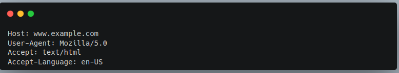

### 3. Тело запроса (Body)
Тело запроса используется для передачи данных на сервер. Оно присутствует только в некоторых типах запросов, например, POST или PUT. Тело может содержать:
- Данные формы (например, `username=john&password=123`).
- JSON, XML или другие форматы данных.

Пример тела запроса:

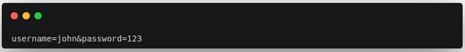

## Пример полного HTTP-запроса:

## **Структура HTTP-ответа**
HTTP-ответ также состоит из трех основных частей:
1. **Строка состояния (Status Line)**.
2. **Заголовки (Headers)**.
3. **Тело ответа (Body)** (опционально).

### 1. Строка состояния (Status Line)
Строка состояния содержит три элемента:
- **Версия HTTP**: Версия протокола (например, `HTTP/1.1`).
- **Код состояния (Status Code)**: Числовой код, указывающий результат обработки запроса (например, 200, 404, 500).
- **Пояснение к коду состояния (Status Text)**: Текстовое описание кода (например, "OK", "Not Found").

Пример:

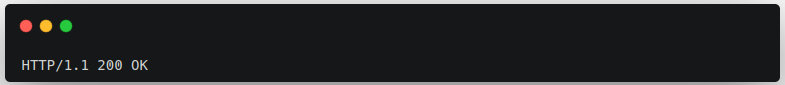

### 2. Заголовки (Headers)
Заголовки ответа содержат метаданные о ответе. Они могут указывать:
- Тип содержимого (`Content-Type`).
- Длину содержимого (`Content-Length`).
- Настройки кэширования (`Cache-Control`).
- Куки (`Set-Cookie`).

Пример заголовков:

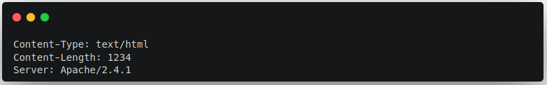

### 3. Тело ответа (Body)
Тело ответа содержит данные, которые сервер возвращает клиенту. Это может быть:
- HTML-страница.
- JSON-данные.
- Изображение или другой бинарный файл.

Пример тела ответа:

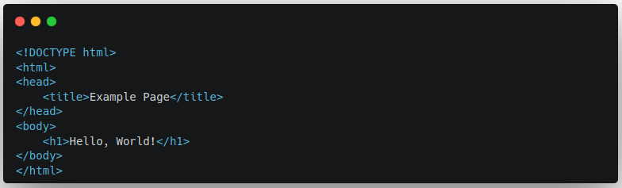

## Пример полного HTTP-ответа:

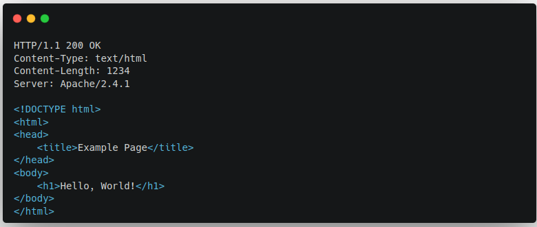

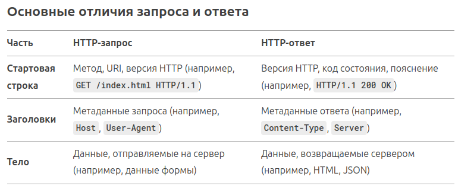

# 47. HTTP методы
HTTP определяет набор методов (или "глаголов"), которые указывают, какое действие нужно выполнить с ресурсом.

Основные методы:

### **GET**: Запрос данных с сервера.
Пример: Запрос информации о пользователе с ID 123.

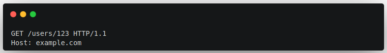

Ответ сервера:

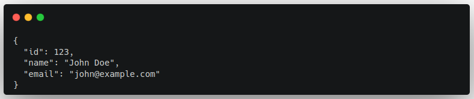

### **POST**: Отправка данных для создания нового ресурса по указанному сервером URL-адресу.
Пример: Создание нового пользователя.

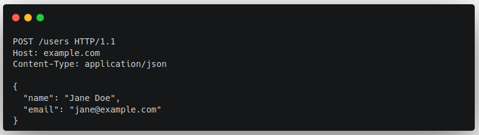

Ответ сервера:

### **PUT**: Обновление существующего ресурса.
Пример: Обновление информации о пользователе с ID 123.

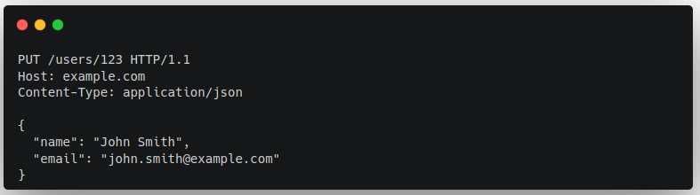

Ответ сервера:

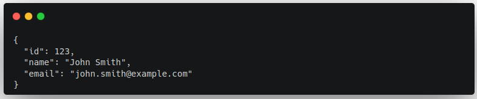

### **DELETE**: Удаление ресурса с сервера.
Пример: Удаление пользователя с ID 123.

Ответ сервера:

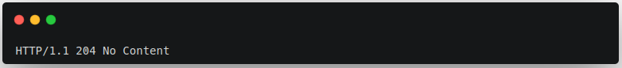

### **PATCH**: Частичное обновление ресурса на сервере.
Пример: Обновление только email пользователя с ID 123.

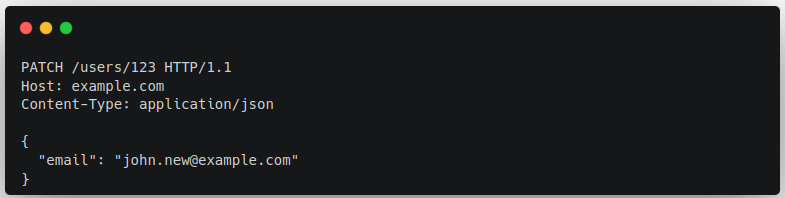

Ответ сервера:

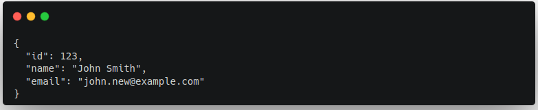

### **HEAD**: Запрос метаданных ресурса (без тела ответа).
Пример: Запрос заголовков для ресурса пользователя с ID 123.

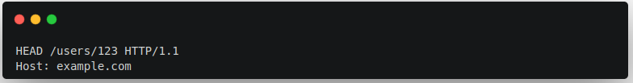

Ответ сервера:

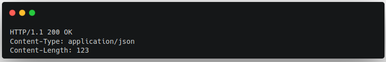

### Дополнительные методы:
### **OPTIONS**: Запрос информации о доступных методах для ресурса.

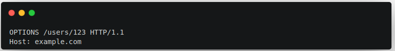

Ответ сервера:

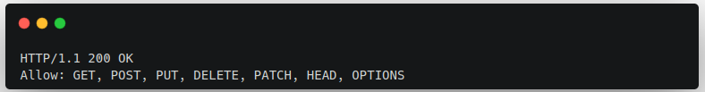

### **CONNECT**: Используется для установления туннеля к серверу (часто для HTTPS).
### **TRACE**: Возвращает полученный запрос, используется для диагностики.

# 48. Ключевое отличие методов POST и GET
### **Назначение**
**GET**: Используется для **запроса данных** от сервера. Он предназначен для получения информации, например, страницы, изображения или JSON-данных.
**POST**: Используется для **отправки данных** на сервер. Он предназначен для создания или изменения ресурсов, например, отправки формы или загрузки файла.

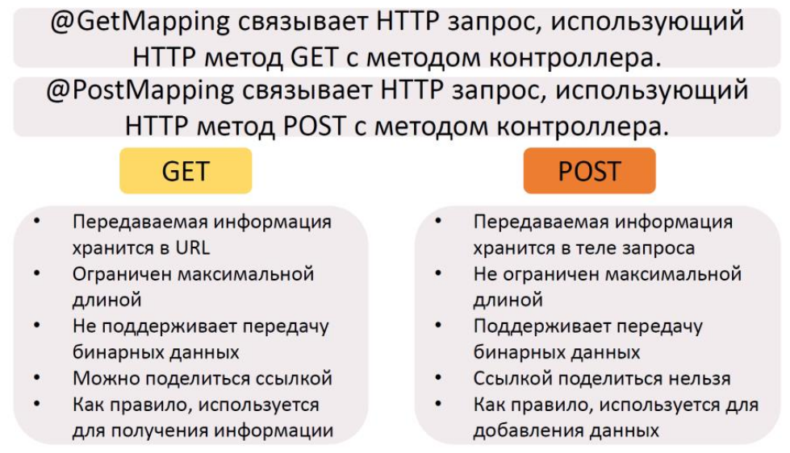

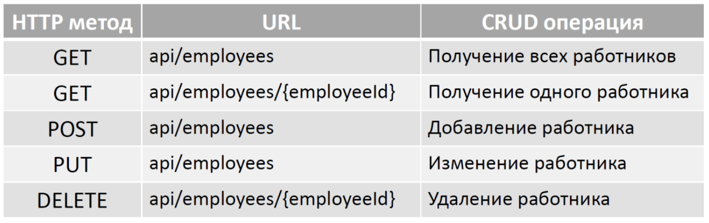

### **Передача данных**
**GET**: Данные передаются в **URL** в виде query-параметров (после знака `?`).
**POST**: Данные передаются в **теле запроса** (body), а не в URL.

### **Кэширование**
**GET**: Запросы могут кэшироваться браузером или прокси-серверами, что повышает производительность.
**POST**: Запросы обычно не кэшируются, так как они изменяют состояние на сервере.

### **Идемпотентность**
**GET**: Идемпотентный метод. Повторные запросы не изменяют состояние сервера (если только данные на сервере не изменились извне).
**POST**: Неидемпотентный метод. Повторные запросы могут создавать новые ресурсы или изменять состояние сервера.

### **Безопасность**
**GET**: Считается "безопасным" методом (safe), так как он не должен изменять состояние сервера.
**POST**: Не является "безопасным" методом, так как он может изменять состояние сервер
# 49. REST стиль
**REST (Representational State Transfer)** — это архитектурный стиль для создания веб-сервисов, который основывается на некоторых принципах и стандартном протоколе, HTTP.

REST был предложен Роем Филдингом (Roy Fielding) в его диссертации в 2000 году. Он описывает набор ограничений и принципов, которые помогают создавать масштабируемые, простые и надежные веб-сервисы.

REST не является стандартом или протоколом, а скорее набором рекомендаций и лучших практик для проектирования API.

Компоненты в REST взаимодействуют в сети Интернет в качестве **клиентов** и **серверов**

Клиент - тот кто пытается получить данные с сервера. Это может быть браузер или любое другое приложение (микросервис).

REST означает передачу репрезентативного состояния (из методы)

**Почему это называется "передачей репрезентативного состояния"?**
Клиент и сервер обмениваются **репрезентациями** (представлениями) ресурсов. Каждая репрезентация отражает текущее **состояние** ресурса. Взаимодействие строится на **передаче** этих репрезентаций между клиентом и сервером.

**Репрезентация (Representation)**: Ресурс на сервере (например, пользователь, товар или документ) может быть представлен в разных форматах: JSON, XML, HTML и т.д. Эти форматы называются **репрезентациями**.

**Состояние (State)**: Состояние ресурса — это его текущие данные (например, имя пользователя, его email и т.д.). Клиент может запросить текущее состояние ресурса (например, с помощью GET-запроса) или изменить его (например, с помощью PUT или POST).

**Передача (Transfer)**: Клиент и сервер обмениваются репрезентациями ресурсов через HTTP-запросы и ответы. Например, клиент запрашивает состояние ресурса (GET), изменяет его (POST/PUT) или удаляет (DELETE).

**ВАЖНО!** Корзина должна быт на стороне клиента (иначе это не REST).
Храним состояние клиента на стороне КЛИЕНТА (а не на сервере).
Клиент наполняет корзину и ОДИН раз id заказа отправляем на сервер. (из методы)

**Клиент хранит корзину**: Клиент (например, браузер) хранит данные корзины в локальном хранилище (localStorage, sessionStorage) или в памяти (например, в состоянии React-приложения).

Пример данных корзины:

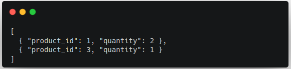

**Клиент отправляет корзину на сервер**: Когда пользователь завершает оформление заказа, клиент отправляет содержимое корзины на сервер **одним запросом**.

Пример запроса:

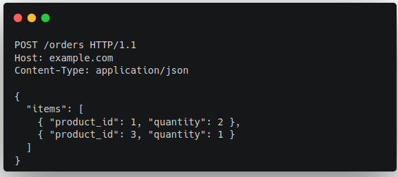

**Сервер создает заказ**: Сервер обрабатывает запрос, создает заказ и возвращает его идентификатор (ID).

Пример ответа:

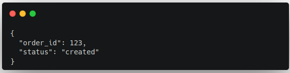

### Основные принципы REST:
1. **Клиент-серверная архитектура**: Клиент и сервер независимы друг от друга. Клиент отвечает за пользовательский интерфейс и взаимодействие с пользователем, а сервер — за хранение данных и бизнес-логику. Это позволяет разделять ответственность и упрощает масштабирование.
2. **Stateless (отсутствие состояния)**: Каждый запрос от клиента к серверу должен содержать всю необходимую информацию для его обработки. Сервер не хранит состояние клиента между запросами. Это упрощает масштабирование серверов, так как любой сервер может обработать любой запрос.
3. **Кэширование**: Ответы сервера могут быть кэшируемыми. Клиенты и промежуточные прокси-серверы могут кэшировать ответы, чтобы уменьшить нагрузку на сервер и повысить производительность. Сервер указывает, можно ли кэшировать ответ, с помощью заголовков HTTP (например, Cache-Control).
4. **Единообразие интерфейса (Uniform Interface)**: Интерфейс между клиентом и сервером должен быть единообразным и предсказуемым.
   Это достигается за счет:
  - Использования ресурсов (все сущности представляются как ресурсы, например, `/users`, `/products`).
  - Использования HTTP-методов (GET, POST, PUT, DELETE и т.д.) для выполнения операций с ресурсами.
  - Использования стандартных форматов данных (например, JSON или XML).
5. **Многоуровневая система (Layered System)**: Архитектура может состоять из нескольких слоев (например, сервер приложений, сервер базы данных, прокси-сервер). Клиент не знает, с каким именно слоем он взаимодействует. Это повышает гибкость и безопасность системы.
6. **Код по требованию (Code on Demand, опционально)**: Сервер может временно расширять функциональность клиента, отправляя ему исполняемый код (например, JavaScript). Это необязательное ограничение, и оно редко используется в RESTful API.
   
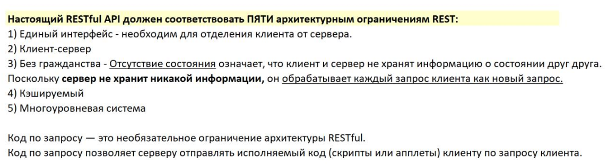

В REST все сущности (пользователи, товары, заказы и т.д.) представляются как ресурсы. Каждый ресурс имеет уникальный идентификатор (URI).

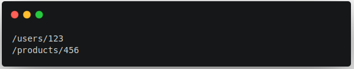

REST использует стандартные HTTP-методы для выполнения операций с ресурсами:
- **GET**: Получить ресурс.
- **POST**: Создать новый ресурс.
- **PUT**: Обновить ресурс.
- **DELETE**: Удалить ресурс.
- **PATCH**: Частично обновить ресурс.

Ресурсы могут быть представлены в разных форматах, например, JSON, XML, HTML и т.д. Клиент и сервер согласовывают формат с помощью заголовков HTTP (например, `Accept` и `Content-Type`).

**Ссылки (Spring HATEOAS)**: RESTful API может включать ссылки на связанные ресурсы в ответах. Это позволяет клиенту "переходить" между ресурсами без необходимости знать всю структуру API заранее.

### Преимущества REST:
- **Простота**: Использует стандартные HTTP-методы и форматы данных.
- **Масштабируемость**: Stateless-архитектура позволяет легко масштабировать серверы.
- **Гибкость**: Поддерживает множество форматов данных (JSON, XML и т.д.).
- **Кэширование**: Улучшает производительность за счет кэширования ответов.

### **Stateless-архитектура** (архитектура без состояния)
Это подход к проектированию систем, при котором сервер не хранит информацию о состоянии клиента между запросами. Каждый запрос от клиента к серверу должен содержать всю необходимую информацию для его обработки, и сервер не полагается на данные из предыдущих запросов.

Этот принцип является одним из ключевых в RESTful API и других распределенных системах.

- Клиент отправляет запрос, который содержит все данные, необходимые для его выполнения. Сервер обрабатывает запрос и возвращает ответ, не сохраняя информацию о клиенте между запросами.
- Сервер не хранит данные о сессиях, cookies или других формах состояния клиента. Вся информация о состоянии (например, данные аутентификации) передается в каждом запросе.
- Stateless-архитектура упрощает разработку и отладку, так как не нужно управлять состоянием на сервере.

### Недостатки REST:
- **Избыточность данных**: В некоторых случаях REST может передавать больше данных, чем необходимо.
- **Отсутствие строгой стандартизации**: REST — это стиль, а не стандарт, поэтому реализации могут отличаться.

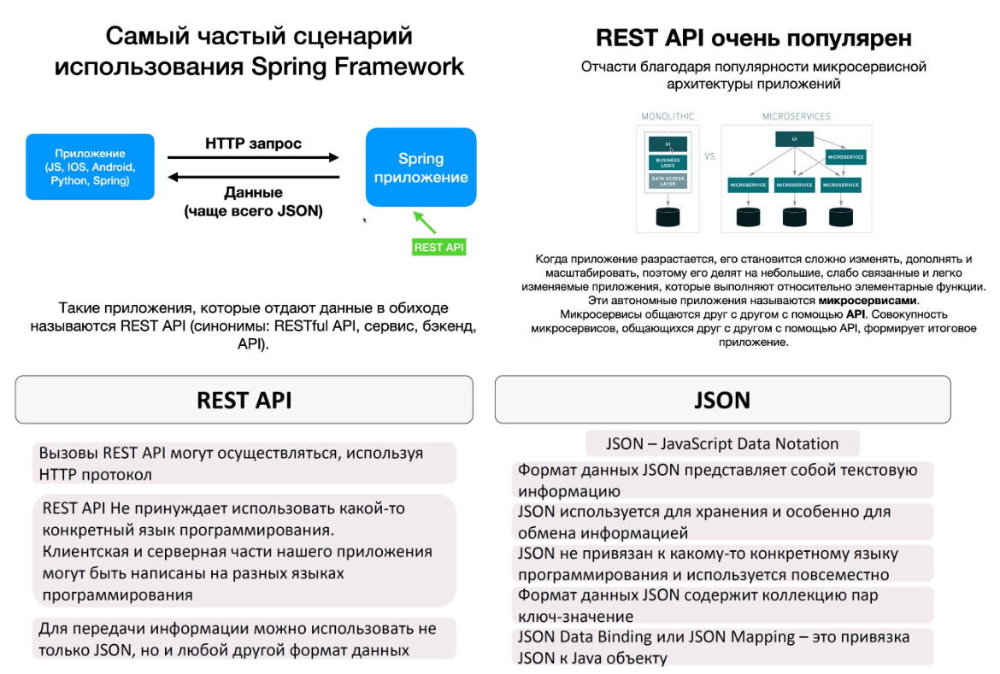

**JSON (JavaScript Object Notation)** — это текстовый формат обмена данными, который используется для представления структурированной информации в виде пар "ключ-значение". Он был создан на основе синтаксиса объектов JavaScript, но теперь широко используется независимо от языка программирования благодаря своей простоте и удобству.

JSON является стандартным форматом для обмена данными между клиентом и сервером в RESTful API.

**Человекочитаемый формат**: JSON легко читать и редактировать вручную, так как он использует простой текстовый синтаксис.

**Легковесный**: JSON имеет минимальный overhead (дополнительные данные), что делает его идеальным для передачи данных по сети.

**Языково-независимый**: Хотя JSON основан на синтаксисе JavaScript, он поддерживается практически всеми современными языками программирования (Python, Java, C#, PHP, Ruby и т.д.).

**Используется повсеместно**: JSON широко применяется в веб-разработке для обмена данными между клиентом и сервером, в API, конфигурационных файлах, базах данных (например, MongoDB) и многом другом.

### **JSON состоит из двух основных структур**

**Объекты**:
- Объекты представляются в виде пар "ключ-значение", заключенных в фигурные скобки `{}`.
- Ключи должны быть строками (заключены в двойные кавычки `"`).
- Значения могут быть строками, числами, массивами, объектами, `true`, `false` или `null`.

**Пример объекта:**

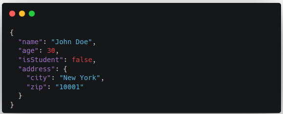

**Массивы**:

- Массивы представляют собой упорядоченные списки значений, заключенные в квадратные скобки `[]`.
- Значения в массиве могут быть любого типа, включая объекты и другие массивы.

**Пример массива:**

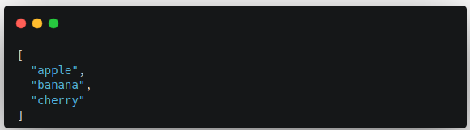

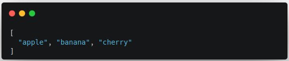

**Пример массива объектов:**

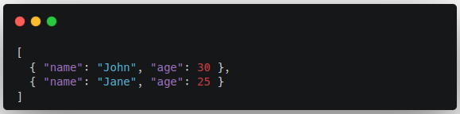

### **Типы данных в JSON:**
- **Строки**: `"Hello, World!"`
- **Числа**: `42`, `3.14`
- **Логические значения**: `true`, `false`
- **Массивы**: `[1, 2, 3]`
- **Объекты**: `{ "key": "value" }`
- **null**: `null`

### **Пример JSON:**

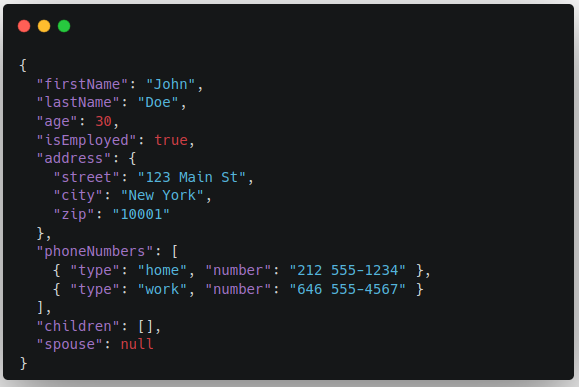

# 50. Идемпотентность: что это такое, методы

# 51. Как метод POST сделать идемпотентным?
